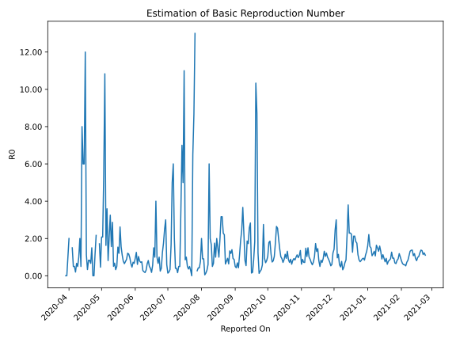

# Country Figures: Time Series for Basic Reproduction Number of Chad 

| Reported On | &Delta; Confirmed | Total &Delta; Confirmed First Interval | Total &Delta; Confirmed Second Interval | Estimated Basic Reproduction Number R0 | 
|-------------|-------------------|----------------------------------------|-----------------------------------------|---------------------------------------------------|
| 2020-05-06 | 0 |  97  |  27  |  3.59  | 
| 2020-05-05 | 53 |  44  |  27  |  1.63  | 
| 2020-05-04 | 0 |  65  |  6  |  10.83  | 
| 2020-05-03 | 0 |  65  |  12  |  5.42  | 
| 2020-05-02 | 44 |  27  |  13  |  2.08  | 
| 2020-05-01 | 0 |  27  |  13  |  2.08  | 
| 2020-04-30 | 21 |  6  |  13  |  0.46  | 
| 2020-04-29 | 0 |  12  |  7  |  1.71  | 
| 2020-04-28 | 6 |  13  |  None  |  None  | 
| 2020-04-27 | 0 |  13  |  None  |  None  | 
| 2020-04-26 | 0 |  13  |  6  |  2.17  | 
| 2020-04-25 | 6 |  7  |  6  |  1.17  | 
| 2020-04-24 | 7 |  None  |  10  |  None  | 
| 2020-04-23 | 0 |  None  |  10  |  None  | 
| 2020-04-22 | 0 |  6  |  4  |  1.50  | 
| 2020-04-21 | 0 |  6  |  9  |  0.67  | 
| 2020-04-20 | 0 |  10  |  12  |  0.83  | 
| 2020-04-19 | 0 |  10  |  12  |  0.83  | 
| 2020-04-18 | 6 |  4  |  12  |  0.33  | 
| 2020-04-17 | 0 |  9  |  8  |  1.12  | 
| 2020-04-16 | 4 |  12  |  1  |  12.00  | 
| 2020-04-15 | 0 |  12  |  2  |  6.00  | 
| 2020-04-14 | 0 |  12  |  2  |  6.00  | 
| 2020-04-13 | 5 |  8  |  1  |  8.00  | 
| 2020-04-12 | 7 |  1  |  2  |  0.50  | 
| 2020-04-11 | 0 |  2  |  1  |  2.00  | 
| 2020-04-10 | 0 |  2  |  2  |  1.00  | 
| 2020-04-09 | 1 |  1  |  2  |  0.50  | 
| 2020-04-08 | 0 |  2  |  3  |  0.67  | 
| 2020-04-07 | 1 |  1  |  5  |  0.20  | 
| 2020-04-06 | 0 |  2  |  4  |  0.50  | 
| 2020-04-05 | 0 |  2  |  4  |  0.50  | 
| 2020-04-04 | 1 |  3  |  2  |  1.50  | 
| 2020-04-03 | 0 |  5  |  None  |  None  | 
| 2020-04-02 | 1 |  4  |  None  |  None  | 
| 2020-04-01 | 0 |  4  |  2  |  2.00  | 
| 2020-03-31 | 2 |  2  |  2  |  1.00  | 
| 2020-03-30 | 2 |  None  |  2  |  None  | 
| 2020-03-29 | 0 |  None  |  2  |  None  | 
| 2020-03-28 | 0 |  2  |  None  |  None  | 
| 2020-03-27 | 0 |  2  |  None  |  None  | 
| 2020-03-26 | 0 |  2  |  None  |  None  | 
| 2020-03-25 | 0 |  2  |  None  |  None  | 
| 2020-03-24 | 2 |  None  |  None  |  None  | 
| 2020-03-23 | 0 |  None  |  None  |  None  | 
| 2020-03-22 | 0 |  None  |  None  |  None  | 
| 2020-03-21 | 0 |  None  |  None  |  None  | 
| 2020-03-20 | 0 |  None  |  None  |  None  | 
| 2020-03-19 | None |  None  |  None  |  None  | 

