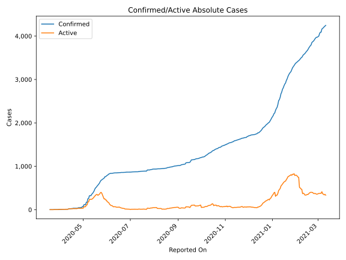
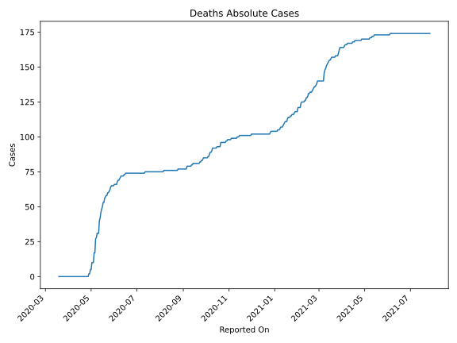
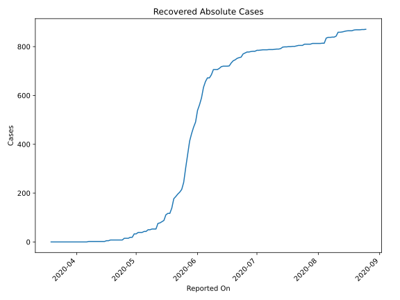
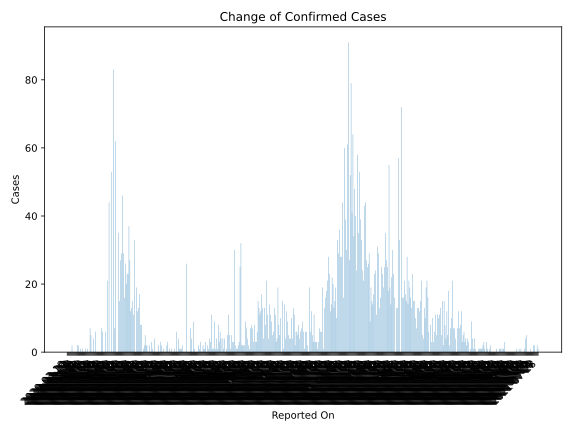
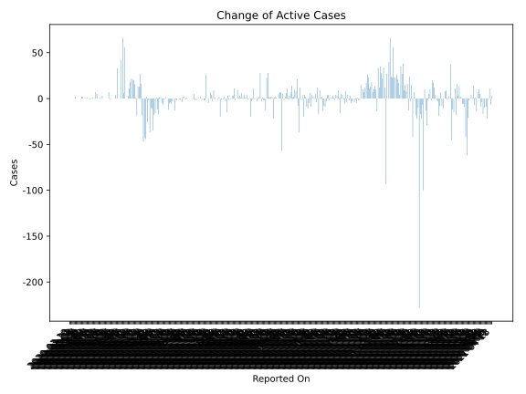
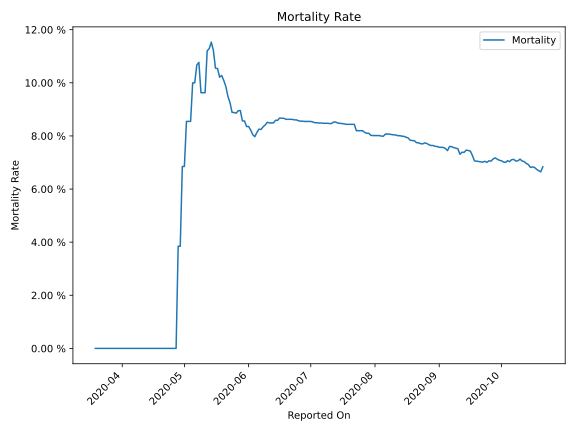

# Country Figures: Time Series for Chad 

| Reported On | Confirmed | Deaths | Recovered | Active | Mortality | &Delta; Confirmed | &Delta; Deaths | &Delta; Recovered | &Delta; Active | % Active of Population |
|-------------|-----------|--------|-----------|--------|-----------|-------------------|----------------|-------------------|----------------|------------------------|
| 2020-05-02 | 117 | 10 | 39 | 68 |  8.55 %  | 44 | 5 | 6 | 33 |  0.000 %  | 
| 2020-05-01 | 73 | 5 | 33 | 35 |  6.85 %  | 0 | 0 | 0 | 0 |  0.000 %  | 
| 2020-04-30 | 73 | 5 | 33 | 35 |  6.85 %  | 21 | 3 | 14 | 4 |  0.000 %  | 
| 2020-04-29 | 52 | 2 | 19 | 31 |  3.85 %  | 0 | 0 | 0 | 0 |  0.000 %  | 
| 2020-04-28 | 52 | 2 | 19 | 31 |  3.85 %  | 6 | 2 | 4 | 0 |  0.000 %  | 
| 2020-04-27 | 46 | 0 | 15 | 31 |  None  | 0 | 0 | 0 | 0 |  0.000 %  | 
| 2020-04-26 | 46 | 0 | 15 | 31 |  None  | 0 | 0 | 0 | 0 |  0.000 %  | 
| 2020-04-25 | 46 | 0 | 15 | 31 |  None  | 6 | 0 | 7 | -1 |  0.000 %  | 
| 2020-04-24 | 40 | 0 | 8 | 32 |  None  | 7 | 0 | 0 | 7 |  0.000 %  | 
| 2020-04-23 | 33 | 0 | 8 | 25 |  None  | 0 | 0 | 0 | 0 |  0.000 %  | 
| 2020-04-22 | 33 | 0 | 8 | 25 |  None  | 0 | 0 | 0 | 0 |  0.000 %  | 
| 2020-04-21 | 33 | 0 | 8 | 25 |  None  | 0 | 0 | 0 | 0 |  0.000 %  | 
| 2020-04-20 | 33 | 0 | 8 | 25 |  None  | 0 | 0 | 0 | 0 |  0.000 %  | 
| 2020-04-19 | 33 | 0 | 8 | 25 |  None  | 0 | 0 | 0 | 0 |  0.000 %  | 
| 2020-04-18 | 33 | 0 | 8 | 25 |  None  | 6 | 0 | 3 | 3 |  0.000 %  | 
| 2020-04-17 | 27 | 0 | 5 | 22 |  None  | 0 | 0 | 0 | 0 |  0.000 %  | 
| 2020-04-16 | 27 | 0 | 5 | 22 |  None  | 4 | 0 | 3 | 1 |  0.000 %  | 
| 2020-04-15 | 23 | 0 | 2 | 21 |  None  | 0 | 0 | 0 | 0 |  0.000 %  | 
| 2020-04-14 | 23 | 0 | 2 | 21 |  None  | 0 | 0 | 0 | 0 |  0.000 %  | 
| 2020-04-13 | 23 | 0 | 2 | 21 |  None  | 5 | 0 | 0 | 5 |  0.000 %  | 
| 2020-04-12 | 18 | 0 | 2 | 16 |  None  | 7 | 0 | 0 | 7 |  0.000 %  | 
| 2020-04-11 | 11 | 0 | 2 | 9 |  None  | 0 | 0 | 0 | 0 |  0.000 %  | 
| 2020-04-10 | 11 | 0 | 2 | 9 |  None  | 0 | 0 | 0 | 0 |  0.000 %  | 
| 2020-04-09 | 11 | 0 | 2 | 9 |  None  | 1 | 0 | 0 | 1 |  0.000 %  | 
| 2020-04-08 | 10 | 0 | 2 | 8 |  None  | 0 | 0 | 0 | 0 |  0.000 %  | 
| 2020-04-07 | 10 | 0 | 2 | 8 |  None  | 1 | 0 | 2 | -1 |  0.000 %  | 
| 2020-04-06 | 9 | 0 | 0 | 9 |  None  | 0 | 0 | 0 | 0 |  0.000 %  | 
| 2020-04-05 | 9 | 0 | 0 | 9 |  None  | 0 | 0 | 0 | 0 |  0.000 %  | 
| 2020-04-04 | 9 | 0 | 0 | 9 |  None  | 1 | 0 | 0 | 1 |  0.000 %  | 
| 2020-04-03 | 8 | 0 | 0 | 8 |  None  | 0 | 0 | 0 | 0 |  0.000 %  | 
| 2020-04-02 | 8 | 0 | 0 | 8 |  None  | 1 | 0 | 0 | 1 |  0.000 %  | 
| 2020-04-01 | 7 | 0 | 0 | 7 |  None  | 0 | 0 | 0 | 0 |  0.000 %  | 
| 2020-03-31 | 7 | 0 | 0 | 7 |  None  | 2 | 0 | 0 | 2 |  0.000 %  | 
| 2020-03-30 | 5 | 0 | 0 | 5 |  None  | 2 | 0 | 0 | 2 |  0.000 %  | 
| 2020-03-29 | 3 | 0 | 0 | 3 |  None  | 0 | 0 | 0 | 0 |  0.000 %  | 
| 2020-03-28 | 3 | 0 | 0 | 3 |  None  | 0 | 0 | 0 | 0 |  0.000 %  | 
| 2020-03-27 | 3 | 0 | 0 | 3 |  None  | 0 | 0 | 0 | 0 |  0.000 %  | 
| 2020-03-26 | 3 | 0 | 0 | 3 |  None  | 0 | 0 | 0 | 0 |  0.000 %  | 
| 2020-03-25 | 3 | 0 | 0 | 3 |  None  | 0 | 0 | 0 | 0 |  0.000 %  | 
| 2020-03-24 | 3 | 0 | 0 | 3 |  None  | 2 | 0 | 0 | 2 |  0.000 %  | 
| 2020-03-23 | 1 | 0 | 0 | 1 |  None  | 0 | 0 | 0 | 0 |  0.000 %  | 
| 2020-03-22 | 1 | 0 | 0 | 1 |  None  | 0 | 0 | 0 | 0 |  0.000 %  | 
| 2020-03-21 | 1 | 0 | 0 | 1 |  None  | 0 | 0 | 0 | 0 |  0.000 %  | 
| 2020-03-20 | 1 | 0 | 0 | 1 |  None  | 0 | 0 | 0 | 0 |  0.000 %  | 
| 2020-03-19 | 1 | 0 | 0 | 1 |  None  | None | None | None | None |  0.000 %  | 

