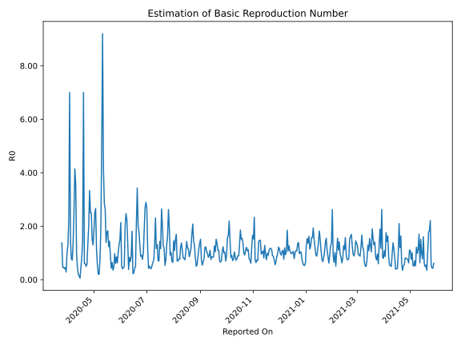

# Country Figures: Time Series for Basic Reproduction Number of Togo 

| Reported On | &Delta; Confirmed | Total &Delta; Confirmed First Interval | Total &Delta; Confirmed Second Interval | Estimated Basic Reproduction Number R0 | 
|-------------|-------------------|----------------------------------------|-----------------------------------------|---------------------------------------------------|
| 2020-05-06 | 0 |  5  |  25  |  0.20  | 
| 2020-05-05 | 2 |  10  |  18  |  0.56  | 
| 2020-05-04 | 2 |  15  |  13  |  1.15  | 
| 2020-05-03 | 1 |  24  |  9  |  2.67  | 
| 2020-05-02 | 0 |  25  |  10  |  2.50  | 
| 2020-05-01 | 7 |  18  |  10  |  1.80  | 
| 2020-04-30 | 7 |  13  |  10  |  1.30  | 
| 2020-04-29 | 10 |  9  |  6  |  1.50  | 
| 2020-04-28 | 1 |  10  |  4  |  2.50  | 
| 2020-04-27 | 0 |  10  |  4  |  2.50  | 
| 2020-04-26 | 2 |  10  |  3  |  3.33  | 
| 2020-04-25 | 6 |  6  |  3  |  2.00  | 
| 2020-04-24 | 2 |  4  |  3  |  1.33  | 
| 2020-04-23 | 0 |  4  |  7  |  0.57  | 
| 2020-04-22 | 2 |  3  |  6  |  0.50  | 
| 2020-04-21 | 2 |  3  |  5  |  0.60  | 
| 2020-04-20 | 0 |  3  |  5  |  0.60  | 
| 2020-04-19 | 0 |  7  |  1  |  7.00  | 
| 2020-04-18 | 1 |  6  |  4  |  1.50  | 
| 2020-04-17 | 2 |  5  |  6  |  0.83  | 
| 2020-04-16 | 0 |  5  |  11  |  0.45  | 
| 2020-04-15 | 4 |  1  |  18  |  0.06  | 
| 2020-04-14 | 0 |  4  |  29  |  0.14  | 
| 2020-04-13 | 1 |  6  |  29  |  0.21  | 
| 2020-04-12 | 0 |  11  |  25  |  0.44  | 
| 2020-04-11 | 0 |  18  |  19  |  0.95  | 
| 2020-04-10 | 3 |  29  |  8  |  3.62  | 
| 2020-04-09 | 3 |  29  |  7  |  4.14  | 
| 2020-04-08 | 5 |  25  |  10  |  2.50  | 
| 2020-04-07 | 7 |  19  |  14  |  1.36  | 
| 2020-04-06 | 14 |  8  |  11  |  0.73  | 
| 2020-04-05 | 3 |  7  |  9  |  0.78  | 
| 2020-04-04 | 1 |  10  |  7  |  1.43  | 
| 2020-04-03 | 1 |  14  |  2  |  7.00  | 
| 2020-04-02 | 3 |  11  |  5  |  2.20  | 
| 2020-04-01 | 2 |  9  |  7  |  1.29  | 
| 2020-03-31 | 4 |  7  |  7  |  1.00  | 
| 2020-03-30 | 5 |  2  |  7  |  0.29  | 
| 2020-03-29 | 0 |  5  |  11  |  0.45  | 
| 2020-03-28 | 0 |  7  |  17  |  0.41  | 
| 2020-03-27 | 2 |  7  |  15  |  0.47  | 
| 2020-03-26 | 0 |  7  |  15  |  0.47  | 
| 2020-03-25 | 3 |  11  |  8  |  1.38  | 
| 2020-03-24 | 2 |  17  |  None  |  None  | 
| 2020-03-23 | 2 |  15  |  None  |  None  | 
| 2020-03-22 | 0 |  15  |  None  |  None  | 
| 2020-03-21 | 7 |  8  |  None  |  None  | 
| 2020-03-20 | 8 |  None  |  None  |  None  | 
| 2020-03-19 | 0 |  None  |  None  |  None  | 
| 2020-03-18 | 0 |  None  |  None  |  None  | 
| 2020-03-17 | 0 |  None  |  None  |  None  | 
| 2020-03-16 | 0 |  None  |  None  |  None  | 
| 2020-03-15 | 0 |  None  |  None  |  None  | 
| 2020-03-14 | 0 |  None  |  None  |  None  | 
| 2020-03-13 | 0 |  None  |  None  |  None  | 
| 2020-03-12 | 0 |  None  |  None  |  None  | 
| 2020-03-11 | 0 |  None  |  None  |  None  | 
| 2020-03-10 | 0 |  None  |  None  |  None  | 
| 2020-03-09 | 0 |  None  |  None  |  None  | 
| 2020-03-08 | 0 |  None  |  None  |  None  | 
| 2020-03-07 | 0 |  None  |  None  |  None  | 
| 2020-03-06 | None |  None  |  None  |  None  | 

