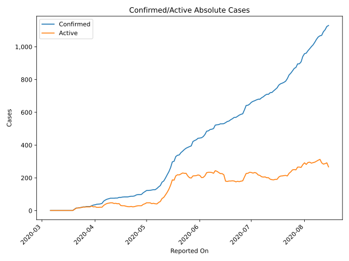
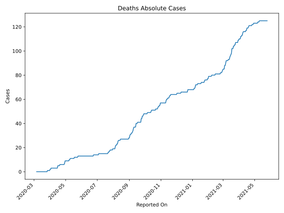
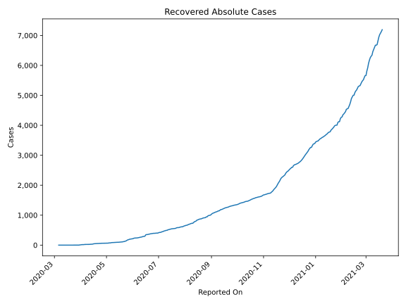
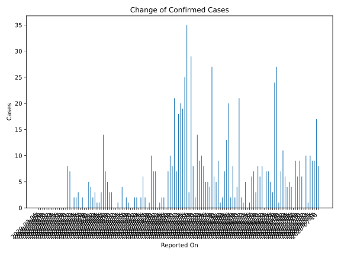
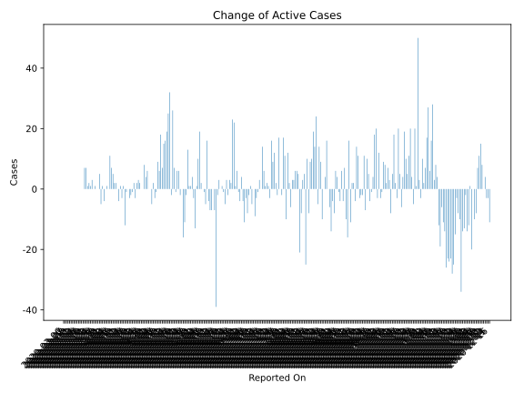
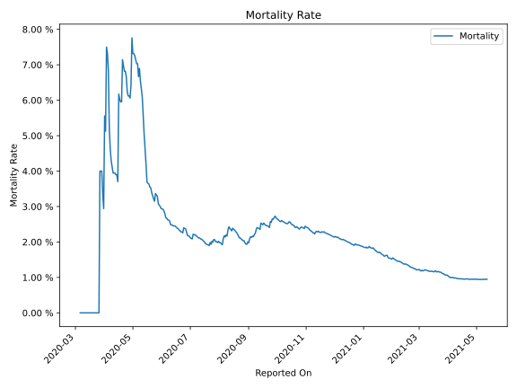

# Country Figures: Time Series for Togo 

| Reported On | Confirmed | Deaths | Recovered | Active | Mortality | &Delta; Confirmed | &Delta; Deaths | &Delta; Recovered | &Delta; Active | % Active of Population |
|-------------|-----------|--------|-----------|--------|-----------|-------------------|----------------|-------------------|----------------|------------------------|
| 2020-04-15 | 81 | 3 | 35 | 43 |  3.70 %  | 4 | 0 | 3 | 1 |  0.001 %  | 
| 2020-04-14 | 77 | 3 | 32 | 42 |  3.90 %  | 0 | 0 | 3 | -3 |  0.001 %  | 
| 2020-04-13 | 77 | 3 | 29 | 45 |  3.90 %  | 1 | 0 | 0 | 1 |  0.001 %  | 
| 2020-04-12 | 76 | 3 | 29 | 44 |  3.95 %  | 0 | 0 | 4 | -4 |  0.001 %  | 
| 2020-04-11 | 76 | 3 | 25 | 48 |  3.95 %  | 0 | 0 | 0 | 0 |  0.001 %  | 
| 2020-04-10 | 76 | 3 | 25 | 48 |  3.95 %  | 3 | 0 | 1 | 2 |  0.001 %  | 
| 2020-04-09 | 73 | 3 | 24 | 46 |  4.11 %  | 3 | 0 | 1 | 2 |  0.001 %  | 
| 2020-04-08 | 70 | 3 | 23 | 44 |  4.29 %  | 5 | 0 | 0 | 5 |  0.001 %  | 
| 2020-04-07 | 65 | 3 | 23 | 39 |  4.62 %  | 7 | 0 | 0 | 7 |  0.000 %  | 
| 2020-04-06 | 58 | 3 | 23 | 32 |  5.17 %  | 14 | 0 | 3 | 11 |  0.000 %  | 
| 2020-04-05 | 44 | 3 | 20 | 21 |  6.82 %  | 3 | 0 | 3 | 0 |  0.000 %  | 
| 2020-04-04 | 41 | 3 | 17 | 21 |  7.32 %  | 1 | 0 | 0 | 1 |  0.000 %  | 
| 2020-04-03 | 40 | 3 | 17 | 20 |  7.50 %  | 1 | 1 | 0 | 0 |  0.000 %  | 
| 2020-04-02 | 39 | 2 | 17 | 20 |  5.13 %  | 3 | 0 | 7 | -4 |  0.000 %  | 
| 2020-04-01 | 36 | 2 | 10 | 24 |  5.56 %  | 2 | 1 | 0 | 1 |  0.000 %  | 
| 2020-03-31 | 34 | 1 | 10 | 23 |  2.94 %  | 4 | 0 | 9 | -5 |  0.000 %  | 
| 2020-03-30 | 30 | 1 | 1 | 28 |  3.33 %  | 5 | 0 | 0 | 5 |  0.000 %  | 
| 2020-03-29 | 25 | 1 | 1 | 23 |  4.00 %  | 0 | 0 | 0 | 0 |  0.000 %  | 
| 2020-03-28 | 25 | 1 | 1 | 23 |  4.00 %  | 0 | 0 | 0 | 0 |  0.000 %  | 
| 2020-03-27 | 25 | 1 | 1 | 23 |  4.00 %  | 2 | 1 | 0 | 1 |  0.000 %  | 
| 2020-03-26 | 23 | 0 | 1 | 22 |  None  | 0 | 0 | 0 | 0 |  0.000 %  | 
| 2020-03-25 | 23 | 0 | 1 | 22 |  None  | 3 | 0 | 0 | 3 |  0.000 %  | 
| 2020-03-24 | 20 | 0 | 1 | 19 |  None  | 2 | 0 | 1 | 1 |  0.000 %  | 
| 2020-03-23 | 18 | 0 | 0 | 18 |  None  | 2 | 0 | 0 | 2 |  0.000 %  | 
| 2020-03-22 | 16 | 0 | 0 | 16 |  None  | 0 | 0 | -1 | 1 |  0.000 %  | 
| 2020-03-21 | 16 | 0 | 1 | 15 |  None  | 7 | 0 | 0 | 7 |  0.000 %  | 
| 2020-03-20 | 9 | 0 | 1 | 8 |  None  | 8 | 0 | 1 | 7 |  0.000 %  | 
| 2020-03-19 | 1 | 0 | 0 | 1 |  None  | 0 | 0 | 0 | 0 |  0.000 %  | 
| 2020-03-18 | 1 | 0 | 0 | 1 |  None  | 0 | 0 | 0 | 0 |  0.000 %  | 
| 2020-03-17 | 1 | 0 | 0 | 1 |  None  | 0 | 0 | 0 | 0 |  0.000 %  | 
| 2020-03-16 | 1 | 0 | 0 | 1 |  None  | 0 | 0 | 0 | 0 |  0.000 %  | 
| 2020-03-15 | 1 | 0 | 0 | 1 |  None  | 0 | 0 | 0 | 0 |  0.000 %  | 
| 2020-03-14 | 1 | 0 | 0 | 1 |  None  | 0 | 0 | 0 | 0 |  0.000 %  | 
| 2020-03-13 | 1 | 0 | 0 | 1 |  None  | 0 | 0 | 0 | 0 |  0.000 %  | 
| 2020-03-12 | 1 | 0 | 0 | 1 |  None  | 0 | 0 | 0 | 0 |  0.000 %  | 
| 2020-03-11 | 1 | 0 | 0 | 1 |  None  | 0 | 0 | 0 | 0 |  0.000 %  | 
| 2020-03-10 | 1 | 0 | 0 | 1 |  None  | 0 | 0 | 0 | 0 |  0.000 %  | 
| 2020-03-09 | 1 | 0 | 0 | 1 |  None  | 0 | 0 | 0 | 0 |  0.000 %  | 
| 2020-03-08 | 1 | 0 | 0 | 1 |  None  | 0 | 0 | 0 | 0 |  0.000 %  | 
| 2020-03-07 | 1 | 0 | 0 | 1 |  None  | 0 | 0 | 0 | 0 |  0.000 %  | 
| 2020-03-06 | 1 | 0 | 0 | 1 |  None  | None | None | None | None |  0.000 %  | 

