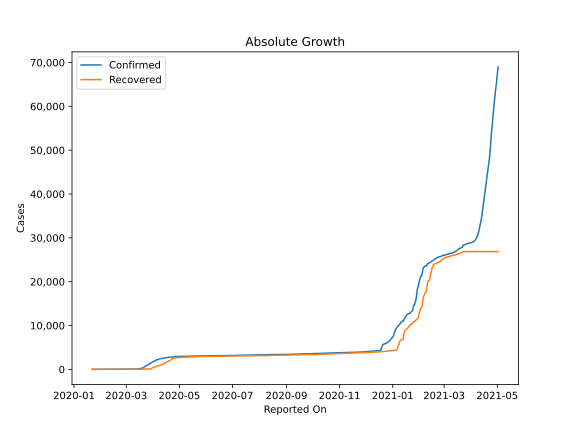
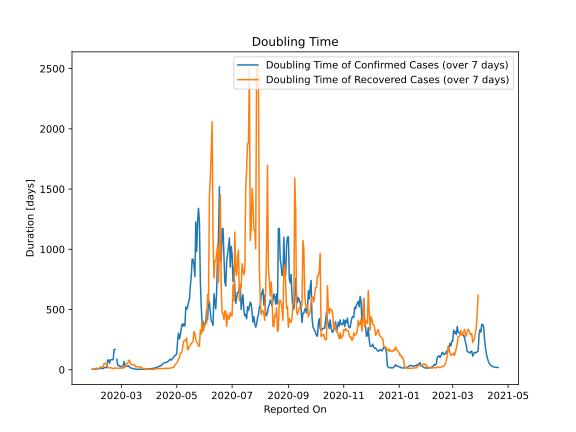

# Country Figures: Doubling Time of Infections for Thailand 

The doubling time below are calculated based on
* an exponential growth assumption
* for time difference of past seven (7) days.
The doubling time's unit is "days".

The first doubling time indicates the increase of confirmed (infected)
cases. There, the *higher* the number is, the better is to take control
of the disease.

The second doubling time indicates the increase of recovered (healed)
cases. There, the *lower* the number is, the better it is to take
control of the disease.

| Reported On | Confirmed | Doubling Time (Confirmed) | Recovered | Doubling Time (Recovered) |
|-------------|-----------|---------------------------|-----------|---------------------------|
| 2020-04-28 | 2938 |  110.1 days  | 2652 |  21.5 days  | 
| 2020-04-27 | 2931 |  100.2 days  | 2609 |  18.6 days  | 
| 2020-04-26 | 2922 |  88.2 days  | 2594 |  16.7 days  | 
| 2020-04-25 | 2907 |  79.0 days  | 2547 |  14.0 days  | 
| 2020-04-24 | 2907 |  66.0 days  | 2547 |  12.2 days  | 
| 2020-04-23 | 2839 |  80.4 days  | 2430 |  11.8 days  | 
| 2020-04-22 | 2826 |  72.8 days  | 2352 |  11.1 days  | 
| 2020-04-21 | 2811 |  66.8 days  | 2108 |  12.3 days  | 
| 2020-04-20 | 2792 |  61.5 days  | 1999 |  11.4 days  | 
| 2020-04-19 | 2765 |  60.6 days  | 1928 |  10.9 days  | 
| 2020-04-18 | 2733 |  59.6 days  | 1787 |  11.0 days  | 
| 2020-04-17 | 2700 |  55.6 days  | 1689 |  9.8 days  | 
| 2020-04-16 | 2672 |  49.9 days  | 1593 |  9.5 days  | 
| 2020-04-15 | 2643 |  44.7 days  | 1497 |  9.6 days  | 
| 2020-04-14 | 2613 |  33.6 days  | 1405 |  10.9 days  | 
| 2020-04-13 | 2579 |  32.7 days  | 1288 |  10.3 days  | 
| 2020-04-12 | 2551 |  30.3 days  | 1218 |  11.6 days  | 
| 2020-04-11 | 2518 |  24.9 days  | 1135 |  9.7 days  | 
| 2020-04-10 | 2473 |  22.1 days  | 1013 |  10.0 days  | 
| 2020-04-09 | 2423 |  19.3 days  | 940 |  8.2 days  | 
| 2020-04-08 | 2369 |  17.0 days  | 888 |  8.9 days  | 
| 2020-04-07 | 2258 |  15.8 days  | 888 |  5.4 days  | 
| 2020-04-06 | 2220 |  13.2 days  | 793 |  4.2 days  | 
| 2020-04-05 | 2169 |  11.2 days  | 793 |  2.6 days  | 
| 2020-04-04 | 2067 |  9.9 days  | 674 |  2.8 days  | 
| 2020-04-03 | 1978 |  9.1 days  | 612 |  3.0 days  | 
| 2020-04-02 | 1875 |  8.6 days  | 505 |  3.1 days  | 
| 2020-04-01 | 1771 |  7.9 days  | 505 |  2.8 days  | 
| 2020-03-31 | 1651 |  7.4 days  | 342 |  2.9 days  | 
| 2020-03-30 | 1524 |  6.8 days  | 229 |  3.6 days  | 
| 2020-03-29 | 1388 |  6.1 days  | 97 |  6.5 days  | 
| 2020-03-28 | 1245 |  4.7 days  | 97 |  6.1 days  | 
| 2020-03-27 | 1136 |  4.2 days  | 97 |  6.1 days  | 
| 2020-03-26 | 1045 |  3.9 days  | 88 |  6.9 days  | 
| 2020-03-25 | 934 |  3.6 days  | 70 |  9.8 days  | 
| 2020-03-24 | 827 |  3.5 days  | 52 |  20.8 days  | 
| 2020-03-23 | 721 |  3.4 days  | 52 |  12.6 days  | 
| 2020-03-22 | 599 |  3.3 days  | 44 |  21.5 days  | 
| 2020-03-21 | 411 |  3.3 days  | 42 |  27.0 days  | 
| 2020-03-20 | 322 |  3.7 days  | 42 |  27.0 days  | 
| 2020-03-19 | 272 |  3.9 days  | 42 |  23.3 days  | 
| 2020-03-18 | 212 |  4.1 days  | 42 |  23.3 days  | 
| 2020-03-17 | 177 |  4.4 days  | 41 |  22.7 days  | 
| 2020-03-16 | 147 |  4.8 days  | 35 |  40.3 days  | 
| 2020-03-15 | 114 |  6.2 days  | 35 |  40.3 days  | 
| 2020-03-14 | 82 |  10.2 days  | 35 |  40.3 days  | 
| 2020-03-13 | 75 |  11.2 days  | 35 |  40.3 days  | 
| 2020-03-12 | 70 |  12.5 days  | 34 |  52.9 days  | 
| 2020-03-11 | 59 |  15.7 days  | 34 |  52.9 days  | 
| 2020-03-10 | 53 |  23.6 days  | 33 |  78.0 days  | 
| 2020-03-09 | 50 |  32.5 days  | 31 |  None  | 
| 2020-03-08 | 50 |  28.2 days  | 31 |  48.0 days  | 
| 2020-03-07 | 50 |  28.2 days  | 31 |  48.0 days  | 
| 2020-03-06 | 48 |  31.1 days  | 31 |  48.0 days  | 
| 2020-03-05 | 47 |  30.4 days  | 31 |  14.5 days  | 
| 2020-03-04 | 43 |  67.4 days  | 31 |  14.5 days  | 
| 2020-03-03 | 43 |  32.6 days  | 31 |  14.5 days  | 
| 2020-03-02 | 43 |  23.9 days  | 31 |  12.8 days  | 
| 2020-03-01 | 42 |  27.0 days  | 28 |  17.2 days  | 
| 2020-02-29 | 42 |  27.0 days  | 28 |  10.1 days  | 
| 2020-02-28 | 41 |  31.0 days  | 28 |  10.1 days  | 
| 2020-02-27 | 40 |  36.7 days  | 22 |  13.0 days  | 
| 2020-02-26 | 40 |  36.7 days  | 22 |  13.0 days  | 
| 2020-02-25 | 37 |  87.7 days  | 22 |  13.0 days  | 
| 2020-02-24 | 35 |  None  | 21 |  14.8 days  | 
| 2020-02-23 | 35 |  167.7 days  | 21 |  12.3 days  | 
| 2020-02-22 | 35 |  82.8 days  | 17 |  14.3 days  | 
| 2020-02-21 | 35 |  82.8 days  | 17 |  14.3 days  | 
| 2020-02-20 | 35 |  82.8 days  | 15 |  22.1 days  | 
| 2020-02-19 | 35 |  82.8 days  | 15 |  12.3 days  | 
| 2020-02-18 | 35 |  82.8 days  | 15 |  12.3 days  | 
| 2020-02-17 | 35 |  54.5 days  | 15 |  12.3 days  | 
| 2020-02-16 | 34 |  80.4 days  | 14 |  14.8 days  | 
| 2020-02-15 | 33 |  158.0 days  | 12 |  27.0 days  | 
| 2020-02-14 | 33 |  17.8 days  | 12 |  5.9 days  | 
| 2020-02-13 | 33 |  17.8 days  | 12 |  5.9 days  | 
| 2020-02-12 | 33 |  17.8 days  | 10 |  7.3 days  | 
| 2020-02-11 | 33 |  17.8 days  | 10 |  7.3 days  | 
| 2020-02-10 | 32 |  9.7 days  | 10 |  7.3 days  | 
| 2020-02-09 | 32 |  9.7 days  | 10 |  7.3 days  | 
| 2020-02-08 | 32 |  9.7 days  | 10 |  7.3 days  | 
| 2020-02-07 | 25 |  None  | 5 |  None  | 
| 2020-02-06 | 25 |  None  | 5 |  None  | 
| 2020-02-05 | 25 |  None  | 5 |  None  | 
| 2020-02-04 | 25 |  None  | 5 |  None  | 
| 2020-02-03 | 19 |  None  | 5 |  None  | 
| 2020-02-02 | 19 |  None  | 5 |  None  | 
| 2020-02-01 | 19 |  None  | 5 |  None  | 

