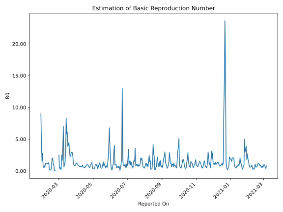

# Country Figures: Time Series for Basic Reproduction Number of Thailand 

| Reported On | &Delta; Confirmed | Total &Delta; Confirmed First Interval | Total &Delta; Confirmed Second Interval | Estimated Basic Reproduction Number R0 | 
|-------------|-------------------|----------------------------------------|-----------------------------------------|---------------------------------------------------|
| 2020-04-30 | 7 |  40  |  96  |  0.42  | 
| 2020-04-29 | 9 |  31  |  115  |  0.27  | 
| 2020-04-28 | 7 |  92  |  74  |  1.24  | 
| 2020-04-27 | 9 |  96  |  93  |  1.03  | 
| 2020-04-26 | 15 |  96  |  111  |  0.86  | 
| 2020-04-25 | 0 |  115  |  120  |  0.96  | 
| 2020-04-24 | 68 |  74  |  122  |  0.61  | 
| 2020-04-23 | 13 |  93  |  120  |  0.78  | 
| 2020-04-22 | 15 |  111  |  121  |  0.92  | 
| 2020-04-21 | 19 |  120  |  121  |  0.99  | 
| 2020-04-20 | 27 |  122  |  125  |  0.98  | 
| 2020-04-19 | 32 |  120  |  140  |  0.86  | 
| 2020-04-18 | 33 |  121  |  156  |  0.78  | 
| 2020-04-17 | 28 |  121  |  182  |  0.66  | 
| 2020-04-16 | 29 |  125  |  260  |  0.48  | 
| 2020-04-15 | 30 |  140  |  253  |  0.55  | 
| 2020-04-14 | 34 |  156  |  254  |  0.61  | 
| 2020-04-13 | 28 |  182  |  302  |  0.60  | 
| 2020-04-12 | 33 |  260  |  280  |  0.93  | 
| 2020-04-11 | 45 |  253  |  345  |  0.73  | 
| 2020-04-10 | 50 |  254  |  398  |  0.64  | 
| 2020-04-09 | 54 |  302  |  416  |  0.73  | 
| 2020-04-08 | 111 |  280  |  454  |  0.62  | 
| 2020-04-07 | 38 |  345  |  487  |  0.71  | 
| 2020-04-06 | 51 |  398  |  526  |  0.76  | 
| 2020-04-05 | 102 |  416  |  515  |  0.81  | 
| 2020-04-04 | 89 |  454  |  479  |  0.95  | 
| 2020-04-03 | 103 |  487  |  454  |  1.07  | 
| 2020-04-02 | 104 |  526  |  418  |  1.26  | 
| 2020-04-01 | 120 |  515  |  415  |  1.24  | 
| 2020-03-31 | 127 |  479  |  446  |  1.07  | 
| 2020-03-30 | 136 |  454  |  523  |  0.87  | 
| 2020-03-29 | 143 |  418  |  505  |  0.83  | 
| 2020-03-28 | 109 |  415  |  449  |  0.92  | 
| 2020-03-27 | 91 |  446  |  387  |  1.15  | 
| 2020-03-26 | 111 |  523  |  234  |  2.24  | 
| 2020-03-25 | 107 |  505  |  175  |  2.89  | 
| 2020-03-24 | 106 |  449  |  158  |  2.84  | 
| 2020-03-23 | 122 |  387  |  130  |  2.98  | 
| 2020-03-22 | 188 |  234  |  102  |  2.29  | 
| 2020-03-21 | 89 |  175  |  77  |  2.27  | 
| 2020-03-20 | 50 |  158  |  55  |  2.87  | 
| 2020-03-19 | 60 |  130  |  29  |  4.48  | 
| 2020-03-18 | 35 |  102  |  25  |  4.08  | 
| 2020-03-17 | 30 |  77  |  20  |  3.85  | 
| 2020-03-16 | 33 |  55  |  9  |  6.11  | 
| 2020-03-15 | 32 |  29  |  5  |  5.80  | 
| 2020-03-14 | 7 |  25  |  3  |  8.33  | 
| 2020-03-13 | 5 |  20  |  7  |  2.86  | 
| 2020-03-12 | 11 |  9  |  7  |  1.29  | 
| 2020-03-11 | 6 |  5  |  5  |  1.00  | 
| 2020-03-10 | 3 |  3  |  5  |  0.60  | 
| 2020-03-09 | 0 |  7  |  1  |  7.00  | 
| 2020-03-08 | 0 |  7  |  2  |  3.50  | 
| 2020-03-07 | 2 |  5  |  3  |  1.67  | 
| 2020-03-06 | 1 |  5  |  2  |  2.50  | 
| 2020-03-05 | 4 |  1  |  5  |  0.20  | 
| 2020-03-04 | 0 |  2  |  6  |  0.33  | 
| 2020-03-03 | 0 |  3  |  5  |  0.60  | 
| 2020-03-02 | 1 |  2  |  5  |  0.40  | 
| 2020-03-01 | 0 |  5  |  2  |  2.50  | 
| 2020-02-29 | 1 |  6  |  None  |  None  | 
| 2020-02-28 | 1 |  5  |  None  |  None  | 
| 2020-02-27 | 0 |  5  |  None  |  None  | 
| 2020-02-26 | 3 |  2  |  None  |  None  | 
| 2020-02-25 | 2 |  None  |  1  |  None  | 
| 2020-02-24 | 0 |  None  |  2  |  None  | 
| 2020-02-23 | 0 |  None  |  2  |  None  | 
| 2020-02-22 | 0 |  None  |  2  |  None  | 
| 2020-02-21 | 0 |  1  |  1  |  1.00  | 
| 2020-02-20 | 0 |  2  |  None  |  None  | 
| 2020-02-19 | 0 |  2  |  1  |  2.00  | 
| 2020-02-18 | 0 |  2  |  1  |  2.00  | 
| 2020-02-17 | 1 |  1  |  1  |  1.00  | 
| 2020-02-16 | 1 |  None  |  8  |  None  | 
| 2020-02-15 | 0 |  1  |  7  |  0.14  | 
| 2020-02-14 | 0 |  1  |  7  |  0.14  | 
| 2020-02-13 | 0 |  1  |  7  |  0.14  | 
| 2020-02-12 | 0 |  8  |  6  |  1.33  | 
| 2020-02-11 | 1 |  7  |  6  |  1.17  | 
| 2020-02-10 | 0 |  7  |  6  |  1.17  | 
| 2020-02-09 | 0 |  7  |  6  |  1.17  | 
| 2020-02-08 | 7 |  6  |  5  |  1.20  | 
| 2020-02-07 | 0 |  6  |  5  |  1.20  | 
| 2020-02-06 | 0 |  6  |  5  |  1.20  | 
| 2020-02-05 | 0 |  6  |  11  |  0.55  | 
| 2020-02-04 | 6 |  5  |  6  |  0.83  | 
| 2020-02-03 | 0 |  5  |  7  |  0.71  | 
| 2020-02-02 | 0 |  5  |  9  |  0.56  | 
| 2020-02-01 | 0 |  11  |  5  |  2.20  | 
| 2020-01-31 | 5 |  6  |  6  |  1.00  | 
| 2020-01-30 | 0 |  7  |  5  |  1.40  | 
| 2020-01-29 | 0 |  9  |  3  |  3.00  | 
| 2020-01-28 | 6 |  5  |  1  |  5.00  | 
| 2020-01-27 | 0 |  6  |  None  |  None  | 
| 2020-01-26 | 1 |  5  |  None  |  None  | 
| 2020-01-25 | 2 |  3  |  None  |  None  | 
| 2020-01-24 | 2 |  1  |  None  |  None  | 
| 2020-01-23 | 1 |  None  |  None  |  None  | 
| 2020-01-22 | None |  None  |  None  |  None  | 

