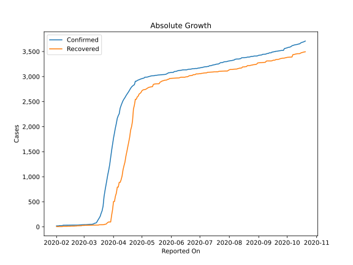
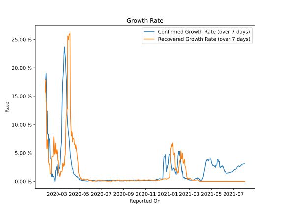

# Country Figures: Growth Rate for Thailand 

The growth rates below are calculated based on
* an exponential growth assumption
* for time difference of past seven (7) days.
The growth rate is to be understood as on "growth per day".

The first growth rate indicates the increase of confirmed (infected) cases.

The second growth rate indicates the increase of recovered (healed) cases.

| Reported On | Confirmed | Growth Rate (Confirmed) | Recovered | Growth Rate (Recovered) |
|-------------|-----------|-------------------------|-----------|-------------------------|
| 2020-05-07 | 2992 |  0.18 %  | 2772 |  0.461 %  | 
| 2020-05-06 | 2989 |  0.20 %  | 2761 |  0.506 %  | 
| 2020-05-05 | 2988 |  0.24 %  | 2747 |  0.503 %  | 
| 2020-05-04 | 2987 |  0.27 %  | 2740 |  0.700 %  | 
| 2020-05-03 | 2969 |  0.23 %  | 2739 |  0.777 %  | 
| 2020-05-02 | 2966 |  0.29 %  | 2732 |  1.002 %  | 
| 2020-05-01 | 2960 |  0.26 %  | 2719 |  0.934 %  | 
| 2020-04-30 | 2954 |  0.57 %  | 2684 |  1.420 %  | 
| 2020-04-29 | 2947 |  0.60 %  | 2665 |  1.785 %  | 
| 2020-04-28 | 2938 |  0.63 %  | 2652 |  3.280 %  | 
| 2020-04-27 | 2931 |  0.69 %  | 2609 |  3.805 %  | 
| 2020-04-26 | 2922 |  0.79 %  | 2594 |  4.239 %  | 
| 2020-04-25 | 2907 |  0.88 %  | 2547 |  5.063 %  | 
| 2020-04-24 | 2907 |  1.06 %  | 2547 |  5.868 %  | 
| 2020-04-23 | 2839 |  0.87 %  | 2430 |  6.032 %  | 
| 2020-04-22 | 2826 |  0.96 %  | 2352 |  6.454 %  | 
| 2020-04-21 | 2811 |  1.04 %  | 2108 |  5.796 %  | 
| 2020-04-20 | 2792 |  1.13 %  | 1999 |  6.279 %  | 
| 2020-04-19 | 2765 |  1.15 %  | 1928 |  6.561 %  | 
| 2020-04-18 | 2733 |  1.17 %  | 1787 |  6.484 %  | 
| 2020-04-17 | 2700 |  1.25 %  | 1689 |  7.303 %  | 
| 2020-04-16 | 2672 |  1.40 %  | 1593 |  7.536 %  | 
| 2020-04-15 | 2643 |  1.56 %  | 1497 |  7.461 %  | 
| 2020-04-14 | 2613 |  2.09 %  | 1405 |  6.555 %  | 
| 2020-04-13 | 2579 |  2.14 %  | 1288 |  6.929 %  | 
| 2020-04-12 | 2551 |  2.32 %  | 1218 |  6.131 %  | 
| 2020-04-11 | 2518 |  2.82 %  | 1135 |  7.445 %  | 
| 2020-04-10 | 2473 |  3.19 %  | 1013 |  7.199 %  | 
| 2020-04-09 | 2423 |  3.66 %  | 940 |  8.876 %  | 
| 2020-04-08 | 2369 |  4.16 %  | 888 |  8.063 %  | 
| 2020-04-07 | 2258 |  4.47 %  | 888 |  13.631 %  | 
| 2020-04-06 | 2220 |  5.37 %  | 793 |  17.744 %  | 
| 2020-04-05 | 2169 |  6.38 %  | 793 |  30.016 %  | 
| 2020-04-04 | 2067 |  7.24 %  | 674 |  27.693 %  | 
| 2020-04-03 | 1978 |  7.92 %  | 612 |  26.315 %  | 
| 2020-04-02 | 1875 |  8.35 %  | 505 |  24.960 %  | 
| 2020-04-01 | 1771 |  9.14 %  | 505 |  28.229 %  | 
| 2020-03-31 | 1651 |  9.88 %  | 342 |  26.908 %  | 
| 2020-03-30 | 1524 |  10.69 %  | 229 |  21.178 %  | 
| 2020-03-29 | 1388 |  12.01 %  | 97 |  11.293 %  | 
| 2020-03-28 | 1245 |  15.83 %  | 97 |  11.958 %  | 
| 2020-03-27 | 1136 |  18.01 %  | 97 |  11.958 %  | 
| 2020-03-26 | 1045 |  19.23 %  | 88 |  10.567 %  | 
| 2020-03-25 | 934 |  21.18 %  | 70 |  7.298 %  | 
| 2020-03-24 | 827 |  22.02 %  | 52 |  3.395 %  | 
| 2020-03-23 | 721 |  22.72 %  | 52 |  5.656 %  | 
| 2020-03-22 | 599 |  23.70 %  | 44 |  3.269 %  | 
| 2020-03-21 | 411 |  23.03 %  | 42 |  2.605 %  | 
| 2020-03-20 | 322 |  20.82 %  | 42 |  2.605 %  | 
| 2020-03-19 | 272 |  19.39 %  | 42 |  3.019 %  | 
| 2020-03-18 | 212 |  18.27 %  | 42 |  3.019 %  | 
| 2020-03-17 | 177 |  17.23 %  | 41 |  3.101 %  | 
| 2020-03-16 | 147 |  15.41 %  | 35 |  1.734 %  | 
| 2020-03-15 | 114 |  11.77 %  | 35 |  1.734 %  | 
| 2020-03-14 | 82 |  7.07 %  | 35 |  1.734 %  | 
| 2020-03-13 | 75 |  6.38 %  | 35 |  1.734 %  | 
| 2020-03-12 | 70 |  5.69 %  | 34 |  1.320 %  | 
| 2020-03-11 | 59 |  4.52 %  | 34 |  1.320 %  | 
| 2020-03-10 | 53 |  2.99 %  | 33 |  0.893 %  | 
| 2020-03-09 | 50 |  2.15 %  | 31 |  None  | 
| 2020-03-08 | 50 |  2.49 %  | 31 |  1.454 %  | 
| 2020-03-07 | 50 |  2.49 %  | 31 |  1.454 %  | 
| 2020-03-06 | 48 |  2.25 %  | 31 |  1.454 %  | 
| 2020-03-05 | 47 |  2.30 %  | 31 |  4.899 %  | 
| 2020-03-04 | 43 |  1.03 %  | 31 |  4.899 %  | 
| 2020-03-03 | 43 |  2.15 %  | 31 |  4.899 %  | 
| 2020-03-02 | 43 |  2.94 %  | 31 |  5.564 %  | 
| 2020-03-01 | 42 |  2.60 %  | 28 |  4.110 %  | 
| 2020-02-29 | 42 |  2.60 %  | 28 |  7.128 %  | 
| 2020-02-28 | 41 |  2.26 %  | 28 |  7.128 %  | 
| 2020-02-27 | 40 |  1.91 %  | 22 |  5.471 %  | 
| 2020-02-26 | 40 |  1.91 %  | 22 |  5.471 %  | 
| 2020-02-25 | 37 |  0.79 %  | 22 |  5.471 %  | 
| 2020-02-24 | 35 |  None  | 21 |  4.807 %  | 
| 2020-02-23 | 35 |  0.41 %  | 21 |  5.792 %  | 
| 2020-02-22 | 35 |  0.84 %  | 17 |  4.976 %  | 
| 2020-02-21 | 35 |  0.84 %  | 17 |  4.976 %  | 
| 2020-02-20 | 35 |  0.84 %  | 15 |  3.188 %  | 
| 2020-02-19 | 35 |  0.84 %  | 15 |  5.792 %  | 
| 2020-02-18 | 35 |  0.84 %  | 15 |  5.792 %  | 
| 2020-02-17 | 35 |  1.28 %  | 15 |  5.792 %  | 
| 2020-02-16 | 34 |  0.87 %  | 14 |  4.807 %  | 
| 2020-02-15 | 33 |  0.44 %  | 12 |  2.605 %  | 
| 2020-02-14 | 33 |  3.97 %  | 12 |  12.507 %  | 
| 2020-02-13 | 33 |  3.97 %  | 12 |  12.507 %  | 
| 2020-02-12 | 33 |  3.97 %  | 10 |  9.902 %  | 
| 2020-02-11 | 33 |  3.97 %  | 10 |  9.902 %  | 
| 2020-02-10 | 32 |  7.45 %  | 10 |  9.902 %  | 
| 2020-02-09 | 32 |  7.45 %  | 10 |  9.902 %  | 
| 2020-02-08 | 32 |  7.45 %  | 10 |  9.902 %  | 
| 2020-02-07 | 25 |  None  | 5 |  None  | 
| 2020-02-06 | 25 |  None  | 5 |  None  | 
| 2020-02-05 | 25 |  None  | 5 |  None  | 
| 2020-02-04 | 25 |  None  | 5 |  None  | 
| 2020-02-03 | 19 |  None  | 5 |  None  | 
| 2020-02-02 | 19 |  None  | 5 |  None  | 
| 2020-02-01 | 19 |  None  | 5 |  None  | 

