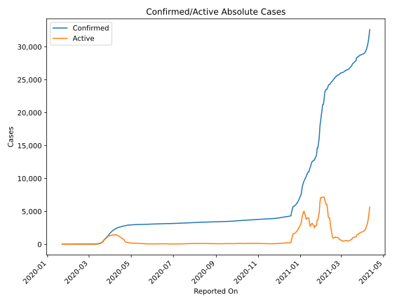
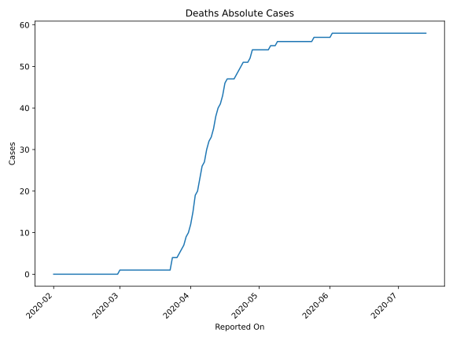
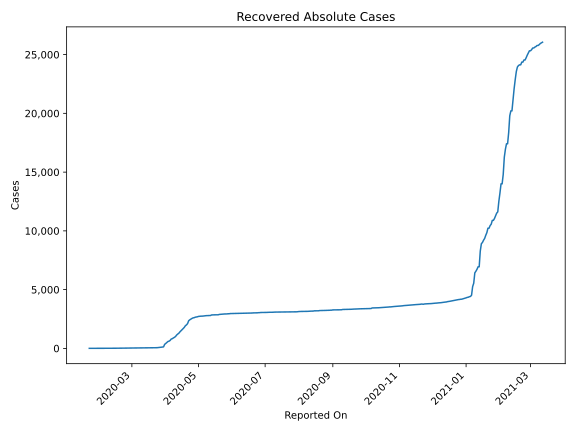
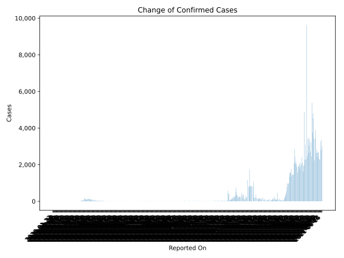
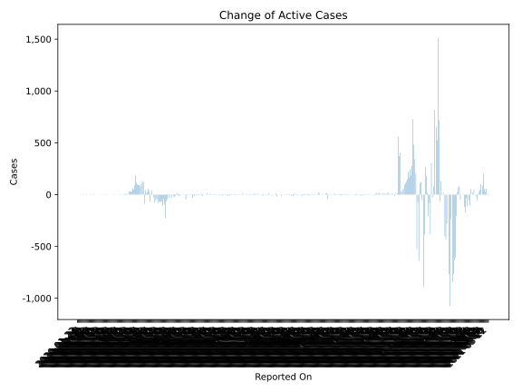
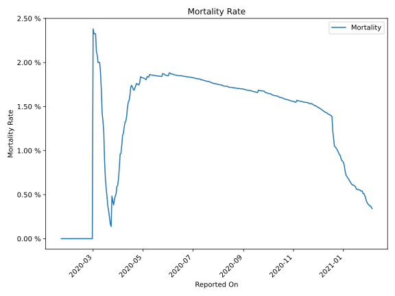

# Country Figures: Time Series for Thailand 

| Reported On | Confirmed | Deaths | Recovered | Active | Mortality | &Delta; Confirmed | &Delta; Deaths | &Delta; Recovered | &Delta; Active | % Active of Population |
|-------------|-----------|--------|-----------|--------|-----------|-------------------|----------------|-------------------|----------------|------------------------|
| 2020-05-08 | 3000 | 55 | 2784 | 161 |  1.83 %  | 8 | 0 | 12 | -4 |  0.000 %  | 
| 2020-05-07 | 2992 | 55 | 2772 | 165 |  1.84 %  | 3 | 0 | 11 | -8 |  0.000 %  | 
| 2020-05-06 | 2989 | 55 | 2761 | 173 |  1.84 %  | 1 | 1 | 14 | -14 |  0.000 %  | 
| 2020-05-05 | 2988 | 54 | 2747 | 187 |  1.81 %  | 1 | 0 | 7 | -6 |  0.000 %  | 
| 2020-05-04 | 2987 | 54 | 2740 | 193 |  1.81 %  | 18 | 0 | 1 | 17 |  0.000 %  | 
| 2020-05-03 | 2969 | 54 | 2739 | 176 |  1.82 %  | 3 | 0 | 7 | -4 |  0.000 %  | 
| 2020-05-02 | 2966 | 54 | 2732 | 180 |  1.82 %  | 6 | 0 | 13 | -7 |  0.000 %  | 
| 2020-05-01 | 2960 | 54 | 2719 | 187 |  1.82 %  | 6 | 0 | 35 | -29 |  0.000 %  | 
| 2020-04-30 | 2954 | 54 | 2684 | 216 |  1.83 %  | 7 | 0 | 19 | -12 |  0.000 %  | 
| 2020-04-29 | 2947 | 54 | 2665 | 228 |  1.83 %  | 9 | 0 | 13 | -4 |  0.000 %  | 
| 2020-04-28 | 2938 | 54 | 2652 | 232 |  1.84 %  | 7 | 2 | 43 | -38 |  0.000 %  | 
| 2020-04-27 | 2931 | 52 | 2609 | 270 |  1.77 %  | 9 | 1 | 15 | -7 |  0.000 %  | 
| 2020-04-26 | 2922 | 51 | 2594 | 277 |  1.75 %  | 15 | 0 | 47 | -32 |  0.000 %  | 
| 2020-04-25 | 2907 | 51 | 2547 | 309 |  1.75 %  | 0 | 0 | 0 | 0 |  0.000 %  | 
| 2020-04-24 | 2907 | 51 | 2547 | 309 |  1.75 %  | 68 | 1 | 117 | -50 |  0.000 %  | 
| 2020-04-23 | 2839 | 50 | 2430 | 359 |  1.76 %  | 13 | 1 | 78 | -66 |  0.001 %  | 
| 2020-04-22 | 2826 | 49 | 2352 | 425 |  1.73 %  | 15 | 1 | 244 | -230 |  0.001 %  | 
| 2020-04-21 | 2811 | 48 | 2108 | 655 |  1.71 %  | 19 | 1 | 109 | -91 |  0.001 %  | 
| 2020-04-20 | 2792 | 47 | 1999 | 746 |  1.68 %  | 27 | 0 | 71 | -44 |  0.001 %  | 
| 2020-04-19 | 2765 | 47 | 1928 | 790 |  1.70 %  | 32 | 0 | 141 | -109 |  0.001 %  | 
| 2020-04-18 | 2733 | 47 | 1787 | 899 |  1.72 %  | 33 | 0 | 98 | -65 |  0.001 %  | 
| 2020-04-17 | 2700 | 47 | 1689 | 964 |  1.74 %  | 28 | 1 | 96 | -69 |  0.001 %  | 
| 2020-04-16 | 2672 | 46 | 1593 | 1033 |  1.72 %  | 29 | 3 | 96 | -70 |  0.001 %  | 
| 2020-04-15 | 2643 | 43 | 1497 | 1103 |  1.63 %  | 30 | 2 | 92 | -64 |  0.002 %  | 
| 2020-04-14 | 2613 | 41 | 1405 | 1167 |  1.57 %  | 34 | 1 | 117 | -84 |  0.002 %  | 
| 2020-04-13 | 2579 | 40 | 1288 | 1251 |  1.55 %  | 28 | 2 | 70 | -44 |  0.002 %  | 
| 2020-04-12 | 2551 | 38 | 1218 | 1295 |  1.49 %  | 33 | 3 | 83 | -53 |  0.002 %  | 
| 2020-04-11 | 2518 | 35 | 1135 | 1348 |  1.39 %  | 45 | 2 | 122 | -79 |  0.002 %  | 
| 2020-04-10 | 2473 | 33 | 1013 | 1427 |  1.33 %  | 50 | 1 | 73 | -24 |  0.002 %  | 
| 2020-04-09 | 2423 | 32 | 940 | 1451 |  1.32 %  | 54 | 2 | 52 | 0 |  0.002 %  | 
| 2020-04-08 | 2369 | 30 | 888 | 1451 |  1.27 %  | 111 | 3 | 0 | 108 |  0.002 %  | 
| 2020-04-07 | 2258 | 27 | 888 | 1343 |  1.20 %  | 38 | 1 | 95 | -58 |  0.002 %  | 
| 2020-04-06 | 2220 | 26 | 793 | 1401 |  1.17 %  | 51 | 3 | 0 | 48 |  0.002 %  | 
| 2020-04-05 | 2169 | 23 | 793 | 1353 |  1.06 %  | 102 | 3 | 119 | -20 |  0.002 %  | 
| 2020-04-04 | 2067 | 20 | 674 | 1373 |  0.97 %  | 89 | 1 | 62 | 26 |  0.002 %  | 
| 2020-04-03 | 1978 | 19 | 612 | 1347 |  0.96 %  | 103 | 4 | 107 | -8 |  0.002 %  | 
| 2020-04-02 | 1875 | 15 | 505 | 1355 |  0.80 %  | 104 | 3 | 0 | 101 |  0.002 %  | 
| 2020-04-01 | 1771 | 12 | 505 | 1254 |  0.68 %  | 120 | 2 | 163 | -45 |  0.002 %  | 
| 2020-03-31 | 1651 | 10 | 342 | 1299 |  0.61 %  | 127 | 1 | 113 | 13 |  0.002 %  | 
| 2020-03-30 | 1524 | 9 | 229 | 1286 |  0.59 %  | 136 | 2 | 132 | 2 |  0.002 %  | 
| 2020-03-29 | 1388 | 7 | 97 | 1284 |  0.50 %  | 143 | 1 | 0 | 142 |  0.002 %  | 
| 2020-03-28 | 1245 | 6 | 97 | 1142 |  0.48 %  | 109 | 1 | 0 | 108 |  0.002 %  | 
| 2020-03-27 | 1136 | 5 | 97 | 1034 |  0.44 %  | 91 | 1 | 9 | 81 |  0.001 %  | 
| 2020-03-26 | 1045 | 4 | 88 | 953 |  0.38 %  | 111 | 0 | 18 | 93 |  0.001 %  | 
| 2020-03-25 | 934 | 4 | 70 | 860 |  0.43 %  | 107 | 0 | 18 | 89 |  0.001 %  | 
| 2020-03-24 | 827 | 4 | 52 | 771 |  0.48 %  | 106 | 3 | 0 | 103 |  0.001 %  | 
| 2020-03-23 | 721 | 1 | 52 | 668 |  0.14 %  | 122 | 0 | 8 | 114 |  0.001 %  | 
| 2020-03-22 | 599 | 1 | 44 | 554 |  0.17 %  | 188 | 0 | 2 | 186 |  0.001 %  | 
| 2020-03-21 | 411 | 1 | 42 | 368 |  0.24 %  | 89 | 0 | 0 | 89 |  0.001 %  | 
| 2020-03-20 | 322 | 1 | 42 | 279 |  0.31 %  | 50 | 0 | 0 | 50 |  0.000 %  | 
| 2020-03-19 | 272 | 1 | 42 | 229 |  0.37 %  | 60 | 0 | 0 | 60 |  0.000 %  | 
| 2020-03-18 | 212 | 1 | 42 | 169 |  0.47 %  | 35 | 0 | 1 | 34 |  0.000 %  | 
| 2020-03-17 | 177 | 1 | 41 | 135 |  0.56 %  | 30 | 0 | 6 | 24 |  0.000 %  | 
| 2020-03-16 | 147 | 1 | 35 | 111 |  0.68 %  | 33 | 0 | 0 | 33 |  0.000 %  | 
| 2020-03-15 | 114 | 1 | 35 | 78 |  0.88 %  | 32 | 0 | 0 | 32 |  0.000 %  | 
| 2020-03-14 | 82 | 1 | 35 | 46 |  1.22 %  | 7 | 0 | 0 | 7 |  0.000 %  | 
| 2020-03-13 | 75 | 1 | 35 | 39 |  1.33 %  | 5 | 0 | 1 | 4 |  0.000 %  | 
| 2020-03-12 | 70 | 1 | 34 | 35 |  1.43 %  | 11 | 0 | 0 | 11 |  0.000 %  | 
| 2020-03-11 | 59 | 1 | 34 | 24 |  1.69 %  | 6 | 0 | 1 | 5 |  0.000 %  | 
| 2020-03-10 | 53 | 1 | 33 | 19 |  1.89 %  | 3 | 0 | 2 | 1 |  0.000 %  | 
| 2020-03-09 | 50 | 1 | 31 | 18 |  2.00 %  | 0 | 0 | 0 | 0 |  0.000 %  | 
| 2020-03-08 | 50 | 1 | 31 | 18 |  2.00 %  | 0 | 0 | 0 | 0 |  0.000 %  | 
| 2020-03-07 | 50 | 1 | 31 | 18 |  2.00 %  | 2 | 0 | 0 | 2 |  0.000 %  | 
| 2020-03-06 | 48 | 1 | 31 | 16 |  2.08 %  | 1 | 0 | 0 | 1 |  0.000 %  | 
| 2020-03-05 | 47 | 1 | 31 | 15 |  2.13 %  | 4 | 0 | 0 | 4 |  0.000 %  | 
| 2020-03-04 | 43 | 1 | 31 | 11 |  2.33 %  | 0 | 0 | 0 | 0 |  0.000 %  | 
| 2020-03-03 | 43 | 1 | 31 | 11 |  2.33 %  | 0 | 0 | 0 | 0 |  0.000 %  | 
| 2020-03-02 | 43 | 1 | 31 | 11 |  2.33 %  | 1 | 0 | 3 | -2 |  0.000 %  | 
| 2020-03-01 | 42 | 1 | 28 | 13 |  2.38 %  | 0 | 1 | 0 | -1 |  0.000 %  | 
| 2020-02-29 | 42 | 0 | 28 | 14 |  None  | 1 | 0 | 0 | 1 |  0.000 %  | 
| 2020-02-28 | 41 | 0 | 28 | 13 |  None  | 1 | 0 | 6 | -5 |  0.000 %  | 
| 2020-02-27 | 40 | 0 | 22 | 18 |  None  | 0 | 0 | 0 | 0 |  0.000 %  | 
| 2020-02-26 | 40 | 0 | 22 | 18 |  None  | 3 | 0 | 0 | 3 |  0.000 %  | 
| 2020-02-25 | 37 | 0 | 22 | 15 |  None  | 2 | 0 | 1 | 1 |  0.000 %  | 
| 2020-02-24 | 35 | 0 | 21 | 14 |  None  | 0 | 0 | 0 | 0 |  0.000 %  | 
| 2020-02-23 | 35 | 0 | 21 | 14 |  None  | 0 | 0 | 4 | -4 |  0.000 %  | 
| 2020-02-22 | 35 | 0 | 17 | 18 |  None  | 0 | 0 | 0 | 0 |  0.000 %  | 
| 2020-02-21 | 35 | 0 | 17 | 18 |  None  | 0 | 0 | 2 | -2 |  0.000 %  | 
| 2020-02-20 | 35 | 0 | 15 | 20 |  None  | 0 | 0 | 0 | 0 |  0.000 %  | 
| 2020-02-19 | 35 | 0 | 15 | 20 |  None  | 0 | 0 | 0 | 0 |  0.000 %  | 
| 2020-02-18 | 35 | 0 | 15 | 20 |  None  | 0 | 0 | 0 | 0 |  0.000 %  | 
| 2020-02-17 | 35 | 0 | 15 | 20 |  None  | 1 | 0 | 1 | 0 |  0.000 %  | 
| 2020-02-16 | 34 | 0 | 14 | 20 |  None  | 1 | 0 | 2 | -1 |  0.000 %  | 
| 2020-02-15 | 33 | 0 | 12 | 21 |  None  | 0 | 0 | 0 | 0 |  0.000 %  | 
| 2020-02-14 | 33 | 0 | 12 | 21 |  None  | 0 | 0 | 0 | 0 |  0.000 %  | 
| 2020-02-13 | 33 | 0 | 12 | 21 |  None  | 0 | 0 | 2 | -2 |  0.000 %  | 
| 2020-02-12 | 33 | 0 | 10 | 23 |  None  | 0 | 0 | 0 | 0 |  0.000 %  | 
| 2020-02-11 | 33 | 0 | 10 | 23 |  None  | 1 | 0 | 0 | 1 |  0.000 %  | 
| 2020-02-10 | 32 | 0 | 10 | 22 |  None  | 0 | 0 | 0 | 0 |  0.000 %  | 
| 2020-02-09 | 32 | 0 | 10 | 22 |  None  | 0 | 0 | 0 | 0 |  0.000 %  | 
| 2020-02-08 | 32 | 0 | 10 | 22 |  None  | 7 | 0 | 5 | 2 |  0.000 %  | 
| 2020-02-07 | 25 | 0 | 5 | 20 |  None  | 0 | 0 | 0 | 0 |  0.000 %  | 
| 2020-02-06 | 25 | 0 | 5 | 20 |  None  | 0 | 0 | 0 | 0 |  0.000 %  | 
| 2020-02-05 | 25 | 0 | 5 | 20 |  None  | 0 | 0 | 0 | 0 |  0.000 %  | 
| 2020-02-04 | 25 | 0 | 5 | 20 |  None  | 6 | 0 | 0 | 6 |  0.000 %  | 
| 2020-02-03 | 19 | 0 | 5 | 14 |  None  | 0 | 0 | 0 | 0 |  0.000 %  | 
| 2020-02-02 | 19 | 0 | 5 | 14 |  None  | 0 | 0 | 0 | 0 |  0.000 %  | 
| 2020-02-01 | 19 | 0 | 5 | 14 |  None  | 0 | None | 0 | None |  0.000 %  | 
| 2020-01-31 | 19 | None | 5 | None |  None  | 5 | None | 0 | None |  n/a  | 
| 2020-01-30 | 14 | None | 5 | None |  None  | 0 | None | 0 | None |  n/a  | 
| 2020-01-29 | 14 | None | 5 | None |  None  | 0 | None | 0 | None |  n/a  | 
| 2020-01-28 | 14 | None | 5 | None |  None  | 6 | None | 3 | None |  n/a  | 
| 2020-01-27 | 8 | None | 2 | None |  None  | 0 | None | 0 | None |  n/a  | 
| 2020-01-26 | 8 | None | 2 | None |  None  | 1 | None | None | None |  n/a  | 
| 2020-01-25 | 7 | None | None | None |  None  | 2 | None | None | None |  n/a  | 
| 2020-01-24 | 5 | None | None | None |  None  | 2 | None | None | None |  n/a  | 
| 2020-01-23 | 3 | None | None | None |  None  | 1 | None | None | None |  n/a  | 
| 2020-01-22 | 2 | None | None | None |  None  | None | None | None | None |  n/a  | 

