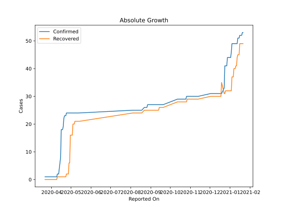
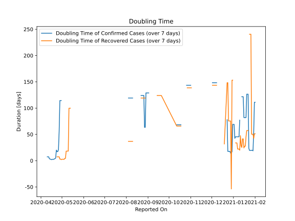

# Country Figures: Doubling Time of Infections for Timor-Leste 

The doubling time below are calculated based on
* an exponential growth assumption
* for time difference of past seven (7) days.
The doubling time's unit is "days".

The first doubling time indicates the increase of confirmed (infected)
cases. There, the *higher* the number is, the better is to take control
of the disease.

The second doubling time indicates the increase of recovered (healed)
cases. There, the *lower* the number is, the better it is to take
control of the disease.

| Reported On | Confirmed | Doubling Time (Confirmed) | Recovered | Doubling Time (Recovered) |
|-------------|-----------|---------------------------|-----------|---------------------------|
| 2020-05-07 | 24 |  None  | 21 |  18.2 days  | 
| 2020-05-06 | 24 |  None  | 20 |  4.4 days  | 
| 2020-05-05 | 24 |  None  | 20 |  4.4 days  | 
| 2020-05-04 | 24 |  None  | 20 |  2.4 days  | 
| 2020-05-03 | 24 |  None  | 16 |  2.7 days  | 
| 2020-05-02 | 24 |  None  | 16 |  2.7 days  | 
| 2020-05-01 | 24 |  None  | 16 |  2.7 days  | 
| 2020-04-30 | 24 |  114.4 days  | 16 |  2.1 days  | 
| 2020-04-29 | 24 |  114.4 days  | 6 |  3.0 days  | 
| 2020-04-28 | 24 |  114.4 days  | 6 |  3.0 days  | 
| 2020-04-27 | 24 |  56.1 days  | 2 |  7.3 days  | 
| 2020-04-26 | 24 |  21.1 days  | 2 |  7.3 days  | 
| 2020-04-25 | 24 |  17.2 days  | 2 |  7.3 days  | 
| 2020-04-24 | 24 |  17.2 days  | 2 |  7.3 days  | 
| 2020-04-23 | 23 |  20.1 days  | 1 |  None  | 
| 2020-04-22 | 23 |  4.9 days  | 1 |  None  | 
| 2020-04-21 | 23 |  3.9 days  | 1 |  None  | 
| 2020-04-20 | 22 |  3.2 days  | 1 |  None  | 
| 2020-04-19 | 19 |  2.5 days  | 1 |  None  | 
| 2020-04-18 | 18 |  2.5 days  | 1 |  None  | 
| 2020-04-17 | 18 |  2.5 days  | 1 |  None  | 
| 2020-04-16 | 18 |  2.0 days  | 1 |  None  | 
| 2020-04-15 | 8 |  2.7 days  | 1 |  None  | 
| 2020-04-14 | 6 |  3.0 days  | 1 |  None  | 
| 2020-04-13 | 4 |  3.8 days  | 1 |  None  | 
| 2020-04-12 | 2 |  7.3 days  | 1 |  None  | 
| 2020-04-11 | 2 |  7.3 days  | 1 |  None  | 
| 2020-04-10 | 2 |  7.3 days  | 1 |  None  | 
| 2020-04-09 | 1 |  None  | 0 |  None  | 
| 2020-04-08 | 1 |  None  | 0 |  None  | 
| 2020-04-07 | 1 |  None  | 0 |  None  | 
| 2020-04-06 | 1 |  None  | 0 |  None  | 
| 2020-04-05 | 1 |  None  | 0 |  None  | 
| 2020-04-04 | 1 |  None  | 0 |  None  | 
| 2020-04-03 | 1 |  None  | 0 |  None  | 
| 2020-04-02 | 1 |  None  | 0 |  None  | 
| 2020-04-01 | 1 |  None  | 0 |  None  | 
| 2020-03-31 | 1 |  None  | 0 |  None  | 
| 2020-03-30 | 1 |  None  | 0 |  None  | 
| 2020-03-29 | 1 |  None  | 0 |  None  | 
| 2020-03-28 | 1 |  None  | 0 |  None  | 
| 2020-03-27 | 1 |  None  | 0 |  None  | 
| 2020-03-26 | 1 |  None  | 0 |  None  | 
| 2020-03-25 | 1 |  None  | 0 |  None  | 
| 2020-03-24 | 1 |  None  | 0 |  None  | 
| 2020-03-23 | 1 |  None  | 0 |  None  | 
| 2020-03-22 | 1 |  None  | 0 |  None  | 

