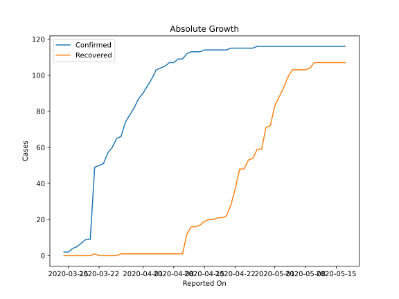
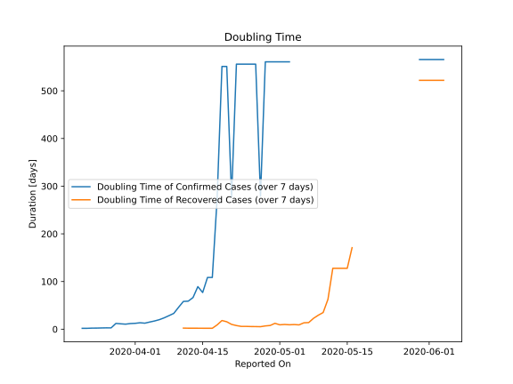

# Country Figures: Doubling Time of Infections for Trinidadand Tobago 

The doubling time below are calculated based on
* an exponential growth assumption
* for time difference of past seven (7) days.
The doubling time's unit is "days".

The first doubling time indicates the increase of confirmed (infected)
cases. There, the *higher* the number is, the better is to take control
of the disease.

The second doubling time indicates the increase of recovered (healed)
cases. There, the *lower* the number is, the better it is to take
control of the disease.

| Reported On | Confirmed | Doubling Time (Confirmed) | Recovered | Doubling Time (Recovered) |
|-------------|-----------|---------------------------|-----------|---------------------------|
| 2020-04-27 | 116 |  279.3 days  | 59 |  5.3 days  | 
| 2020-04-26 | 115 |  555.9 days  | 54 |  5.5 days  | 
| 2020-04-25 | 115 |  555.9 days  | 53 |  5.6 days  | 
| 2020-04-24 | 115 |  555.9 days  | 48 |  5.9 days  | 
| 2020-04-23 | 115 |  555.9 days  | 48 |  5.9 days  | 
| 2020-04-22 | 115 |  555.9 days  | 37 |  7.6 days  | 
| 2020-04-21 | 115 |  276.9 days  | 28 |  10.1 days  | 
| 2020-04-20 | 114 |  551.0 days  | 22 |  15.6 days  | 
| 2020-04-19 | 114 |  551.0 days  | 21 |  18.2 days  | 
| 2020-04-18 | 114 |  274.5 days  | 21 |  9.0 days  | 
| 2020-04-17 | 114 |  108.5 days  | 20 |  1.9 days  | 
| 2020-04-16 | 114 |  108.5 days  | 20 |  1.9 days  | 
| 2020-04-15 | 114 |  76.9 days  | 19 |  2.0 days  | 
| 2020-04-14 | 113 |  89.3 days  | 17 |  2.0 days  | 
| 2020-04-13 | 113 |  66.4 days  | 16 |  2.1 days  | 
| 2020-04-12 | 113 |  58.8 days  | 16 |  2.1 days  | 
| 2020-04-11 | 112 |  58.3 days  | 12 |  2.3 days  | 
| 2020-04-10 | 109 |  46.0 days  | 1 |  None  | 
| 2020-04-09 | 109 |  33.1 days  | 1 |  None  | 
| 2020-04-08 | 107 |  28.4 days  | 1 |  None  | 
| 2020-04-07 | 107 |  23.8 days  | 1 |  None  | 
| 2020-04-06 | 105 |  20.0 days  | 1 |  None  | 
| 2020-04-05 | 104 |  17.2 days  | 1 |  None  | 
| 2020-04-04 | 103 |  15.0 days  | 1 |  None  | 
| 2020-04-03 | 98 |  12.6 days  | 1 |  None  | 
| 2020-04-02 | 94 |  13.5 days  | 1 |  None  | 
| 2020-04-01 | 90 |  12.3 days  | 1 |  None  | 
| 2020-03-31 | 87 |  11.8 days  | 1 |  None  | 
| 2020-03-30 | 82 |  10.6 days  | 1 |  None  | 
| 2020-03-29 | 78 |  11.3 days  | 1 |  None  | 
| 2020-03-28 | 74 |  12.1 days  | 1 |  None  | 
| 2020-03-27 | 66 |  2.8 days  | 1 |  None  | 
| 2020-03-26 | 65 |  2.8 days  | 0 |  None  | 
| 2020-03-25 | 60 |  2.6 days  | 0 |  None  | 
| 2020-03-24 | 57 |  2.3 days  | 0 |  None  | 
| 2020-03-23 | 51 |  2.2 days  | 0 |  None  | 
| 2020-03-22 | 50 |  1.8 days  | 0 |  None  | 
| 2020-03-21 | 49 |  1.8 days  | 1 |  None  | 
| 2020-03-20 | 9 |  None  | 0 |  None  | 
| 2020-03-19 | 9 |  None  | 0 |  None  | 
| 2020-03-18 | 7 |  None  | 0 |  None  | 
| 2020-03-17 | 5 |  None  | 0 |  None  | 
| 2020-03-16 | 4 |  None  | 0 |  None  | 
| 2020-03-15 | 2 |  None  | 0 |  None  | 
| 2020-03-14 | 2 |  None  | 0 |  None  | 

