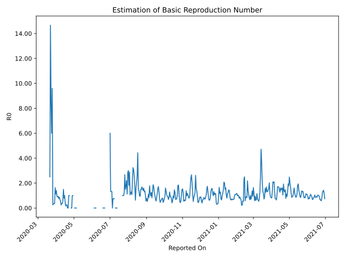

# Country Figures: Time Series for Basic Reproduction Number of Trinidadand Tobago 

| Reported On | &Delta; Confirmed | Total &Delta; Confirmed First Interval | Total &Delta; Confirmed Second Interval | Estimated Basic Reproduction Number R0 | 
|-------------|-------------------|----------------------------------------|-----------------------------------------|---------------------------------------------------|
| 2020-05-05 | 0 |  None  |  1  |  None  | 
| 2020-05-04 | 0 |  None  |  1  |  None  | 
| 2020-05-03 | 0 |  None  |  1  |  None  | 
| 2020-05-02 | 0 |  None  |  1  |  None  | 
| 2020-05-01 | 0 |  1  |  None  |  None  | 
| 2020-04-30 | 0 |  1  |  None  |  None  | 
| 2020-04-29 | 0 |  1  |  1  |  1.00  | 
| 2020-04-28 | 0 |  1  |  1  |  1.00  | 
| 2020-04-27 | 1 |  None  |  1  |  None  | 
| 2020-04-26 | 0 |  None  |  1  |  None  | 
| 2020-04-25 | 0 |  1  |  None  |  None  | 
| 2020-04-24 | 0 |  1  |  None  |  None  | 
| 2020-04-23 | 0 |  1  |  1  |  1.00  | 
| 2020-04-22 | 0 |  1  |  1  |  1.00  | 
| 2020-04-21 | 1 |  None  |  1  |  None  | 
| 2020-04-20 | 0 |  None  |  2  |  None  | 
| 2020-04-19 | 0 |  1  |  4  |  0.25  | 
| 2020-04-18 | 0 |  1  |  4  |  0.25  | 
| 2020-04-17 | 0 |  1  |  6  |  0.17  | 
| 2020-04-16 | 0 |  2  |  5  |  0.40  | 
| 2020-04-15 | 1 |  4  |  4  |  1.00  | 
| 2020-04-14 | 0 |  4  |  5  |  0.80  | 
| 2020-04-13 | 0 |  6  |  4  |  1.50  | 
| 2020-04-12 | 1 |  5  |  9  |  0.56  | 
| 2020-04-11 | 3 |  4  |  11  |  0.36  | 
| 2020-04-10 | 0 |  5  |  14  |  0.36  | 
| 2020-04-09 | 2 |  4  |  16  |  0.25  | 
| 2020-04-08 | 0 |  9  |  16  |  0.56  | 
| 2020-04-07 | 2 |  11  |  16  |  0.69  | 
| 2020-04-06 | 1 |  14  |  16  |  0.88  | 
| 2020-04-05 | 1 |  16  |  21  |  0.76  | 
| 2020-04-04 | 5 |  16  |  17  |  0.94  | 
| 2020-04-03 | 4 |  16  |  18  |  0.89  | 
| 2020-04-02 | 4 |  16  |  17  |  0.94  | 
| 2020-04-01 | 3 |  21  |  15  |  1.40  | 
| 2020-03-31 | 5 |  17  |  15  |  1.13  | 
| 2020-03-30 | 4 |  18  |  11  |  1.64  | 
| 2020-03-29 | 4 |  17  |  48  |  0.35  | 
| 2020-03-28 | 8 |  15  |  42  |  0.36  | 
| 2020-03-27 | 1 |  15  |  43  |  0.35  | 
| 2020-03-26 | 5 |  11  |  44  |  0.25  | 
| 2020-03-25 | 3 |  48  |  5  |  9.60  | 
| 2020-03-24 | 6 |  42  |  7  |  6.00  | 
| 2020-03-23 | 1 |  43  |  5  |  8.60  | 
| 2020-03-22 | 1 |  44  |  3  |  14.67  | 
| 2020-03-21 | 40 |  5  |  2  |  2.50  | 
| 2020-03-20 | 0 |  7  |  None  |  None  | 
| 2020-03-19 | 2 |  5  |  None  |  None  | 
| 2020-03-18 | 2 |  3  |  None  |  None  | 
| 2020-03-17 | 1 |  2  |  None  |  None  | 
| 2020-03-16 | 2 |  None  |  None  |  None  | 
| 2020-03-15 | 0 |  None  |  None  |  None  | 
| 2020-03-14 | None |  None  |  None  |  None  | 

