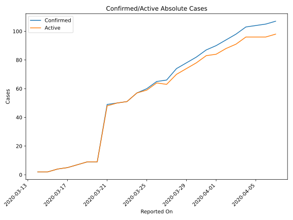
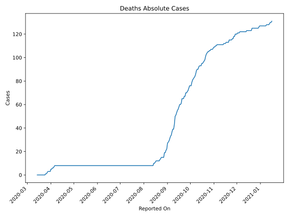
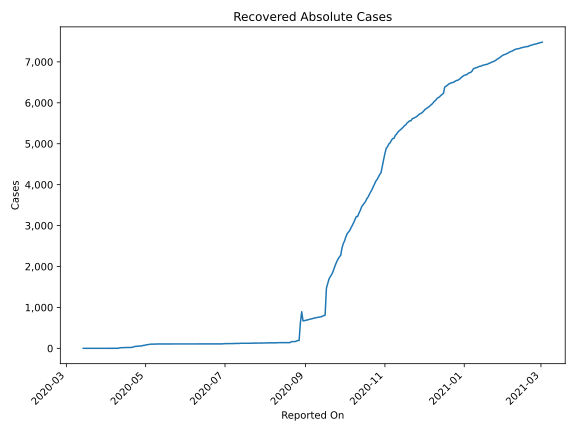
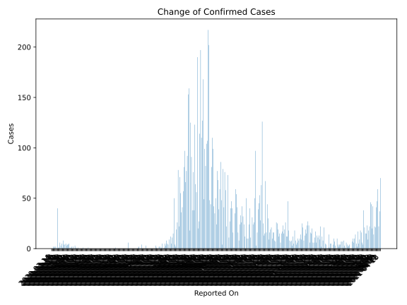
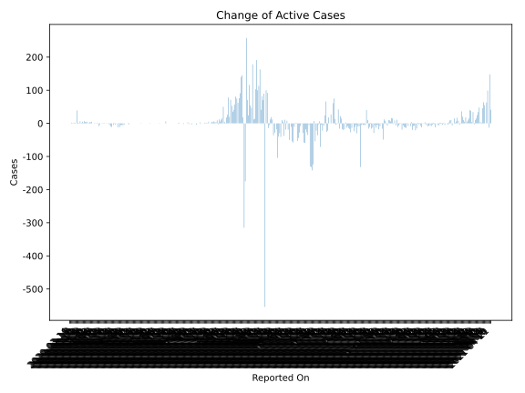
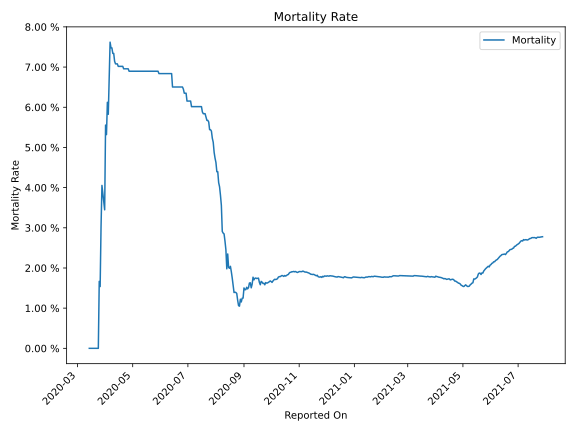

# Country Figures: Time Series for Trinidadand Tobago 

| Reported On | Confirmed | Deaths | Recovered | Active | Mortality | &Delta; Confirmed | &Delta; Deaths | &Delta; Recovered | &Delta; Active | % Active of Population |
|-------------|-----------|--------|-----------|--------|-----------|-------------------|----------------|-------------------|----------------|------------------------|
| 2020-05-01 | 116 | 8 | 83 | 25 |  6.90 %  | 0 | 0 | 11 | -11 |  0.002 %  | 
| 2020-04-30 | 116 | 8 | 72 | 36 |  6.90 %  | 0 | 0 | 1 | -1 |  0.003 %  | 
| 2020-04-29 | 116 | 8 | 71 | 37 |  6.90 %  | 0 | 0 | 12 | -12 |  0.003 %  | 
| 2020-04-28 | 116 | 8 | 59 | 49 |  6.90 %  | 0 | 0 | 0 | 0 |  0.004 %  | 
| 2020-04-27 | 116 | 8 | 59 | 49 |  6.90 %  | 1 | 0 | 5 | -4 |  0.004 %  | 
| 2020-04-26 | 115 | 8 | 54 | 53 |  6.96 %  | 0 | 0 | 1 | -1 |  0.004 %  | 
| 2020-04-25 | 115 | 8 | 53 | 54 |  6.96 %  | 0 | 0 | 5 | -5 |  0.004 %  | 
| 2020-04-24 | 115 | 8 | 48 | 59 |  6.96 %  | 0 | 0 | 0 | 0 |  0.004 %  | 
| 2020-04-23 | 115 | 8 | 48 | 59 |  6.96 %  | 0 | 0 | 11 | -11 |  0.004 %  | 
| 2020-04-22 | 115 | 8 | 37 | 70 |  6.96 %  | 0 | 0 | 9 | -9 |  0.005 %  | 
| 2020-04-21 | 115 | 8 | 28 | 79 |  6.96 %  | 1 | 0 | 6 | -5 |  0.006 %  | 
| 2020-04-20 | 114 | 8 | 22 | 84 |  7.02 %  | 0 | 0 | 1 | -1 |  0.006 %  | 
| 2020-04-19 | 114 | 8 | 21 | 85 |  7.02 %  | 0 | 0 | 0 | 0 |  0.006 %  | 
| 2020-04-18 | 114 | 8 | 21 | 85 |  7.02 %  | 0 | 0 | 1 | -1 |  0.006 %  | 
| 2020-04-17 | 114 | 8 | 20 | 86 |  7.02 %  | 0 | 0 | 0 | 0 |  0.006 %  | 
| 2020-04-16 | 114 | 8 | 20 | 86 |  7.02 %  | 0 | 0 | 1 | -1 |  0.006 %  | 
| 2020-04-15 | 114 | 8 | 19 | 87 |  7.02 %  | 1 | 0 | 2 | -1 |  0.006 %  | 
| 2020-04-14 | 113 | 8 | 17 | 88 |  7.08 %  | 0 | 0 | 1 | -1 |  0.006 %  | 
| 2020-04-13 | 113 | 8 | 16 | 89 |  7.08 %  | 0 | 0 | 0 | 0 |  0.006 %  | 
| 2020-04-12 | 113 | 8 | 16 | 89 |  7.08 %  | 1 | 0 | 4 | -3 |  0.006 %  | 
| 2020-04-11 | 112 | 8 | 12 | 92 |  7.14 %  | 3 | 0 | 11 | -8 |  0.007 %  | 
| 2020-04-10 | 109 | 8 | 1 | 100 |  7.34 %  | 0 | 0 | 0 | 0 |  0.007 %  | 
| 2020-04-09 | 109 | 8 | 1 | 100 |  7.34 %  | 2 | 0 | 0 | 2 |  0.007 %  | 
| 2020-04-08 | 107 | 8 | 1 | 98 |  7.48 %  | 0 | 0 | 0 | 0 |  0.007 %  | 
| 2020-04-07 | 107 | 8 | 1 | 98 |  7.48 %  | 2 | 0 | 0 | 2 |  0.007 %  | 
| 2020-04-06 | 105 | 8 | 1 | 96 |  7.62 %  | 1 | 1 | 0 | 0 |  0.007 %  | 
| 2020-04-05 | 104 | 7 | 1 | 96 |  6.73 %  | 1 | 1 | 0 | 0 |  0.007 %  | 
| 2020-04-04 | 103 | 6 | 1 | 96 |  5.83 %  | 5 | 0 | 0 | 5 |  0.007 %  | 
| 2020-04-03 | 98 | 6 | 1 | 91 |  6.12 %  | 4 | 1 | 0 | 3 |  0.007 %  | 
| 2020-04-02 | 94 | 5 | 1 | 88 |  5.32 %  | 4 | 0 | 0 | 4 |  0.006 %  | 
| 2020-04-01 | 90 | 5 | 1 | 84 |  5.56 %  | 3 | 2 | 0 | 1 |  0.006 %  | 
| 2020-03-31 | 87 | 3 | 1 | 83 |  3.45 %  | 5 | 0 | 0 | 5 |  0.006 %  | 
| 2020-03-30 | 82 | 3 | 1 | 78 |  3.66 %  | 4 | 0 | 0 | 4 |  0.006 %  | 
| 2020-03-29 | 78 | 3 | 1 | 74 |  3.85 %  | 4 | 0 | 0 | 4 |  0.005 %  | 
| 2020-03-28 | 74 | 3 | 1 | 70 |  4.05 %  | 8 | 1 | 0 | 7 |  0.005 %  | 
| 2020-03-27 | 66 | 2 | 1 | 63 |  3.03 %  | 1 | 1 | 1 | -1 |  0.005 %  | 
| 2020-03-26 | 65 | 1 | 0 | 64 |  1.54 %  | 5 | 0 | 0 | 5 |  0.005 %  | 
| 2020-03-25 | 60 | 1 | 0 | 59 |  1.67 %  | 3 | 1 | 0 | 2 |  0.004 %  | 
| 2020-03-24 | 57 | 0 | 0 | 57 |  None  | 6 | 0 | 0 | 6 |  0.004 %  | 
| 2020-03-23 | 51 | 0 | 0 | 51 |  None  | 1 | 0 | 0 | 1 |  0.004 %  | 
| 2020-03-22 | 50 | 0 | 0 | 50 |  None  | 1 | 0 | -1 | 2 |  0.004 %  | 
| 2020-03-21 | 49 | 0 | 1 | 48 |  None  | 40 | 0 | 1 | 39 |  0.003 %  | 
| 2020-03-20 | 9 | 0 | 0 | 9 |  None  | 0 | 0 | 0 | 0 |  0.001 %  | 
| 2020-03-19 | 9 | 0 | 0 | 9 |  None  | 2 | 0 | 0 | 2 |  0.001 %  | 
| 2020-03-18 | 7 | 0 | 0 | 7 |  None  | 2 | 0 | 0 | 2 |  0.001 %  | 
| 2020-03-17 | 5 | 0 | 0 | 5 |  None  | 1 | 0 | 0 | 1 |  0.000 %  | 
| 2020-03-16 | 4 | 0 | 0 | 4 |  None  | 2 | 0 | 0 | 2 |  0.000 %  | 
| 2020-03-15 | 2 | 0 | 0 | 2 |  None  | 0 | 0 | 0 | 0 |  0.000 %  | 
| 2020-03-14 | 2 | 0 | 0 | 2 |  None  | None | None | None | None |  0.000 %  | 

