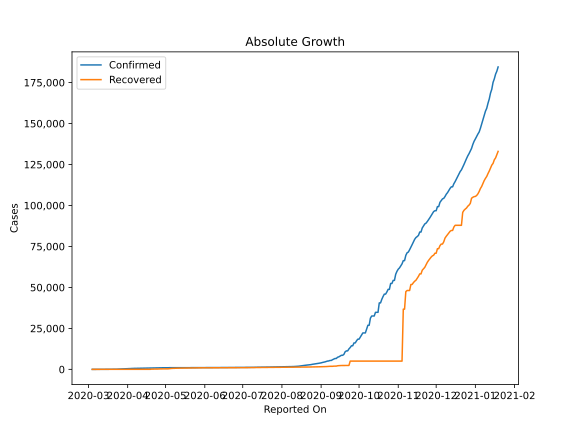
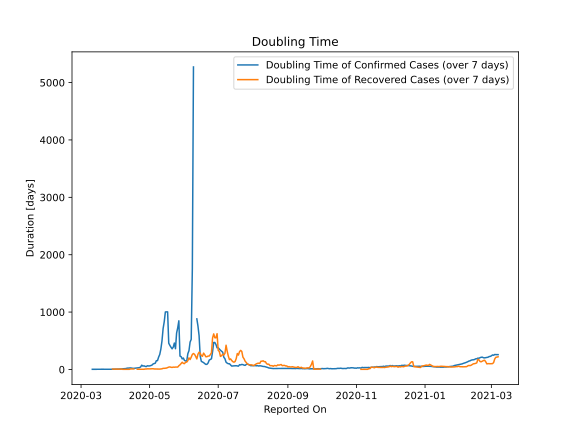

# Country Figures: Doubling Time of Infections for Tunisia 

The doubling time below are calculated based on
* an exponential growth assumption
* for time difference of past seven (7) days.
The doubling time's unit is "days".

The first doubling time indicates the increase of confirmed (infected)
cases. There, the *higher* the number is, the better is to take control
of the disease.

The second doubling time indicates the increase of recovered (healed)
cases. There, the *lower* the number is, the better it is to take
control of the disease.

| Reported On | Confirmed | Doubling Time (Confirmed) | Recovered | Doubling Time (Recovered) |
|-------------|-----------|---------------------------|-----------|---------------------------|
| 2020-05-09 | 1032 |  215.6 days  | 660 |  7.1 days  | 
| 2020-05-08 | 1030 |  154.1 days  | 638 |  7.2 days  | 
| 2020-05-07 | 1026 |  153.5 days  | 600 |  7.5 days  | 
| 2020-05-06 | 1025 |  108.4 days  | 591 |  7.3 days  | 
| 2020-05-05 | 1022 |  103.4 days  | 482 |  9.2 days  | 
| 2020-05-04 | 1018 |  94.7 days  | 406 |  13.3 days  | 
| 2020-05-03 | 1013 |  74.7 days  | 328 |  12.0 days  | 
| 2020-05-02 | 1009 |  67.8 days  | 323 |  11.2 days  | 
| 2020-05-01 | 998 |  61.6 days  | 316 |  10.3 days  | 
| 2020-04-30 | 994 |  61.3 days  | 305 |  10.6 days  | 
| 2020-04-29 | 980 |  64.9 days  | 294 |  11.5 days  | 
| 2020-04-28 | 975 |  49.9 days  | 279 |  8.0 days  | 
| 2020-04-27 | 967 |  54.4 days  | 279 |  8.0 days  | 
| 2020-04-26 | 949 |  63.7 days  | 216 |  3.3 days  | 
| 2020-04-25 | 939 |  58.6 days  | 207 |  3.4 days  | 
| 2020-04-24 | 922 |  75.0 days  | 194 |  3.6 days  | 
| 2020-04-23 | 918 |  44.3 days  | 190 |  3.6 days  | 
| 2020-04-22 | 909 |  32.0 days  | 190 |  3.6 days  | 
| 2020-04-21 | 884 |  29.2 days  | 148 |  4.3 days  | 
| 2020-04-20 | 884 |  25.0 days  | 148 |  4.3 days  | 
| 2020-04-19 | 879 |  22.6 days  | 43 |  None  | 
| 2020-04-18 | 864 |  21.2 days  | 43 |  None  | 
| 2020-04-17 | 864 |  19.5 days  | 43 |  9.3 days  | 
| 2020-04-16 | 822 |  20.1 days  | 43 |  9.3 days  | 
| 2020-04-15 | 780 |  22.7 days  | 43 |  9.3 days  | 
| 2020-04-14 | 747 |  27.1 days  | 43 |  9.3 days  | 
| 2020-04-13 | 726 |  24.9 days  | 43 |  2.6 days  | 
| 2020-04-12 | 707 |  23.6 days  | 43 |  2.6 days  | 
| 2020-04-11 | 685 |  23.0 days  | 43 |  2.6 days  | 
| 2020-04-10 | 671 |  16.3 days  | 25 |  3.3 days  | 
| 2020-04-09 | 643 |  14.4 days  | 25 |  3.3 days  | 
| 2020-04-08 | 628 |  12.6 days  | 25 |  3.3 days  | 
| 2020-04-07 | 623 |  10.9 days  | 25 |  2.6 days  | 
| 2020-04-06 | 596 |  7.8 days  | 5 |  9.8 days  | 
| 2020-04-05 | 574 |  8.3 days  | 5 |  5.6 days  | 
| 2020-04-04 | 553 |  7.4 days  | 5 |  5.6 days  | 
| 2020-04-03 | 495 |  6.6 days  | 5 |  5.6 days  | 
| 2020-04-02 | 455 |  6.1 days  | 5 |  5.6 days  | 
| 2020-04-01 | 423 |  5.8 days  | 5 |  5.6 days  | 
| 2020-03-31 | 394 |  4.2 days  | 3 |  4.8 days  | 
| 2020-03-30 | 312 |  4.2 days  | 3 |  4.8 days  | 
| 2020-03-29 | 312 |  3.7 days  | 2 |  7.3 days  | 
| 2020-03-28 | 278 |  3.5 days  | 2 |  None  | 
| 2020-03-27 | 227 |  3.7 days  | 2 |  None  | 
| 2020-03-26 | 197 |  3.3 days  | 2 |  None  | 
| 2020-03-25 | 173 |  3.1 days  | 2 |  None  | 
| 2020-03-24 | 114 |  3.4 days  | 1 |  None  | 
| 2020-03-23 | 89 |  3.6 days  | 1 |  None  | 
| 2020-03-22 | 75 |  3.7 days  | 1 |  None  | 
| 2020-03-21 | 60 |  4.4 days  | 0 |  None  | 
| 2020-03-20 | 54 |  4.3 days  | 0 |  None  | 
| 2020-03-19 | 39 |  3.2 days  | 0 |  None  | 
| 2020-03-18 | 29 |  3.7 days  | 0 |  None  | 
| 2020-03-17 | 24 |  3.4 days  | 0 |  None  | 
| 2020-03-16 | 20 |  2.4 days  | 0 |  None  | 
| 2020-03-15 | 18 |  2.5 days  | 0 |  None  | 
| 2020-03-14 | 18 |  2.0 days  | 0 |  None  | 
| 2020-03-13 | 16 |  2.1 days  | 0 |  None  | 
| 2020-03-12 | 7 |  2.8 days  | 0 |  None  | 
| 2020-03-11 | 7 |  2.8 days  | 0 |  None  | 
| 2020-03-10 | 5 |  None  | 0 |  None  | 
| 2020-03-09 | 2 |  None  | 0 |  None  | 
| 2020-03-08 | 2 |  None  | 0 |  None  | 
| 2020-03-07 | 1 |  None  | 0 |  None  | 
| 2020-03-06 | 1 |  None  | 0 |  None  | 
| 2020-03-05 | 1 |  None  | 0 |  None  | 
| 2020-03-04 | 1 |  None  | 0 |  None  | 

