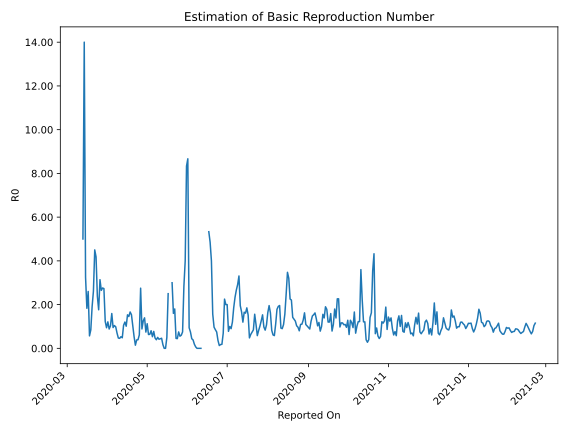

# Country Figures: Time Series for Basic Reproduction Number of Tunisia 

| Reported On | &Delta; Confirmed | Total &Delta; Confirmed First Interval | Total &Delta; Confirmed Second Interval | Estimated Basic Reproduction Number R0 | 
|-------------|-------------------|----------------------------------------|-----------------------------------------|---------------------------------------------------|
| 2020-05-07 | 1 |  16  |  34  |  0.47  | 
| 2020-05-06 | 3 |  24  |  31  |  0.77  | 
| 2020-05-05 | 4 |  24  |  45  |  0.53  | 
| 2020-05-04 | 5 |  33  |  41  |  0.80  | 
| 2020-05-03 | 4 |  34  |  53  |  0.64  | 
| 2020-05-02 | 11 |  31  |  49  |  0.63  | 
| 2020-05-01 | 4 |  45  |  40  |  1.12  | 
| 2020-04-30 | 14 |  41  |  55  |  0.75  | 
| 2020-04-29 | 5 |  53  |  38  |  1.39  | 
| 2020-04-28 | 8 |  49  |  39  |  1.26  | 
| 2020-04-27 | 18 |  40  |  45  |  0.89  | 
| 2020-04-26 | 10 |  55  |  20  |  2.75  | 
| 2020-04-25 | 17 |  38  |  62  |  0.61  | 
| 2020-04-24 | 4 |  39  |  99  |  0.39  | 
| 2020-04-23 | 9 |  45  |  117  |  0.38  | 
| 2020-04-22 | 25 |  20  |  138  |  0.14  | 
| 2020-04-21 | 0 |  62  |  115  |  0.54  | 
| 2020-04-20 | 5 |  99  |  95  |  1.04  | 
| 2020-04-19 | 15 |  117  |  76  |  1.54  | 
| 2020-04-18 | 0 |  138  |  83  |  1.66  | 
| 2020-04-17 | 42 |  115  |  79  |  1.46  | 
| 2020-04-16 | 42 |  95  |  62  |  1.53  | 
| 2020-04-15 | 33 |  76  |  75  |  1.01  | 
| 2020-04-14 | 21 |  83  |  69  |  1.20  | 
| 2020-04-13 | 19 |  79  |  75  |  1.05  | 
| 2020-04-12 | 22 |  62  |  128  |  0.48  | 
| 2020-04-11 | 14 |  75  |  141  |  0.53  | 
| 2020-04-10 | 28 |  69  |  151  |  0.46  | 
| 2020-04-09 | 15 |  75  |  159  |  0.47  | 
| 2020-04-08 | 5 |  128  |  183  |  0.70  | 
| 2020-04-07 | 27 |  141  |  143  |  0.99  | 
| 2020-04-06 | 22 |  151  |  145  |  1.04  | 
| 2020-04-05 | 21 |  159  |  167  |  0.95  | 
| 2020-04-04 | 58 |  183  |  115  |  1.59  | 
| 2020-04-03 | 40 |  143  |  139  |  1.03  | 
| 2020-04-02 | 32 |  145  |  164  |  0.88  | 
| 2020-04-01 | 29 |  167  |  138  |  1.21  | 
| 2020-03-31 | 82 |  115  |  122  |  0.94  | 
| 2020-03-30 | 0 |  139  |  113  |  1.23  | 
| 2020-03-29 | 34 |  164  |  60  |  2.73  | 
| 2020-03-28 | 51 |  138  |  50  |  2.76  | 
| 2020-03-27 | 30 |  122  |  46  |  2.65  | 
| 2020-03-26 | 24 |  113  |  36  |  3.14  | 
| 2020-03-25 | 59 |  60  |  34  |  1.76  | 
| 2020-03-24 | 25 |  50  |  21  |  2.38  | 
| 2020-03-23 | 14 |  46  |  11  |  4.18  | 
| 2020-03-22 | 15 |  36  |  8  |  4.50  | 
| 2020-03-21 | 6 |  34  |  13  |  2.62  | 
| 2020-03-20 | 15 |  21  |  11  |  1.91  | 
| 2020-03-19 | 10 |  11  |  13  |  0.85  | 
| 2020-03-18 | 5 |  8  |  14  |  0.57  | 
| 2020-03-17 | 4 |  13  |  5  |  2.60  | 
| 2020-03-16 | 2 |  11  |  6  |  1.83  | 
| 2020-03-15 | 0 |  13  |  4  |  3.25  | 
| 2020-03-14 | 2 |  14  |  1  |  14.00  | 
| 2020-03-13 | 9 |  5  |  1  |  5.00  | 
| 2020-03-12 | 0 |  6  |  None  |  None  | 
| 2020-03-11 | 2 |  4  |  None  |  None  | 
| 2020-03-10 | 3 |  1  |  None  |  None  | 
| 2020-03-09 | 0 |  1  |  None  |  None  | 
| 2020-03-08 | 1 |  None  |  None  |  None  | 
| 2020-03-07 | 0 |  None  |  None  |  None  | 
| 2020-03-06 | 0 |  None  |  None  |  None  | 
| 2020-03-05 | 0 |  None  |  None  |  None  | 
| 2020-03-04 | None |  None  |  None  |  None  | 

