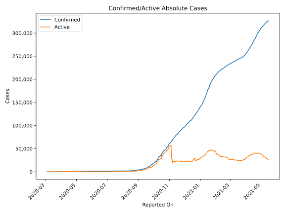
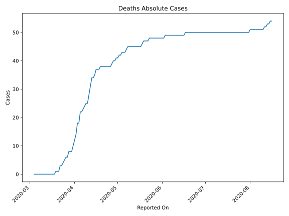
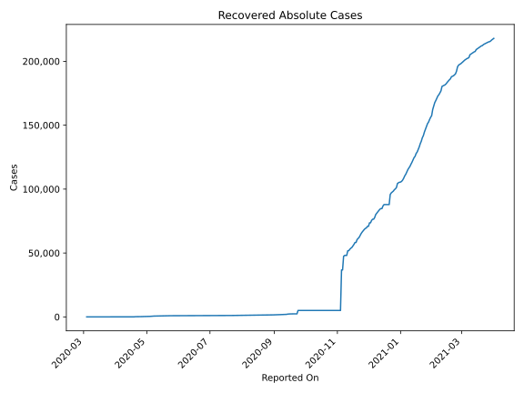
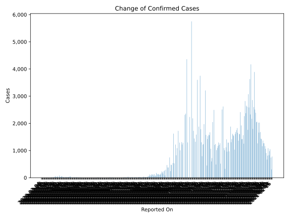
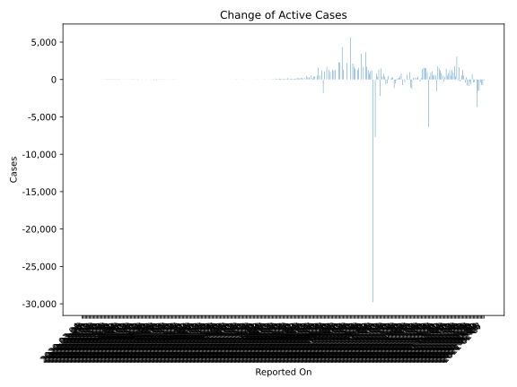
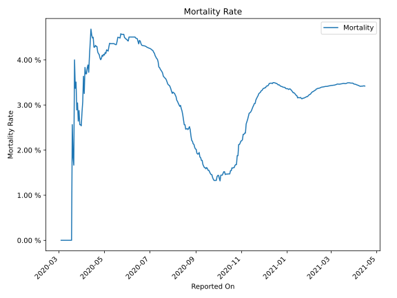

# Country Figures: Time Series for Tunisia 

| Reported On | Confirmed | Deaths | Recovered | Active | Mortality | &Delta; Confirmed | &Delta; Deaths | &Delta; Recovered | &Delta; Active | % Active of Population |
|-------------|-----------|--------|-----------|--------|-----------|-------------------|----------------|-------------------|----------------|------------------------|
| 2020-04-26 | 949 | 38 | 216 | 695 |  4.00 %  | 10 | 0 | 9 | 1 |  0.006 %  | 
| 2020-04-25 | 939 | 38 | 207 | 694 |  4.05 %  | 17 | 0 | 13 | 4 |  0.006 %  | 
| 2020-04-24 | 922 | 38 | 194 | 690 |  4.12 %  | 4 | 0 | 4 | 0 |  0.006 %  | 
| 2020-04-23 | 918 | 38 | 190 | 690 |  4.14 %  | 9 | 0 | 0 | 9 |  0.006 %  | 
| 2020-04-22 | 909 | 38 | 190 | 681 |  4.18 %  | 25 | 0 | 42 | -17 |  0.006 %  | 
| 2020-04-21 | 884 | 38 | 148 | 698 |  4.30 %  | 0 | 0 | 0 | 0 |  0.006 %  | 
| 2020-04-20 | 884 | 38 | 148 | 698 |  4.30 %  | 5 | 0 | 105 | -100 |  0.006 %  | 
| 2020-04-19 | 879 | 38 | 43 | 798 |  4.32 %  | 15 | 1 | 0 | 14 |  0.007 %  | 
| 2020-04-18 | 864 | 37 | 43 | 784 |  4.28 %  | 0 | 0 | 0 | 0 |  0.007 %  | 
| 2020-04-17 | 864 | 37 | 43 | 784 |  4.28 %  | 42 | 0 | 0 | 42 |  0.007 %  | 
| 2020-04-16 | 822 | 37 | 43 | 742 |  4.50 %  | 42 | 2 | 0 | 40 |  0.006 %  | 
| 2020-04-15 | 780 | 35 | 43 | 702 |  4.49 %  | 33 | 1 | 0 | 32 |  0.006 %  | 
| 2020-04-14 | 747 | 34 | 43 | 670 |  4.55 %  | 21 | 0 | 0 | 21 |  0.006 %  | 
| 2020-04-13 | 726 | 34 | 43 | 649 |  4.68 %  | 19 | 3 | 0 | 16 |  0.006 %  | 
| 2020-04-12 | 707 | 31 | 43 | 633 |  4.38 %  | 22 | 3 | 0 | 19 |  0.005 %  | 
| 2020-04-11 | 685 | 28 | 43 | 614 |  4.09 %  | 14 | 3 | 18 | -7 |  0.005 %  | 
| 2020-04-10 | 671 | 25 | 25 | 621 |  3.73 %  | 28 | 0 | 0 | 28 |  0.005 %  | 
| 2020-04-09 | 643 | 25 | 25 | 593 |  3.89 %  | 15 | 1 | 0 | 14 |  0.005 %  | 
| 2020-04-08 | 628 | 24 | 25 | 579 |  3.82 %  | 5 | 1 | 0 | 4 |  0.005 %  | 
| 2020-04-07 | 623 | 23 | 25 | 575 |  3.69 %  | 27 | 1 | 20 | 6 |  0.005 %  | 
| 2020-04-06 | 596 | 22 | 5 | 569 |  3.69 %  | 22 | 0 | 0 | 22 |  0.005 %  | 
| 2020-04-05 | 574 | 22 | 5 | 547 |  3.83 %  | 21 | 4 | 0 | 17 |  0.005 %  | 
| 2020-04-04 | 553 | 18 | 5 | 530 |  3.25 %  | 58 | 0 | 0 | 58 |  0.005 %  | 
| 2020-04-03 | 495 | 18 | 5 | 472 |  3.64 %  | 40 | 4 | 0 | 36 |  0.004 %  | 
| 2020-04-02 | 455 | 14 | 5 | 436 |  3.08 %  | 32 | 2 | 0 | 30 |  0.004 %  | 
| 2020-04-01 | 423 | 12 | 5 | 406 |  2.84 %  | 29 | 2 | 2 | 25 |  0.004 %  | 
| 2020-03-31 | 394 | 10 | 3 | 381 |  2.54 %  | 82 | 2 | 0 | 80 |  0.003 %  | 
| 2020-03-30 | 312 | 8 | 3 | 301 |  2.56 %  | 0 | 0 | 1 | -1 |  0.003 %  | 
| 2020-03-29 | 312 | 8 | 2 | 302 |  2.56 %  | 34 | 0 | 0 | 34 |  0.003 %  | 
| 2020-03-28 | 278 | 8 | 2 | 268 |  2.88 %  | 51 | 2 | 0 | 49 |  0.002 %  | 
| 2020-03-27 | 227 | 6 | 2 | 219 |  2.64 %  | 30 | 0 | 0 | 30 |  0.002 %  | 
| 2020-03-26 | 197 | 6 | 2 | 189 |  3.05 %  | 24 | 1 | 0 | 23 |  0.002 %  | 
| 2020-03-25 | 173 | 5 | 2 | 166 |  2.89 %  | 59 | 1 | 1 | 57 |  0.001 %  | 
| 2020-03-24 | 114 | 4 | 1 | 109 |  3.51 %  | 25 | 1 | 0 | 24 |  0.001 %  | 
| 2020-03-23 | 89 | 3 | 1 | 85 |  3.37 %  | 14 | 0 | 0 | 14 |  0.001 %  | 
| 2020-03-22 | 75 | 3 | 1 | 71 |  4.00 %  | 15 | 2 | 1 | 12 |  0.001 %  | 
| 2020-03-21 | 60 | 1 | 0 | 59 |  1.67 %  | 6 | 0 | 0 | 6 |  0.001 %  | 
| 2020-03-20 | 54 | 1 | 0 | 53 |  1.85 %  | 15 | 0 | 0 | 15 |  0.000 %  | 
| 2020-03-19 | 39 | 1 | 0 | 38 |  2.56 %  | 10 | 1 | 0 | 9 |  0.000 %  | 
| 2020-03-18 | 29 | 0 | 0 | 29 |  None  | 5 | 0 | 0 | 5 |  0.000 %  | 
| 2020-03-17 | 24 | 0 | 0 | 24 |  None  | 4 | 0 | 0 | 4 |  0.000 %  | 
| 2020-03-16 | 20 | 0 | 0 | 20 |  None  | 2 | 0 | 0 | 2 |  0.000 %  | 
| 2020-03-15 | 18 | 0 | 0 | 18 |  None  | 0 | 0 | 0 | 0 |  0.000 %  | 
| 2020-03-14 | 18 | 0 | 0 | 18 |  None  | 2 | 0 | 0 | 2 |  0.000 %  | 
| 2020-03-13 | 16 | 0 | 0 | 16 |  None  | 9 | 0 | 0 | 9 |  0.000 %  | 
| 2020-03-12 | 7 | 0 | 0 | 7 |  None  | 0 | 0 | 0 | 0 |  0.000 %  | 
| 2020-03-11 | 7 | 0 | 0 | 7 |  None  | 2 | 0 | 0 | 2 |  0.000 %  | 
| 2020-03-10 | 5 | 0 | 0 | 5 |  None  | 3 | 0 | 0 | 3 |  0.000 %  | 
| 2020-03-09 | 2 | 0 | 0 | 2 |  None  | 0 | 0 | 0 | 0 |  0.000 %  | 
| 2020-03-08 | 2 | 0 | 0 | 2 |  None  | 1 | 0 | 0 | 1 |  0.000 %  | 
| 2020-03-07 | 1 | 0 | 0 | 1 |  None  | 0 | 0 | 0 | 0 |  0.000 %  | 
| 2020-03-06 | 1 | 0 | 0 | 1 |  None  | 0 | 0 | 0 | 0 |  0.000 %  | 
| 2020-03-05 | 1 | 0 | 0 | 1 |  None  | 0 | 0 | 0 | 0 |  0.000 %  | 
| 2020-03-04 | 1 | 0 | 0 | 1 |  None  | None | None | None | None |  0.000 %  | 

