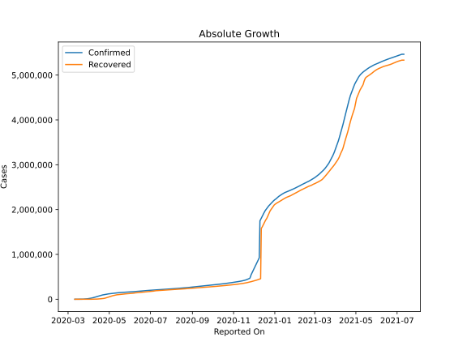
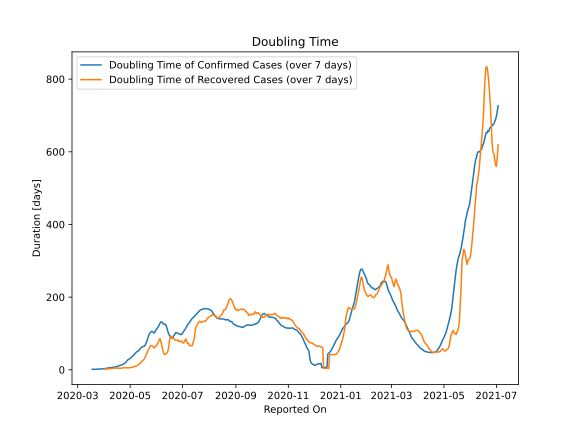

# Country Figures: Doubling Time of Infections for Turkey 

The doubling time below are calculated based on
* an exponential growth assumption
* for time difference of past seven (7) days.
The doubling time's unit is "days".

The first doubling time indicates the increase of confirmed (infected)
cases. There, the *higher* the number is, the better is to take control
of the disease.

The second doubling time indicates the increase of recovered (healed)
cases. There, the *lower* the number is, the better it is to take
control of the disease.

| Reported On | Confirmed | Doubling Time (Confirmed) | Recovered | Doubling Time (Recovered) |
|-------------|-----------|---------------------------|-----------|---------------------------|
| 2020-04-27 | 112261 |  23.4 days  | 33791 |  5.6 days  | 
| 2020-04-26 | 110130 |  20.2 days  | 29140 |  5.8 days  | 
| 2020-04-25 | 107773 |  18.4 days  | 25582 |  5.8 days  | 
| 2020-04-24 | 104912 |  17.1 days  | 21737 |  5.6 days  | 
| 2020-04-23 | 101790 |  15.7 days  | 18491 |  5.4 days  | 
| 2020-04-22 | 98674 |  14.1 days  | 16477 |  4.9 days  | 
| 2020-04-21 | 95591 |  13.0 days  | 14918 |  4.6 days  | 
| 2020-04-20 | 90980 |  12.5 days  | 13430 |  4.3 days  | 
| 2020-04-19 | 86306 |  12.0 days  | 11976 |  4.2 days  | 
| 2020-04-18 | 82329 |  11.0 days  | 10453 |  4.2 days  | 
| 2020-04-17 | 78546 |  9.8 days  | 8631 |  4.2 days  | 
| 2020-04-16 | 74193 |  9.0 days  | 7089 |  4.4 days  | 
| 2020-04-15 | 69392 |  8.5 days  | 5674 |  4.7 days  | 
| 2020-04-14 | 65111 |  7.8 days  | 4799 |  4.7 days  | 
| 2020-04-13 | 61049 |  7.2 days  | 3957 |  4.8 days  | 
| 2020-04-12 | 56956 |  6.9 days  | 3446 |  4.4 days  | 
| 2020-04-11 | 52167 |  6.6 days  | 2965 |  4.0 days  | 
| 2020-04-10 | 47029 |  6.3 days  | 2423 |  3.3 days  | 
| 2020-04-09 | 42282 |  6.1 days  | 2142 |  3.3 days  | 
| 2020-04-08 | 38226 |  5.8 days  | 1846 |  3.2 days  | 
| 2020-04-07 | 34109 |  5.6 days  | 1582 |  2.9 days  | 
| 2020-04-06 | 30217 |  5.1 days  | 1326 |  2.6 days  | 
| 2020-04-05 | 27069 |  4.8 days  | 1042 |  2.4 days  | 
| 2020-04-04 | 23934 |  4.5 days  | 786 |  2.3 days  | 
| 2020-04-03 | 20921 |  4.1 days  | 484 |  2.3 days  | 
| 2020-04-02 | 18135 |  3.4 days  | 415 |  2.1 days  | 
| 2020-04-01 | 15679 |  2.9 days  | 333 |  2.2 days  | 
| 2020-03-31 | 13531 |  2.8 days  | 243 |  None  | 
| 2020-03-30 | 10827 |  2.8 days  | 162 |  None  | 
| 2020-03-29 | 9217 |  2.7 days  | 105 |  None  | 
| 2020-03-28 | 7402 |  2.3 days  | 70 |  None  | 
| 2020-03-27 | 5698 |  2.1 days  | 42 |  None  | 
| 2020-03-26 | 3629 |  2.0 days  | 26 |  None  | 
| 2020-03-25 | 2433 |  1.8 days  | 26 |  None  | 
| 2020-03-24 | 1872 |  1.6 days  | 0 |  None  | 
| 2020-03-23 | 1529 |  1.4 days  | 0 |  None  | 
| 2020-03-22 | 1236 |  1.2 days  | 0 |  None  | 
| 2020-03-21 | 670 |  1.3 days  | 0 |  None  | 
| 2020-03-20 | 359 |  1.5 days  | 0 |  None  | 
| 2020-03-19 | 192 |  1.2 days  | 0 |  None  | 
| 2020-03-18 | 98 |  1.4 days  | 0 |  None  | 
| 2020-03-17 | 47 |  None  | 0 |  None  | 
| 2020-03-16 | 18 |  None  | 0 |  None  | 
| 2020-03-15 | 6 |  None  | 0 |  None  | 
| 2020-03-14 | 5 |  None  | 0 |  None  | 
| 2020-03-13 | 5 |  None  | 0 |  None  | 
| 2020-03-12 | 1 |  None  | 0 |  None  | 
| 2020-03-11 | 1 |  None  | 0 |  None  | 

