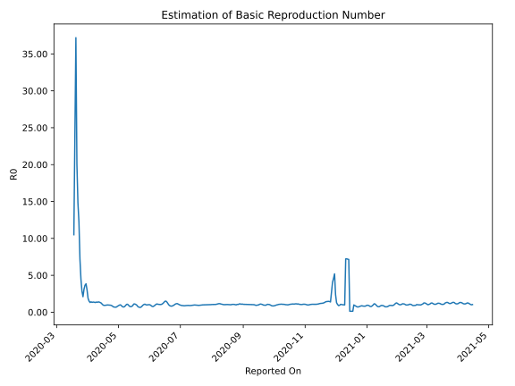

# Country Figures: Time Series for Basic Reproduction Number of Turkey 

| Reported On | &Delta; Confirmed | Total &Delta; Confirmed First Interval | Total &Delta; Confirmed Second Interval | Estimated Basic Reproduction Number R0 | 
|-------------|-------------------|----------------------------------------|-----------------------------------------|---------------------------------------------------|
| 2020-04-28 | 2392 |  10471  |  15484  |  0.68  | 
| 2020-04-27 | 2131 |  11456  |  16345  |  0.70  | 
| 2020-04-26 | 2357 |  12182  |  17045  |  0.71  | 
| 2020-04-25 | 2861 |  13932  |  16787  |  0.83  | 
| 2020-04-24 | 3122 |  15484  |  16914  |  0.92  | 
| 2020-04-23 | 3116 |  16345  |  17218  |  0.95  | 
| 2020-04-22 | 3083 |  17045  |  17497  |  0.97  | 
| 2020-04-21 | 4611 |  16787  |  17237  |  0.97  | 
| 2020-04-20 | 4674 |  16914  |  17225  |  0.98  | 
| 2020-04-19 | 3977 |  17218  |  18082  |  0.95  | 
| 2020-04-18 | 3783 |  17497  |  18767  |  0.93  | 
| 2020-04-17 | 4353 |  17237  |  18730  |  0.92  | 
| 2020-04-16 | 4801 |  17225  |  18058  |  0.95  | 
| 2020-04-15 | 4281 |  18082  |  16812  |  1.08  | 
| 2020-04-14 | 4062 |  18767  |  15213  |  1.23  | 
| 2020-04-13 | 4093 |  18730  |  14292  |  1.31  | 
| 2020-04-12 | 4789 |  18058  |  13188  |  1.37  | 
| 2020-04-11 | 5138 |  16812  |  12082  |  1.39  | 
| 2020-04-10 | 4747 |  15213  |  11390  |  1.34  | 
| 2020-04-09 | 4056 |  14292  |  10403  |  1.37  | 
| 2020-04-08 | 4117 |  13188  |  10094  |  1.31  | 
| 2020-04-07 | 3892 |  12082  |  8918  |  1.35  | 
| 2020-04-06 | 3148 |  11390  |  8277  |  1.38  | 
| 2020-04-05 | 3135 |  10403  |  7833  |  1.33  | 
| 2020-04-04 | 3013 |  10094  |  7198  |  1.40  | 
| 2020-04-03 | 2786 |  8918  |  6784  |  1.31  | 
| 2020-04-02 | 2456 |  8277  |  5530  |  1.50  | 
| 2020-04-01 | 2148 |  7833  |  4169  |  1.88  | 
| 2020-03-31 | 2704 |  7198  |  2393  |  3.01  | 
| 2020-03-30 | 1610 |  6784  |  1763  |  3.85  | 
| 2020-03-29 | 1815 |  5530  |  1513  |  3.65  | 
| 2020-03-28 | 1704 |  4169  |  1337  |  3.12  | 
| 2020-03-27 | 2069 |  2393  |  1138  |  2.10  | 
| 2020-03-26 | 1196 |  1763  |  623  |  2.83  | 
| 2020-03-25 | 561 |  1513  |  341  |  4.44  | 
| 2020-03-24 | 343 |  1337  |  186  |  7.19  | 
| 2020-03-23 | 293 |  1138  |  93  |  12.24  | 
| 2020-03-22 | 566 |  623  |  42  |  14.83  | 
| 2020-03-21 | 311 |  341  |  17  |  20.06  | 
| 2020-03-20 | 167 |  186  |  5  |  37.20  | 
| 2020-03-19 | 94 |  93  |  4  |  23.25  | 
| 2020-03-18 | 51 |  42  |  4  |  10.50  | 
| 2020-03-17 | 29 |  17  |  None  |  None  | 
| 2020-03-16 | 12 |  5  |  None  |  None  | 
| 2020-03-15 | 1 |  4  |  None  |  None  | 
| 2020-03-14 | 0 |  4  |  None  |  None  | 
| 2020-03-13 | 4 |  None  |  None  |  None  | 
| 2020-03-12 | 0 |  None  |  None  |  None  | 
| 2020-03-11 | None |  None  |  None  |  None  | 

