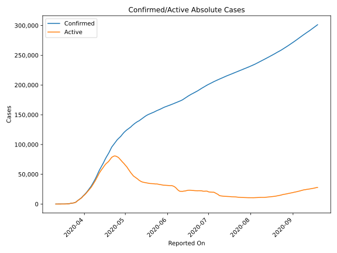
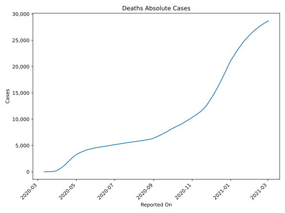
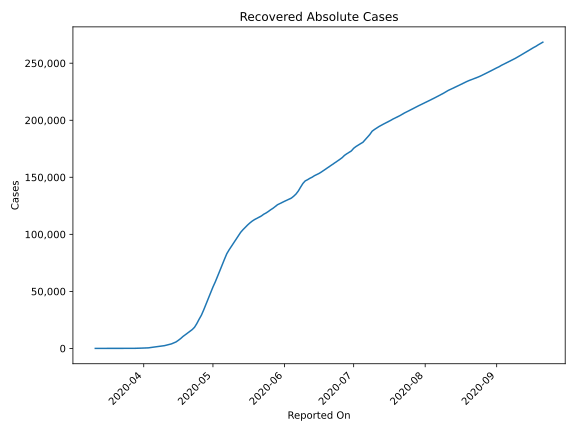
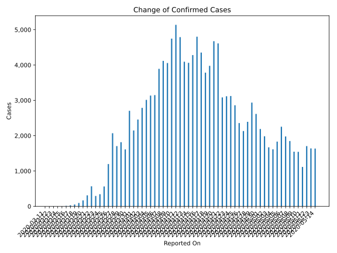
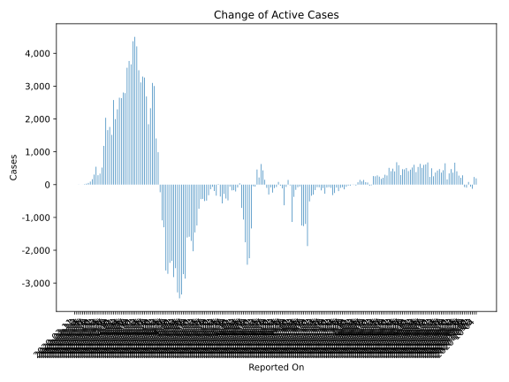
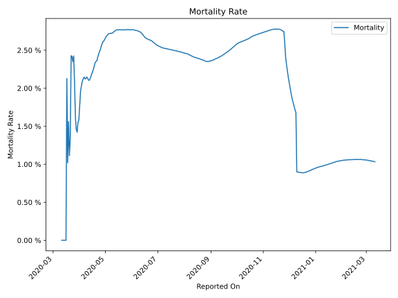

# Country Figures: Time Series for Turkey 

| Reported On | Confirmed | Deaths | Recovered | Active | Mortality | &Delta; Confirmed | &Delta; Deaths | &Delta; Recovered | &Delta; Active | % Active of Population |
|-------------|-----------|--------|-----------|--------|-----------|-------------------|----------------|-------------------|----------------|------------------------|
| 2020-04-11 | 52167 | 1101 | 2965 | 48101 |  2.11 %  | 5138 | 95 | 542 | 4501 |  0.058 %  | 
| 2020-04-10 | 47029 | 1006 | 2423 | 43600 |  2.14 %  | 4747 | 98 | 281 | 4368 |  0.053 %  | 
| 2020-04-09 | 42282 | 908 | 2142 | 39232 |  2.15 %  | 4056 | 96 | 296 | 3664 |  0.048 %  | 
| 2020-04-08 | 38226 | 812 | 1846 | 35568 |  2.12 %  | 4117 | 87 | 264 | 3766 |  0.043 %  | 
| 2020-04-07 | 34109 | 725 | 1582 | 31802 |  2.13 %  | 3892 | 76 | 256 | 3560 |  0.039 %  | 
| 2020-04-06 | 30217 | 649 | 1326 | 28242 |  2.15 %  | 3148 | 75 | 284 | 2789 |  0.034 %  | 
| 2020-04-05 | 27069 | 574 | 1042 | 25453 |  2.12 %  | 3135 | 73 | 256 | 2806 |  0.031 %  | 
| 2020-04-04 | 23934 | 501 | 786 | 22647 |  2.09 %  | 3013 | 76 | 302 | 2635 |  0.028 %  | 
| 2020-04-03 | 20921 | 425 | 484 | 20012 |  2.03 %  | 2786 | 69 | 69 | 2648 |  0.024 %  | 
| 2020-04-02 | 18135 | 356 | 415 | 17364 |  1.96 %  | 2456 | 79 | 82 | 2295 |  0.021 %  | 
| 2020-04-01 | 15679 | 277 | 333 | 15069 |  1.77 %  | 2148 | 63 | 90 | 1995 |  0.018 %  | 
| 2020-03-31 | 13531 | 214 | 243 | 13074 |  1.58 %  | 2704 | 46 | 81 | 2577 |  0.016 %  | 
| 2020-03-30 | 10827 | 168 | 162 | 10497 |  1.55 %  | 1610 | 37 | 57 | 1516 |  0.013 %  | 
| 2020-03-29 | 9217 | 131 | 105 | 8981 |  1.42 %  | 1815 | 23 | 35 | 1757 |  0.011 %  | 
| 2020-03-28 | 7402 | 108 | 70 | 7224 |  1.46 %  | 1704 | 16 | 28 | 1660 |  0.009 %  | 
| 2020-03-27 | 5698 | 92 | 42 | 5564 |  1.61 %  | 2069 | 17 | 16 | 2036 |  0.007 %  | 
| 2020-03-26 | 3629 | 75 | 26 | 3528 |  2.07 %  | 1196 | 16 | 0 | 1180 |  0.004 %  | 
| 2020-03-25 | 2433 | 59 | 26 | 2348 |  2.42 %  | 561 | 15 | 26 | 520 |  0.003 %  | 
| 2020-03-24 | 1872 | 44 | 0 | 1828 |  2.35 %  | 343 | 7 | 0 | 336 |  0.002 %  | 
| 2020-03-23 | 1529 | 37 | 0 | 1492 |  2.42 %  | 293 | 7 | 0 | 286 |  0.002 %  | 
| 2020-03-22 | 1236 | 30 | 0 | 1206 |  2.43 %  | 566 | 21 | 0 | 545 |  0.001 %  | 
| 2020-03-21 | 670 | 9 | 0 | 661 |  1.34 %  | 311 | 5 | 0 | 306 |  0.001 %  | 
| 2020-03-20 | 359 | 4 | 0 | 355 |  1.11 %  | 167 | 1 | 0 | 166 |  0.000 %  | 
| 2020-03-19 | 192 | 3 | 0 | 189 |  1.56 %  | 94 | 2 | 0 | 92 |  0.000 %  | 
| 2020-03-18 | 98 | 1 | 0 | 97 |  1.02 %  | 51 | 0 | 0 | 51 |  0.000 %  | 
| 2020-03-17 | 47 | 1 | 0 | 46 |  2.13 %  | 29 | 1 | 0 | 28 |  0.000 %  | 
| 2020-03-16 | 18 | 0 | 0 | 18 |  None  | 12 | 0 | 0 | 12 |  0.000 %  | 
| 2020-03-15 | 6 | 0 | 0 | 6 |  None  | 1 | 0 | 0 | 1 |  0.000 %  | 
| 2020-03-14 | 5 | 0 | 0 | 5 |  None  | 0 | 0 | 0 | 0 |  0.000 %  | 
| 2020-03-13 | 5 | 0 | 0 | 5 |  None  | 4 | 0 | 0 | 4 |  0.000 %  | 
| 2020-03-12 | 1 | 0 | 0 | 1 |  None  | 0 | 0 | 0 | 0 |  0.000 %  | 
| 2020-03-11 | 1 | 0 | 0 | 1 |  None  | None | None | None | None |  0.000 %  | 

