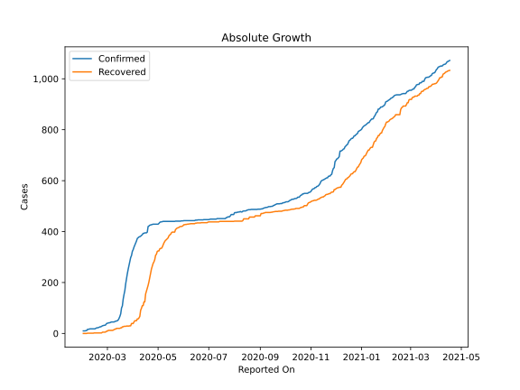
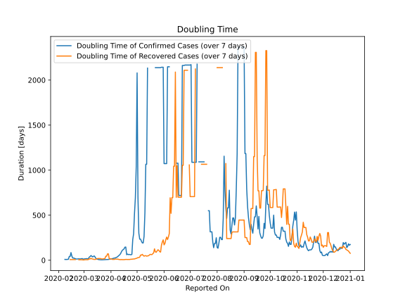

# Country Figures: Doubling Time of Infections for Taiwan 

The doubling time below are calculated based on
* an exponential growth assumption
* for time difference of past seven (7) days.
The doubling time's unit is "days".

The first doubling time indicates the increase of confirmed (infected)
cases. There, the *higher* the number is, the better is to take control
of the disease.

The second doubling time indicates the increase of recovered (healed)
cases. There, the *lower* the number is, the better it is to take
control of the disease.

| Reported On | Confirmed | Doubling Time (Confirmed) | Recovered | Doubling Time (Recovered) |
|-------------|-----------|---------------------------|-----------|---------------------------|
| 2020-04-30 | 429 |  1038.7 days  | 322 |  20.5 days  | 
| 2020-04-29 | 429 |  691.8 days  | 311 |  17.9 days  | 
| 2020-04-28 | 429 |  518.3 days  | 307 |  14.3 days  | 
| 2020-04-27 | 429 |  295.3 days  | 290 |  13.9 days  | 
| 2020-04-26 | 429 |  229.2 days  | 281 |  12.6 days  | 
| 2020-04-25 | 429 |  65.0 days  | 275 |  11.5 days  | 
| 2020-04-24 | 428 |  60.8 days  | 264 |  10.8 days  | 
| 2020-04-23 | 427 |  62.6 days  | 253 |  10.2 days  | 
| 2020-04-22 | 426 |  64.6 days  | 236 |  7.9 days  | 
| 2020-04-21 | 425 |  62.3 days  | 217 |  9.0 days  | 
| 2020-04-20 | 422 |  68.5 days  | 203 |  8.1 days  | 
| 2020-04-19 | 420 |  61.6 days  | 189 |  9.2 days  | 
| 2020-04-18 | 398 |  146.5 days  | 178 |  8.6 days  | 
| 2020-04-17 | 395 |  145.3 days  | 166 |  8.4 days  | 
| 2020-04-16 | 395 |  125.7 days  | 155 |  6.1 days  | 
| 2020-04-15 | 395 |  117.7 days  | 124 |  7.2 days  | 
| 2020-04-14 | 393 |  110.1 days  | 124 |  6.6 days  | 
| 2020-04-13 | 393 |  93.2 days  | 109 |  7.8 days  | 
| 2020-04-12 | 388 |  73.2 days  | 109 |  6.6 days  | 
| 2020-04-11 | 385 |  60.2 days  | 99 |  7.4 days  | 
| 2020-04-10 | 382 |  52.4 days  | 91 |  8.4 days  | 
| 2020-04-09 | 380 |  42.8 days  | 67 |  12.5 days  | 
| 2020-04-08 | 379 |  34.6 days  | 61 |  11.2 days  | 
| 2020-04-07 | 376 |  31.6 days  | 57 |  13.1 days  | 
| 2020-04-06 | 373 |  24.9 days  | 57 |  13.1 days  | 
| 2020-04-05 | 363 |  24.9 days  | 50 |  9.8 days  | 
| 2020-04-04 | 355 |  21.8 days  | 50 |  9.8 days  | 
| 2020-04-03 | 348 |  18.7 days  | 50 |  9.2 days  | 
| 2020-04-02 | 339 |  16.7 days  | 45 |  11.4 days  | 
| 2020-04-01 | 329 |  14.8 days  | 39 |  16.7 days  | 
| 2020-03-31 | 322 |  12.4 days  | 39 |  16.7 days  | 
| 2020-03-30 | 306 |  11.1 days  | 39 |  15.0 days  | 
| 2020-03-29 | 298 |  8.9 days  | 30 |  70.7 days  | 
| 2020-03-28 | 283 |  8.2 days  | 30 |  70.7 days  | 
| 2020-03-27 | 267 |  7.5 days  | 29 |  44.8 days  | 
| 2020-03-26 | 252 |  6.1 days  | 29 |  44.8 days  | 
| 2020-03-25 | 235 |  6.0 days  | 29 |  17.9 days  | 
| 2020-03-24 | 215 |  5.1 days  | 29 |  17.9 days  | 
| 2020-03-23 | 195 |  4.9 days  | 28 |  14.8 days  | 
| 2020-03-22 | 169 |  4.9 days  | 28 |  14.8 days  | 
| 2020-03-21 | 153 |  4.9 days  | 28 |  14.8 days  | 
| 2020-03-20 | 135 |  5.2 days  | 26 |  18.8 days  | 
| 2020-03-19 | 108 |  6.5 days  | 26 |  18.8 days  | 
| 2020-03-18 | 100 |  7.0 days  | 22 |  19.2 days  | 
| 2020-03-17 | 77 |  10.2 days  | 22 |  19.2 days  | 
| 2020-03-16 | 67 |  12.5 days  | 20 |  17.2 days  | 
| 2020-03-15 | 59 |  18.3 days  | 20 |  11.6 days  | 
| 2020-03-14 | 53 |  30.0 days  | 20 |  9.8 days  | 
| 2020-03-13 | 50 |  46.4 days  | 20 |  9.8 days  | 
| 2020-03-12 | 49 |  45.4 days  | 20 |  9.8 days  | 
| 2020-03-11 | 48 |  36.7 days  | 17 |  14.3 days  | 
| 2020-03-10 | 47 |  43.5 days  | 17 |  14.3 days  | 
| 2020-03-09 | 45 |  52.5 days  | 15 |  22.1 days  | 
| 2020-03-08 | 45 |  41.5 days  | 13 |  13.5 days  | 
| 2020-03-07 | 45 |  34.3 days  | 12 |  17.2 days  | 
| 2020-03-06 | 45 |  17.7 days  | 12 |  7.3 days  | 
| 2020-03-05 | 44 |  15.6 days  | 12 |  5.9 days  | 
| 2020-03-04 | 42 |  18.2 days  | 12 |  5.9 days  | 
| 2020-03-03 | 42 |  16.3 days  | 12 |  5.9 days  | 
| 2020-03-02 | 41 |  15.9 days  | 12 |  5.9 days  | 
| 2020-03-01 | 40 |  13.9 days  | 9 |  3.6 days  | 
| 2020-02-29 | 39 |  12.3 days  | 9 |  3.6 days  | 
| 2020-02-28 | 34 |  18.4 days  | 6 |  4.8 days  | 
| 2020-02-27 | 32 |  17.2 days  | 5 |  5.6 days  | 
| 2020-02-26 | 32 |  15.0 days  | 5 |  5.6 days  | 
| 2020-02-25 | 31 |  14.5 days  | 5 |  5.6 days  | 
| 2020-02-24 | 30 |  16.0 days  | 5 |  5.6 days  | 
| 2020-02-23 | 28 |  14.8 days  | 2 |  None  | 
| 2020-02-22 | 26 |  13.5 days  | 2 |  None  | 
| 2020-02-21 | 26 |  13.5 days  | 2 |  None  | 
| 2020-02-20 | 24 |  17.2 days  | 2 |  7.3 days  | 
| 2020-02-19 | 23 |  20.1 days  | 2 |  7.3 days  | 
| 2020-02-18 | 22 |  24.5 days  | 2 |  7.3 days  | 
| 2020-02-17 | 22 |  24.5 days  | 2 |  7.3 days  | 
| 2020-02-16 | 20 |  46.4 days  | 2 |  7.3 days  | 
| 2020-02-15 | 18 |  85.2 days  | 2 |  7.3 days  | 
| 2020-02-14 | 18 |  41.5 days  | 2 |  7.3 days  | 
| 2020-02-13 | 18 |  41.5 days  | 1 |  None  | 
| 2020-02-12 | 18 |  10.2 days  | 1 |  None  | 
| 2020-02-11 | 18 |  10.2 days  | 1 |  None  | 
| 2020-02-10 | 18 |  8.6 days  | 1 |  None  | 
| 2020-02-09 | 18 |  8.6 days  | 1 |  None  | 
| 2020-02-08 | 17 |  9.5 days  | 1 |  None  | 
| 2020-02-07 | 16 |  None  | 1 |  None  | 
| 2020-02-06 | 16 |  None  | 1 |  None  | 
| 2020-02-05 | 11 |  None  | 0 |  None  | 
| 2020-02-04 | 11 |  None  | 0 |  None  | 
| 2020-02-03 | 10 |  None  | 0 |  None  | 
| 2020-02-02 | 10 |  None  | 0 |  None  | 
| 2020-02-01 | 10 |  None  | 0 |  None  | 

