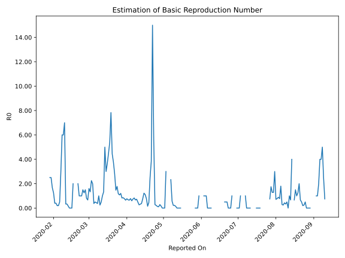

# Country Figures: Time Series for Basic Reproduction Number of Taiwan 

| Reported On | &Delta; Confirmed | Total &Delta; Confirmed First Interval | Total &Delta; Confirmed Second Interval | Estimated Basic Reproduction Number R0 | 
|-------------|-------------------|----------------------------------------|-----------------------------------------|---------------------------------------------------|
| 2020-04-29 | 0 |  1  |  6  |  0.17  | 
| 2020-04-28 | 0 |  2  |  7  |  0.29  | 
| 2020-04-27 | 0 |  3  |  28  |  0.11  | 
| 2020-04-26 | 0 |  4  |  30  |  0.13  | 
| 2020-04-25 | 1 |  6  |  27  |  0.22  | 
| 2020-04-24 | 1 |  7  |  25  |  0.28  | 
| 2020-04-23 | 1 |  28  |  5  |  5.60  | 
| 2020-04-22 | 1 |  30  |  2  |  15.00  | 
| 2020-04-21 | 3 |  27  |  7  |  3.86  | 
| 2020-04-20 | 2 |  25  |  10  |  2.50  | 
| 2020-04-19 | 22 |  5  |  11  |  0.45  | 
| 2020-04-18 | 3 |  2  |  13  |  0.15  | 
| 2020-04-17 | 0 |  7  |  9  |  0.78  | 
| 2020-04-16 | 0 |  10  |  9  |  1.11  | 
| 2020-04-15 | 2 |  11  |  9  |  1.22  | 
| 2020-04-14 | 0 |  13  |  17  |  0.76  | 
| 2020-04-13 | 5 |  9  |  24  |  0.38  | 
| 2020-04-12 | 3 |  9  |  28  |  0.32  | 
| 2020-04-11 | 3 |  9  |  34  |  0.26  | 
| 2020-04-10 | 2 |  17  |  34  |  0.50  | 
| 2020-04-09 | 1 |  24  |  33  |  0.73  | 
| 2020-04-08 | 3 |  28  |  42  |  0.67  | 
| 2020-04-07 | 3 |  34  |  41  |  0.83  | 
| 2020-04-06 | 10 |  34  |  46  |  0.74  | 
| 2020-04-05 | 8 |  33  |  55  |  0.60  | 
| 2020-04-04 | 7 |  42  |  54  |  0.78  | 
| 2020-04-03 | 9 |  41  |  63  |  0.65  | 
| 2020-04-02 | 10 |  46  |  68  |  0.68  | 
| 2020-04-01 | 7 |  55  |  72  |  0.76  | 
| 2020-03-31 | 16 |  54  |  83  |  0.65  | 
| 2020-03-30 | 8 |  63  |  82  |  0.77  | 
| 2020-03-29 | 15 |  68  |  80  |  0.85  | 
| 2020-03-28 | 16 |  72  |  87  |  0.83  | 
| 2020-03-27 | 15 |  83  |  69  |  1.20  | 
| 2020-03-26 | 17 |  82  |  76  |  1.08  | 
| 2020-03-25 | 20 |  80  |  68  |  1.18  | 
| 2020-03-24 | 20 |  87  |  49  |  1.78  | 
| 2020-03-23 | 26 |  69  |  47  |  1.47  | 
| 2020-03-22 | 16 |  76  |  27  |  2.81  | 
| 2020-03-21 | 18 |  68  |  18  |  3.78  | 
| 2020-03-20 | 27 |  49  |  11  |  4.45  | 
| 2020-03-19 | 8 |  47  |  6  |  7.83  | 
| 2020-03-18 | 23 |  27  |  5  |  5.40  | 
| 2020-03-17 | 10 |  18  |  4  |  4.50  | 
| 2020-03-16 | 8 |  11  |  3  |  3.67  | 
| 2020-03-15 | 6 |  6  |  2  |  3.00  | 
| 2020-03-14 | 3 |  5  |  1  |  5.00  | 
| 2020-03-13 | 1 |  4  |  3  |  1.33  | 
| 2020-03-12 | 1 |  3  |  3  |  1.00  | 
| 2020-03-11 | 1 |  2  |  4  |  0.50  | 
| 2020-03-10 | 2 |  1  |  4  |  0.25  | 
| 2020-03-09 | 0 |  3  |  3  |  1.00  | 
| 2020-03-08 | 0 |  3  |  8  |  0.38  | 
| 2020-03-07 | 0 |  4  |  9  |  0.44  | 
| 2020-03-06 | 1 |  4  |  8  |  0.50  | 
| 2020-03-05 | 2 |  3  |  8  |  0.38  | 
| 2020-03-04 | 0 |  8  |  4  |  2.00  | 
| 2020-03-03 | 1 |  9  |  4  |  2.25  | 
| 2020-03-02 | 1 |  8  |  6  |  1.33  | 
| 2020-03-01 | 1 |  8  |  5  |  1.60  | 
| 2020-02-29 | 5 |  4  |  6  |  0.67  | 
| 2020-02-28 | 2 |  4  |  5  |  0.80  | 
| 2020-02-27 | 0 |  6  |  4  |  1.50  | 
| 2020-02-26 | 1 |  5  |  4  |  1.25  | 
| 2020-02-25 | 1 |  6  |  4  |  1.50  | 
| 2020-02-24 | 2 |  5  |  5  |  1.00  | 
| 2020-02-23 | 2 |  4  |  4  |  1.00  | 
| 2020-02-22 | 0 |  4  |  4  |  1.00  | 
| 2020-02-21 | 2 |  4  |  2  |  2.00  | 
| 2020-02-20 | 1 |  5  |  None  |  None  | 
| 2020-02-19 | 1 |  4  |  None  |  None  | 
| 2020-02-18 | 0 |  4  |  None  |  None  | 
| 2020-02-17 | 2 |  2  |  1  |  2.00  | 
| 2020-02-16 | 2 |  None  |  2  |  None  | 
| 2020-02-15 | 0 |  None  |  2  |  None  | 
| 2020-02-14 | 0 |  None  |  7  |  None  | 
| 2020-02-13 | 0 |  1  |  6  |  0.17  | 
| 2020-02-12 | 0 |  2  |  6  |  0.33  | 
| 2020-02-11 | 0 |  2  |  6  |  0.33  | 
| 2020-02-10 | 0 |  7  |  1  |  7.00  | 
| 2020-02-09 | 1 |  6  |  1  |  6.00  | 
| 2020-02-08 | 1 |  6  |  1  |  6.00  | 
| 2020-02-07 | 0 |  6  |  2  |  3.00  | 
| 2020-02-06 | 5 |  1  |  2  |  0.50  | 
| 2020-02-05 | 0 |  1  |  5  |  0.20  | 
| 2020-02-04 | 1 |  1  |  5  |  0.20  | 
| 2020-02-03 | 0 |  2  |  5  |  0.40  | 
| 2020-02-02 | 0 |  2  |  5  |  0.40  | 
| 2020-02-01 | 0 |  5  |  4  |  1.25  | 
| 2020-01-31 | 1 |  5  |  3  |  1.67  | 
| 2020-01-30 | 1 |  5  |  2  |  2.50  | 
| 2020-01-29 | 0 |  5  |  2  |  2.50  | 
| 2020-01-28 | 3 |  4  |  None  |  None  | 
| 2020-01-27 | 1 |  3  |  None  |  None  | 
| 2020-01-26 | 1 |  2  |  None  |  None  | 
| 2020-01-25 | 0 |  2  |  None  |  None  | 
| 2020-01-24 | 2 |  None  |  None  |  None  | 
| 2020-01-23 | 0 |  None  |  None  |  None  | 
| 2020-01-22 | None |  None  |  None  |  None  | 

