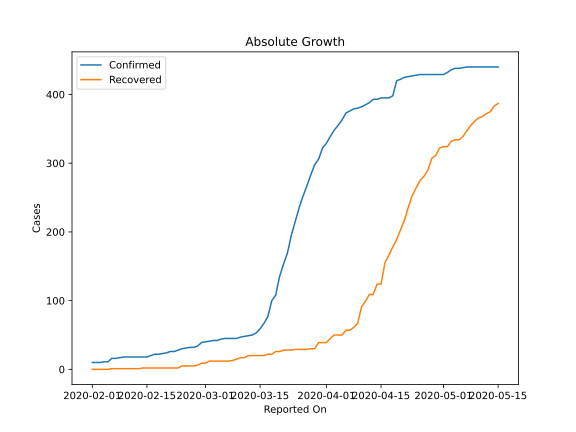
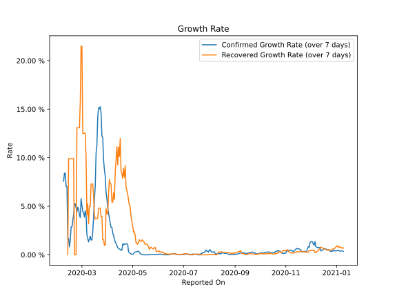

# Country Figures: Growth Rate for Taiwan 

The growth rates below are calculated based on
* an exponential growth assumption
* for time difference of past seven (7) days.
The growth rate is to be understood as on "growth per day".

The first growth rate indicates the increase of confirmed (infected) cases.

The second growth rate indicates the increase of recovered (healed) cases.

| Reported On | Confirmed | Growth Rate (Confirmed) | Recovered | Growth Rate (Recovered) |
|-------------|-----------|-------------------------|-----------|-------------------------|
| 2020-05-02 | 432 |  0.10 %  | 324 |  2.342 %  | 
| 2020-05-01 | 429 |  0.03 %  | 324 |  2.926 %  | 
| 2020-04-30 | 429 |  0.07 %  | 322 |  3.445 %  | 
| 2020-04-29 | 429 |  0.10 %  | 311 |  3.942 %  | 
| 2020-04-28 | 429 |  0.13 %  | 307 |  4.956 %  | 
| 2020-04-27 | 429 |  0.24 %  | 290 |  5.095 %  | 
| 2020-04-26 | 429 |  0.30 %  | 281 |  5.666 %  | 
| 2020-04-25 | 429 |  1.07 %  | 275 |  6.214 %  | 
| 2020-04-24 | 428 |  1.15 %  | 264 |  6.628 %  | 
| 2020-04-23 | 427 |  1.11 %  | 253 |  6.999 %  | 
| 2020-04-22 | 426 |  1.08 %  | 236 |  9.194 %  | 
| 2020-04-21 | 425 |  1.12 %  | 217 |  7.995 %  | 
| 2020-04-20 | 422 |  1.02 %  | 203 |  8.884 %  | 
| 2020-04-19 | 420 |  1.13 %  | 189 |  7.863 %  | 
| 2020-04-18 | 398 |  0.47 %  | 178 |  8.381 %  | 
| 2020-04-17 | 395 |  0.48 %  | 166 |  8.588 %  | 
| 2020-04-16 | 395 |  0.55 %  | 155 |  11.982 %  | 
| 2020-04-15 | 395 |  0.59 %  | 124 |  10.134 %  | 
| 2020-04-14 | 393 |  0.63 %  | 124 |  11.103 %  | 
| 2020-04-13 | 393 |  0.75 %  | 109 |  9.261 %  | 
| 2020-04-12 | 388 |  0.95 %  | 109 |  11.133 %  | 
| 2020-04-11 | 385 |  1.16 %  | 99 |  9.759 %  | 
| 2020-04-10 | 382 |  1.33 %  | 91 |  8.555 %  | 
| 2020-04-09 | 380 |  1.63 %  | 67 |  5.686 %  | 
| 2020-04-08 | 379 |  2.02 %  | 61 |  6.390 %  | 
| 2020-04-07 | 376 |  2.21 %  | 57 |  5.421 %  | 
| 2020-04-06 | 373 |  2.83 %  | 57 |  5.421 %  | 
| 2020-04-05 | 363 |  2.82 %  | 50 |  7.298 %  | 
| 2020-04-04 | 355 |  3.24 %  | 50 |  7.298 %  | 
| 2020-04-03 | 348 |  3.79 %  | 50 |  7.782 %  | 
| 2020-04-02 | 339 |  4.24 %  | 45 |  6.277 %  | 
| 2020-04-01 | 329 |  4.81 %  | 39 |  4.232 %  | 
| 2020-03-31 | 322 |  5.77 %  | 39 |  4.232 %  | 
| 2020-03-30 | 306 |  6.44 %  | 39 |  4.734 %  | 
| 2020-03-29 | 298 |  8.10 %  | 30 |  0.986 %  | 
| 2020-03-28 | 283 |  8.79 %  | 30 |  0.986 %  | 
| 2020-03-27 | 267 |  9.74 %  | 29 |  1.560 %  | 
| 2020-03-26 | 252 |  12.10 %  | 29 |  1.560 %  | 
| 2020-03-25 | 235 |  12.21 %  | 29 |  3.946 %  | 
| 2020-03-24 | 215 |  14.67 %  | 29 |  3.946 %  | 
| 2020-03-23 | 195 |  15.26 %  | 28 |  4.807 %  | 
| 2020-03-22 | 169 |  15.03 %  | 28 |  4.807 %  | 
| 2020-03-21 | 153 |  15.14 %  | 28 |  4.807 %  | 
| 2020-03-20 | 135 |  14.19 %  | 26 |  3.748 %  | 
| 2020-03-19 | 108 |  11.29 %  | 26 |  3.748 %  | 
| 2020-03-18 | 100 |  10.49 %  | 22 |  3.683 %  | 
| 2020-03-17 | 77 |  7.05 %  | 22 |  3.683 %  | 
| 2020-03-16 | 67 |  5.69 %  | 20 |  4.110 %  | 
| 2020-03-15 | 59 |  3.87 %  | 20 |  6.154 %  | 
| 2020-03-14 | 53 |  2.34 %  | 20 |  7.298 %  | 
| 2020-03-13 | 50 |  1.51 %  | 20 |  7.298 %  | 
| 2020-03-12 | 49 |  1.54 %  | 20 |  7.298 %  | 
| 2020-03-11 | 48 |  1.91 %  | 17 |  4.976 %  | 
| 2020-03-10 | 47 |  1.61 %  | 17 |  4.976 %  | 
| 2020-03-09 | 45 |  1.33 %  | 15 |  3.188 %  | 
| 2020-03-08 | 45 |  1.68 %  | 13 |  5.253 %  | 
| 2020-03-07 | 45 |  2.04 %  | 12 |  4.110 %  | 
| 2020-03-06 | 45 |  4.00 %  | 12 |  9.902 %  | 
| 2020-03-05 | 44 |  4.55 %  | 12 |  12.507 %  | 
| 2020-03-04 | 42 |  3.88 %  | 12 |  12.507 %  | 
| 2020-03-03 | 42 |  4.34 %  | 12 |  12.507 %  | 
| 2020-03-02 | 41 |  4.46 %  | 12 |  12.507 %  | 
| 2020-03-01 | 40 |  5.10 %  | 9 |  21.487 %  | 
| 2020-02-29 | 39 |  5.79 %  | 9 |  21.487 %  | 
| 2020-02-28 | 34 |  3.83 %  | 6 |  15.694 %  | 
| 2020-02-27 | 32 |  4.11 %  | 5 |  13.090 %  | 
| 2020-02-26 | 32 |  4.72 %  | 5 |  13.090 %  | 
| 2020-02-25 | 31 |  4.90 %  | 5 |  13.090 %  | 
| 2020-02-24 | 30 |  4.43 %  | 5 |  13.090 %  | 
| 2020-02-23 | 28 |  4.81 %  | 2 |  None  | 
| 2020-02-22 | 26 |  5.25 %  | 2 |  None  | 
| 2020-02-21 | 26 |  5.25 %  | 2 |  None  | 
| 2020-02-20 | 24 |  4.11 %  | 2 |  9.902 %  | 
| 2020-02-19 | 23 |  3.50 %  | 2 |  9.902 %  | 
| 2020-02-18 | 22 |  2.87 %  | 2 |  9.902 %  | 
| 2020-02-17 | 22 |  2.87 %  | 2 |  9.902 %  | 
| 2020-02-16 | 20 |  1.51 %  | 2 |  9.902 %  | 
| 2020-02-15 | 18 |  0.82 %  | 2 |  9.902 %  | 
| 2020-02-14 | 18 |  1.68 %  | 2 |  9.902 %  | 
| 2020-02-13 | 18 |  1.68 %  | 1 |  None  | 
| 2020-02-12 | 18 |  7.04 %  | 1 |  None  | 
| 2020-02-11 | 18 |  7.04 %  | 1 |  None  | 
| 2020-02-10 | 18 |  8.40 %  | 1 |  None  | 
| 2020-02-09 | 18 |  8.40 %  | 1 |  None  | 
| 2020-02-08 | 17 |  7.58 %  | 1 |  None  | 
| 2020-02-07 | 16 |  None  | 1 |  None  | 
| 2020-02-06 | 16 |  None  | 1 |  None  | 
| 2020-02-05 | 11 |  None  | 0 |  None  | 
| 2020-02-04 | 11 |  None  | 0 |  None  | 
| 2020-02-03 | 10 |  None  | 0 |  None  | 
| 2020-02-02 | 10 |  None  | 0 |  None  | 
| 2020-02-01 | 10 |  None  | 0 |  None  | 

