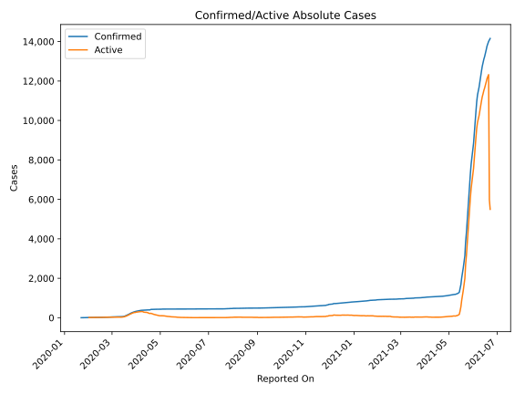
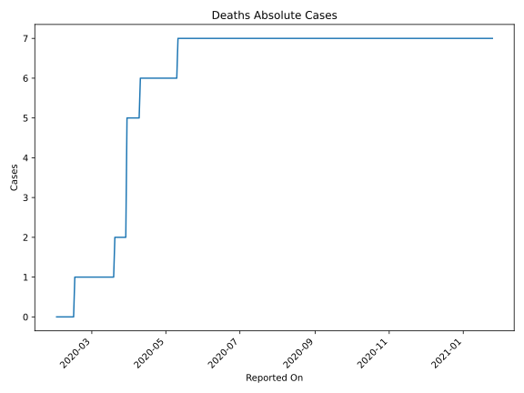
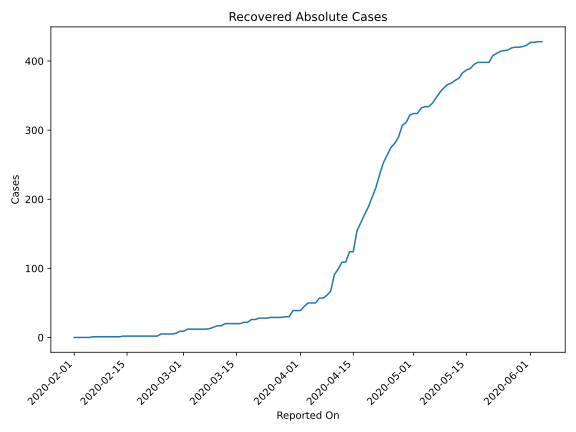
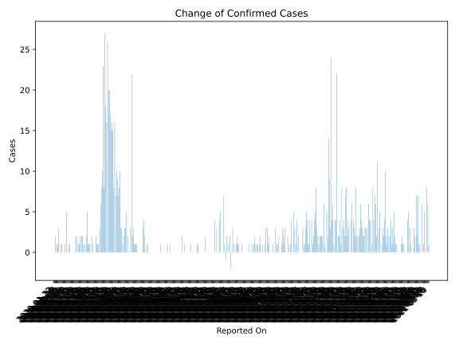
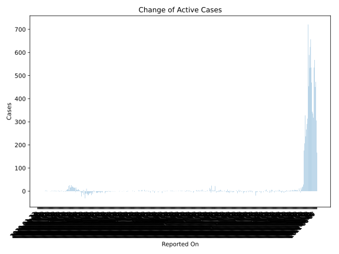
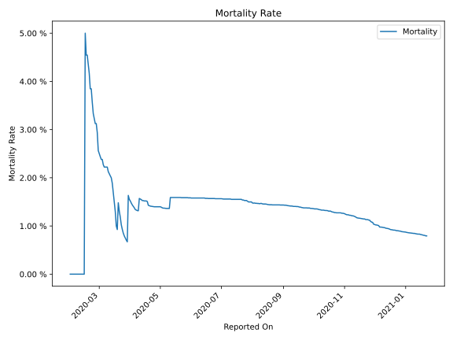

# Country Figures: Time Series for Taiwan 

| Reported On | Confirmed | Deaths | Recovered | Active | Mortality | &Delta; Confirmed | &Delta; Deaths | &Delta; Recovered | &Delta; Active | % Active of Population |
|-------------|-----------|--------|-----------|--------|-----------|-------------------|----------------|-------------------|----------------|------------------------|
| 2020-04-26 | 429 | 6 | 281 | 142 |  1.40 %  | 0 | 0 | 6 | -6 |  n/a  | 
| 2020-04-25 | 429 | 6 | 275 | 148 |  1.40 %  | 1 | 0 | 11 | -10 |  n/a  | 
| 2020-04-24 | 428 | 6 | 264 | 158 |  1.40 %  | 1 | 0 | 11 | -10 |  n/a  | 
| 2020-04-23 | 427 | 6 | 253 | 168 |  1.41 %  | 1 | 0 | 17 | -16 |  n/a  | 
| 2020-04-22 | 426 | 6 | 236 | 184 |  1.41 %  | 1 | 0 | 19 | -18 |  n/a  | 
| 2020-04-21 | 425 | 6 | 217 | 202 |  1.41 %  | 3 | 0 | 14 | -11 |  n/a  | 
| 2020-04-20 | 422 | 6 | 203 | 213 |  1.42 %  | 2 | 0 | 14 | -12 |  n/a  | 
| 2020-04-19 | 420 | 6 | 189 | 225 |  1.43 %  | 22 | 0 | 11 | 11 |  n/a  | 
| 2020-04-18 | 398 | 6 | 178 | 214 |  1.51 %  | 3 | 0 | 12 | -9 |  n/a  | 
| 2020-04-17 | 395 | 6 | 166 | 223 |  1.52 %  | 0 | 0 | 11 | -11 |  n/a  | 
| 2020-04-16 | 395 | 6 | 155 | 234 |  1.52 %  | 0 | 0 | 31 | -31 |  n/a  | 
| 2020-04-15 | 395 | 6 | 124 | 265 |  1.52 %  | 2 | 0 | 0 | 2 |  n/a  | 
| 2020-04-14 | 393 | 6 | 124 | 263 |  1.53 %  | 0 | 0 | 15 | -15 |  n/a  | 
| 2020-04-13 | 393 | 6 | 109 | 278 |  1.53 %  | 5 | 0 | 0 | 5 |  n/a  | 
| 2020-04-12 | 388 | 6 | 109 | 273 |  1.55 %  | 3 | 0 | 10 | -7 |  n/a  | 
| 2020-04-11 | 385 | 6 | 99 | 280 |  1.56 %  | 3 | 0 | 8 | -5 |  n/a  | 
| 2020-04-10 | 382 | 6 | 91 | 285 |  1.57 %  | 2 | 1 | 24 | -23 |  n/a  | 
| 2020-04-09 | 380 | 5 | 67 | 308 |  1.32 %  | 1 | 0 | 6 | -5 |  n/a  | 
| 2020-04-08 | 379 | 5 | 61 | 313 |  1.32 %  | 3 | 0 | 4 | -1 |  n/a  | 
| 2020-04-07 | 376 | 5 | 57 | 314 |  1.33 %  | 3 | 0 | 0 | 3 |  n/a  | 
| 2020-04-06 | 373 | 5 | 57 | 311 |  1.34 %  | 10 | 0 | 7 | 3 |  n/a  | 
| 2020-04-05 | 363 | 5 | 50 | 308 |  1.38 %  | 8 | 0 | 0 | 8 |  n/a  | 
| 2020-04-04 | 355 | 5 | 50 | 300 |  1.41 %  | 7 | 0 | 0 | 7 |  n/a  | 
| 2020-04-03 | 348 | 5 | 50 | 293 |  1.44 %  | 9 | 0 | 5 | 4 |  n/a  | 
| 2020-04-02 | 339 | 5 | 45 | 289 |  1.47 %  | 10 | 0 | 6 | 4 |  n/a  | 
| 2020-04-01 | 329 | 5 | 39 | 285 |  1.52 %  | 7 | 0 | 0 | 7 |  n/a  | 
| 2020-03-31 | 322 | 5 | 39 | 278 |  1.55 %  | 16 | 0 | 0 | 16 |  n/a  | 
| 2020-03-30 | 306 | 5 | 39 | 262 |  1.63 %  | 8 | 3 | 9 | -4 |  n/a  | 
| 2020-03-29 | 298 | 2 | 30 | 266 |  0.67 %  | 15 | 0 | 0 | 15 |  n/a  | 
| 2020-03-28 | 283 | 2 | 30 | 251 |  0.71 %  | 16 | 0 | 1 | 15 |  n/a  | 
| 2020-03-27 | 267 | 2 | 29 | 236 |  0.75 %  | 15 | 0 | 0 | 15 |  n/a  | 
| 2020-03-26 | 252 | 2 | 29 | 221 |  0.79 %  | 17 | 0 | 0 | 17 |  n/a  | 
| 2020-03-25 | 235 | 2 | 29 | 204 |  0.85 %  | 20 | 0 | 0 | 20 |  n/a  | 
| 2020-03-24 | 215 | 2 | 29 | 184 |  0.93 %  | 20 | 0 | 1 | 19 |  n/a  | 
| 2020-03-23 | 195 | 2 | 28 | 165 |  1.03 %  | 26 | 0 | 0 | 26 |  n/a  | 
| 2020-03-22 | 169 | 2 | 28 | 139 |  1.18 %  | 16 | 0 | 0 | 16 |  n/a  | 
| 2020-03-21 | 153 | 2 | 28 | 123 |  1.31 %  | 18 | 0 | 2 | 16 |  n/a  | 
| 2020-03-20 | 135 | 2 | 26 | 107 |  1.48 %  | 27 | 1 | 0 | 26 |  n/a  | 
| 2020-03-19 | 108 | 1 | 26 | 81 |  0.93 %  | 8 | 0 | 4 | 4 |  n/a  | 
| 2020-03-18 | 100 | 1 | 22 | 77 |  1.00 %  | 23 | 0 | 0 | 23 |  n/a  | 
| 2020-03-17 | 77 | 1 | 22 | 54 |  1.30 %  | 10 | 0 | 2 | 8 |  n/a  | 
| 2020-03-16 | 67 | 1 | 20 | 46 |  1.49 %  | 8 | 0 | 0 | 8 |  n/a  | 
| 2020-03-15 | 59 | 1 | 20 | 38 |  1.69 %  | 6 | 0 | 0 | 6 |  n/a  | 
| 2020-03-14 | 53 | 1 | 20 | 32 |  1.89 %  | 3 | 0 | 0 | 3 |  n/a  | 
| 2020-03-13 | 50 | 1 | 20 | 29 |  2.00 %  | 1 | 0 | 0 | 1 |  n/a  | 
| 2020-03-12 | 49 | 1 | 20 | 28 |  2.04 %  | 1 | 0 | 3 | -2 |  n/a  | 
| 2020-03-11 | 48 | 1 | 17 | 30 |  2.08 %  | 1 | 0 | 0 | 1 |  n/a  | 
| 2020-03-10 | 47 | 1 | 17 | 29 |  2.13 %  | 2 | 0 | 2 | 0 |  n/a  | 
| 2020-03-09 | 45 | 1 | 15 | 29 |  2.22 %  | 0 | 0 | 2 | -2 |  n/a  | 
| 2020-03-08 | 45 | 1 | 13 | 31 |  2.22 %  | 0 | 0 | 1 | -1 |  n/a  | 
| 2020-03-07 | 45 | 1 | 12 | 32 |  2.22 %  | 0 | 0 | 0 | 0 |  n/a  | 
| 2020-03-06 | 45 | 1 | 12 | 32 |  2.22 %  | 1 | 0 | 0 | 1 |  n/a  | 
| 2020-03-05 | 44 | 1 | 12 | 31 |  2.27 %  | 2 | 0 | 0 | 2 |  n/a  | 
| 2020-03-04 | 42 | 1 | 12 | 29 |  2.38 %  | 0 | 0 | 0 | 0 |  n/a  | 
| 2020-03-03 | 42 | 1 | 12 | 29 |  2.38 %  | 1 | 0 | 0 | 1 |  n/a  | 
| 2020-03-02 | 41 | 1 | 12 | 28 |  2.44 %  | 1 | 0 | 3 | -2 |  n/a  | 
| 2020-03-01 | 40 | 1 | 9 | 30 |  2.50 %  | 1 | 0 | 0 | 1 |  n/a  | 
| 2020-02-29 | 39 | 1 | 9 | 29 |  2.56 %  | 5 | 0 | 3 | 2 |  n/a  | 
| 2020-02-28 | 34 | 1 | 6 | 27 |  2.94 %  | 2 | 0 | 1 | 1 |  n/a  | 
| 2020-02-27 | 32 | 1 | 5 | 26 |  3.12 %  | 0 | 0 | 0 | 0 |  n/a  | 
| 2020-02-26 | 32 | 1 | 5 | 26 |  3.12 %  | 1 | 0 | 0 | 1 |  n/a  | 
| 2020-02-25 | 31 | 1 | 5 | 25 |  3.23 %  | 1 | 0 | 0 | 1 |  n/a  | 
| 2020-02-24 | 30 | 1 | 5 | 24 |  3.33 %  | 2 | 0 | 3 | -1 |  n/a  | 
| 2020-02-23 | 28 | 1 | 2 | 25 |  3.57 %  | 2 | 0 | 0 | 2 |  n/a  | 
| 2020-02-22 | 26 | 1 | 2 | 23 |  3.85 %  | 0 | 0 | 0 | 0 |  n/a  | 
| 2020-02-21 | 26 | 1 | 2 | 23 |  3.85 %  | 2 | 0 | 0 | 2 |  n/a  | 
| 2020-02-20 | 24 | 1 | 2 | 21 |  4.17 %  | 1 | 0 | 0 | 1 |  n/a  | 
| 2020-02-19 | 23 | 1 | 2 | 20 |  4.35 %  | 1 | 0 | 0 | 1 |  n/a  | 
| 2020-02-18 | 22 | 1 | 2 | 19 |  4.55 %  | 0 | 0 | 0 | 0 |  n/a  | 
| 2020-02-17 | 22 | 1 | 2 | 19 |  4.55 %  | 2 | 0 | 0 | 2 |  n/a  | 
| 2020-02-16 | 20 | 1 | 2 | 17 |  5.00 %  | 2 | 1 | 0 | 1 |  n/a  | 
| 2020-02-15 | 18 | 0 | 2 | 16 |  None  | 0 | 0 | 0 | 0 |  n/a  | 
| 2020-02-14 | 18 | 0 | 2 | 16 |  None  | 0 | 0 | 1 | -1 |  n/a  | 
| 2020-02-13 | 18 | 0 | 1 | 17 |  None  | 0 | 0 | 0 | 0 |  n/a  | 
| 2020-02-12 | 18 | 0 | 1 | 17 |  None  | 0 | 0 | 0 | 0 |  n/a  | 
| 2020-02-11 | 18 | 0 | 1 | 17 |  None  | 0 | 0 | 0 | 0 |  n/a  | 
| 2020-02-10 | 18 | 0 | 1 | 17 |  None  | 0 | 0 | 0 | 0 |  n/a  | 
| 2020-02-09 | 18 | 0 | 1 | 17 |  None  | 1 | 0 | 0 | 1 |  n/a  | 
| 2020-02-08 | 17 | 0 | 1 | 16 |  None  | 1 | 0 | 0 | 1 |  n/a  | 
| 2020-02-07 | 16 | 0 | 1 | 15 |  None  | 0 | 0 | 0 | 0 |  n/a  | 
| 2020-02-06 | 16 | 0 | 1 | 15 |  None  | 5 | 0 | 1 | 4 |  n/a  | 
| 2020-02-05 | 11 | 0 | 0 | 11 |  None  | 0 | 0 | 0 | 0 |  n/a  | 
| 2020-02-04 | 11 | 0 | 0 | 11 |  None  | 1 | 0 | 0 | 1 |  n/a  | 
| 2020-02-03 | 10 | 0 | 0 | 10 |  None  | 0 | 0 | 0 | 0 |  n/a  | 
| 2020-02-02 | 10 | 0 | 0 | 10 |  None  | 0 | 0 | 0 | 0 |  n/a  | 
| 2020-02-01 | 10 | 0 | 0 | 10 |  None  | 0 | None | None | None |  n/a  | 
| 2020-01-31 | 10 | None | None | None |  None  | 1 | None | None | None |  n/a  | 
| 2020-01-30 | 9 | None | None | None |  None  | 1 | None | None | None |  n/a  | 
| 2020-01-29 | 8 | None | None | None |  None  | 0 | None | None | None |  n/a  | 
| 2020-01-28 | 8 | None | None | None |  None  | 3 | None | None | None |  n/a  | 
| 2020-01-27 | 5 | None | None | None |  None  | 1 | None | None | None |  n/a  | 
| 2020-01-26 | 4 | None | None | None |  None  | 1 | None | None | None |  n/a  | 
| 2020-01-25 | 3 | None | None | None |  None  | 0 | None | None | None |  n/a  | 
| 2020-01-24 | 3 | None | None | None |  None  | 2 | None | None | None |  n/a  | 
| 2020-01-23 | 1 | None | None | None |  None  | 0 | None | None | None |  n/a  | 
| 2020-01-22 | 1 | None | None | None |  None  | None | None | None | None |  n/a  | 

