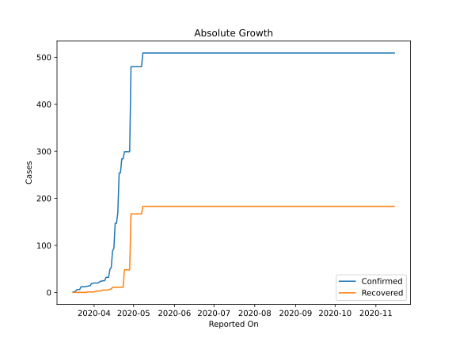
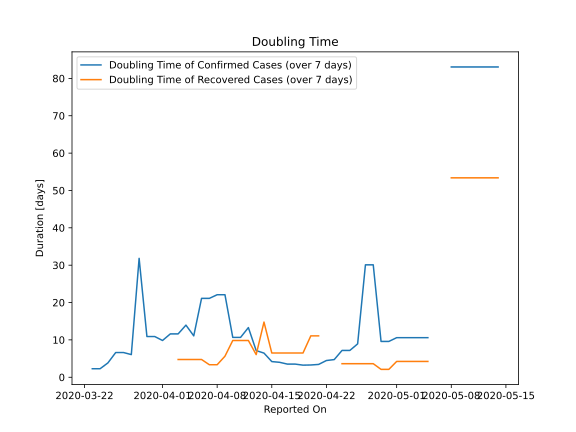

# Country Figures: Doubling Time of Infections for Tanzania 

The doubling time below are calculated based on
* an exponential growth assumption
* for time difference of past seven (7) days.
The doubling time's unit is "days".

The first doubling time indicates the increase of confirmed (infected)
cases. There, the *higher* the number is, the better is to take control
of the disease.

The second doubling time indicates the increase of recovered (healed)
cases. There, the *lower* the number is, the better it is to take
control of the disease.

| Reported On | Confirmed | Doubling Time (Confirmed) | Recovered | Doubling Time (Recovered) |
|-------------|-----------|---------------------------|-----------|---------------------------|
| 2020-05-04 | 480 |  10.6 days  | 167 |  4.2 days  | 
| 2020-05-03 | 480 |  10.6 days  | 167 |  4.2 days  | 
| 2020-05-02 | 480 |  10.6 days  | 167 |  4.2 days  | 
| 2020-05-01 | 480 |  10.6 days  | 167 |  4.2 days  | 
| 2020-04-30 | 480 |  9.6 days  | 167 |  2.1 days  | 
| 2020-04-29 | 480 |  9.6 days  | 167 |  2.1 days  | 
| 2020-04-28 | 299 |  30.1 days  | 48 |  3.6 days  | 
| 2020-04-27 | 299 |  30.1 days  | 48 |  3.6 days  | 
| 2020-04-26 | 299 |  8.9 days  | 48 |  3.6 days  | 
| 2020-04-25 | 299 |  7.2 days  | 48 |  3.6 days  | 
| 2020-04-24 | 299 |  7.2 days  | 48 |  3.6 days  | 
| 2020-04-23 | 284 |  4.7 days  | 11 |  None  | 
| 2020-04-22 | 284 |  4.5 days  | 11 |  None  | 
| 2020-04-21 | 254 |  3.4 days  | 11 |  11.1 days  | 
| 2020-04-20 | 254 |  3.3 days  | 11 |  11.1 days  | 
| 2020-04-19 | 170 |  3.2 days  | 11 |  6.5 days  | 
| 2020-04-18 | 147 |  3.5 days  | 11 |  6.5 days  | 
| 2020-04-17 | 147 |  3.5 days  | 11 |  6.5 days  | 
| 2020-04-16 | 94 |  4.0 days  | 11 |  6.5 days  | 
| 2020-04-15 | 88 |  4.2 days  | 11 |  6.5 days  | 
| 2020-04-14 | 53 |  6.5 days  | 7 |  14.8 days  | 
| 2020-04-13 | 49 |  7.1 days  | 7 |  6.1 days  | 
| 2020-04-12 | 32 |  13.3 days  | 5 |  9.8 days  | 
| 2020-04-11 | 32 |  10.7 days  | 5 |  9.8 days  | 
| 2020-04-10 | 32 |  10.7 days  | 5 |  9.8 days  | 
| 2020-04-09 | 25 |  22.1 days  | 5 |  5.6 days  | 
| 2020-04-08 | 25 |  22.1 days  | 5 |  3.3 days  | 
| 2020-04-07 | 24 |  21.1 days  | 5 |  3.3 days  | 
| 2020-04-06 | 24 |  21.1 days  | 3 |  4.8 days  | 
| 2020-04-05 | 22 |  11.1 days  | 3 |  4.8 days  | 
| 2020-04-04 | 20 |  13.9 days  | 3 |  4.8 days  | 
| 2020-04-03 | 20 |  11.6 days  | 3 |  4.8 days  | 
| 2020-04-02 | 20 |  11.6 days  | 2 |  None  | 
| 2020-04-01 | 20 |  9.8 days  | 1 |  None  | 
| 2020-03-31 | 19 |  10.9 days  | 1 |  None  | 
| 2020-03-30 | 19 |  10.9 days  | 1 |  None  | 
| 2020-03-29 | 14 |  31.8 days  | 1 |  None  | 
| 2020-03-28 | 14 |  6.1 days  | 1 |  None  | 
| 2020-03-27 | 13 |  6.6 days  | 1 |  None  | 
| 2020-03-26 | 13 |  6.6 days  | 0 |  None  | 
| 2020-03-25 | 12 |  3.8 days  | 0 |  None  | 
| 2020-03-24 | 12 |  2.3 days  | 0 |  None  | 
| 2020-03-23 | 12 |  2.3 days  | 0 |  None  | 
| 2020-03-22 | 12 |  None  | 0 |  None  | 
| 2020-03-21 | 6 |  None  | 0 |  None  | 
| 2020-03-20 | 6 |  None  | 0 |  None  | 
| 2020-03-19 | 6 |  None  | 0 |  None  | 
| 2020-03-18 | 3 |  None  | 0 |  None  | 
| 2020-03-17 | 1 |  None  | 0 |  None  | 
| 2020-03-16 | 1 |  None  | 0 |  None  | 

