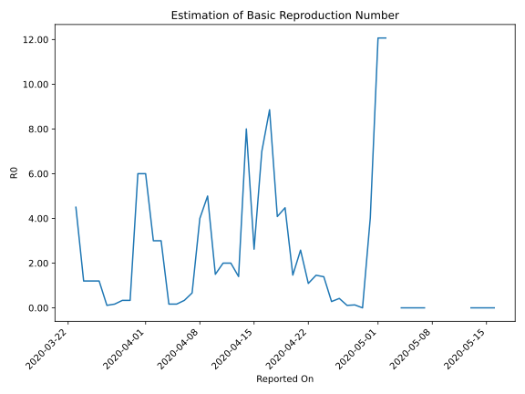

# Country Figures: Time Series for Basic Reproduction Number of Tanzania 

| Reported On | &Delta; Confirmed | Total &Delta; Confirmed First Interval | Total &Delta; Confirmed Second Interval | Estimated Basic Reproduction Number R0 | 
|-------------|-------------------|----------------------------------------|-----------------------------------------|---------------------------------------------------|
| 2020-05-01 | 0 |  181  |  15  |  12.07  | 
| 2020-04-30 | 0 |  181  |  45  |  4.02  | 
| 2020-04-29 | 181 |  None  |  45  |  None  | 
| 2020-04-28 | 0 |  15  |  114  |  0.13  | 
| 2020-04-27 | 0 |  15  |  137  |  0.11  | 
| 2020-04-26 | 0 |  45  |  107  |  0.42  | 
| 2020-04-25 | 0 |  45  |  160  |  0.28  | 
| 2020-04-24 | 15 |  114  |  82  |  1.39  | 
| 2020-04-23 | 0 |  137  |  94  |  1.46  | 
| 2020-04-22 | 30 |  107  |  98  |  1.09  | 
| 2020-04-21 | 0 |  160  |  62  |  2.58  | 
| 2020-04-20 | 84 |  82  |  56  |  1.46  | 
| 2020-04-19 | 23 |  94  |  21  |  4.48  | 
| 2020-04-18 | 0 |  98  |  24  |  4.08  | 
| 2020-04-17 | 53 |  62  |  7  |  8.86  | 
| 2020-04-16 | 6 |  56  |  8  |  7.00  | 
| 2020-04-15 | 35 |  21  |  8  |  2.62  | 
| 2020-04-14 | 4 |  24  |  3  |  8.00  | 
| 2020-04-13 | 17 |  7  |  5  |  1.40  | 
| 2020-04-12 | 0 |  8  |  4  |  2.00  | 
| 2020-04-11 | 0 |  8  |  4  |  2.00  | 
| 2020-04-10 | 7 |  3  |  2  |  1.50  | 
| 2020-04-09 | 0 |  5  |  1  |  5.00  | 
| 2020-04-08 | 1 |  4  |  1  |  4.00  | 
| 2020-04-07 | 0 |  4  |  6  |  0.67  | 
| 2020-04-06 | 2 |  2  |  6  |  0.33  | 
| 2020-04-05 | 2 |  1  |  6  |  0.17  | 
| 2020-04-04 | 0 |  1  |  6  |  0.17  | 
| 2020-04-03 | 0 |  6  |  2  |  3.00  | 
| 2020-04-02 | 0 |  6  |  2  |  3.00  | 
| 2020-04-01 | 1 |  6  |  1  |  6.00  | 
| 2020-03-31 | 0 |  6  |  1  |  6.00  | 
| 2020-03-30 | 5 |  2  |  6  |  0.33  | 
| 2020-03-29 | 0 |  2  |  6  |  0.33  | 
| 2020-03-28 | 1 |  1  |  6  |  0.17  | 
| 2020-03-27 | 0 |  1  |  9  |  0.11  | 
| 2020-03-26 | 1 |  6  |  5  |  1.20  | 
| 2020-03-25 | 0 |  6  |  5  |  1.20  | 
| 2020-03-24 | 0 |  6  |  5  |  1.20  | 
| 2020-03-23 | 0 |  9  |  2  |  4.50  | 
| 2020-03-22 | 6 |  5  |  None  |  None  | 
| 2020-03-21 | 0 |  5  |  None  |  None  | 
| 2020-03-20 | 0 |  5  |  None  |  None  | 
| 2020-03-19 | 3 |  2  |  None  |  None  | 
| 2020-03-18 | 2 |  None  |  None  |  None  | 
| 2020-03-17 | 0 |  None  |  None  |  None  | 
| 2020-03-16 | None |  None  |  None  |  None  | 

