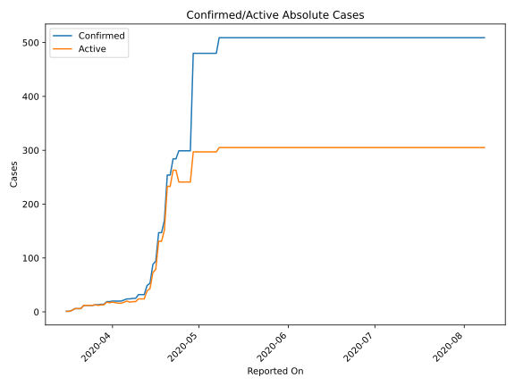
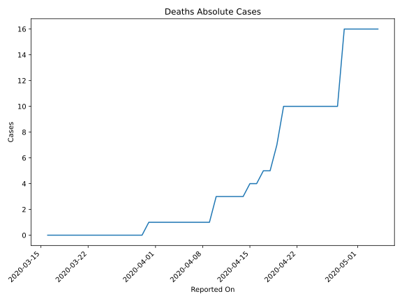
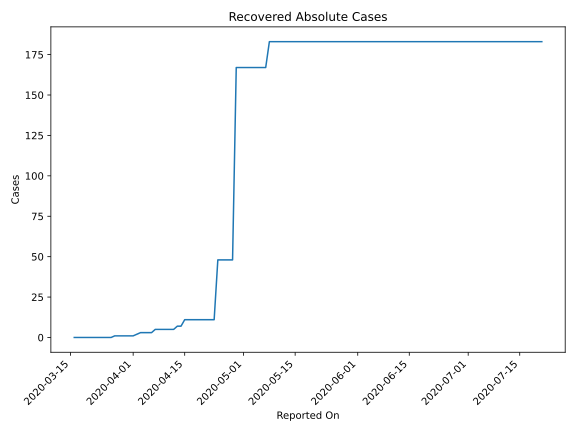
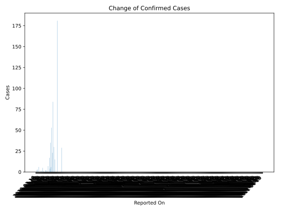
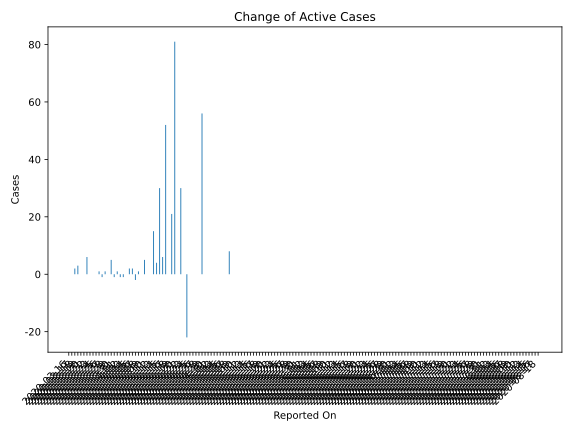
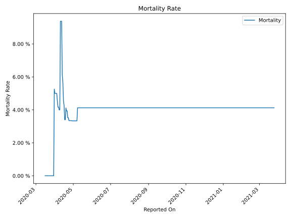

# Country Figures: Time Series for Tanzania 

| Reported On | Confirmed | Deaths | Recovered | Active | Mortality | &Delta; Confirmed | &Delta; Deaths | &Delta; Recovered | &Delta; Active | % Active of Population |
|-------------|-----------|--------|-----------|--------|-----------|-------------------|----------------|-------------------|----------------|------------------------|
| 2020-05-01 | 480 | 16 | 167 | 297 |  3.33 %  | 0 | 0 | 0 | 0 |  0.001 %  | 
| 2020-04-30 | 480 | 16 | 167 | 297 |  3.33 %  | 0 | 0 | 0 | 0 |  0.001 %  | 
| 2020-04-29 | 480 | 16 | 167 | 297 |  3.33 %  | 181 | 6 | 119 | 56 |  0.001 %  | 
| 2020-04-28 | 299 | 10 | 48 | 241 |  3.34 %  | 0 | 0 | 0 | 0 |  0.000 %  | 
| 2020-04-27 | 299 | 10 | 48 | 241 |  3.34 %  | 0 | 0 | 0 | 0 |  0.000 %  | 
| 2020-04-26 | 299 | 10 | 48 | 241 |  3.34 %  | 0 | 0 | 0 | 0 |  0.000 %  | 
| 2020-04-25 | 299 | 10 | 48 | 241 |  3.34 %  | 0 | 0 | 0 | 0 |  0.000 %  | 
| 2020-04-24 | 299 | 10 | 48 | 241 |  3.34 %  | 15 | 0 | 37 | -22 |  0.000 %  | 
| 2020-04-23 | 284 | 10 | 11 | 263 |  3.52 %  | 0 | 0 | 0 | 0 |  0.000 %  | 
| 2020-04-22 | 284 | 10 | 11 | 263 |  3.52 %  | 30 | 0 | 0 | 30 |  0.000 %  | 
| 2020-04-21 | 254 | 10 | 11 | 233 |  3.94 %  | 0 | 0 | 0 | 0 |  0.000 %  | 
| 2020-04-20 | 254 | 10 | 11 | 233 |  3.94 %  | 84 | 3 | 0 | 81 |  0.000 %  | 
| 2020-04-19 | 170 | 7 | 11 | 152 |  4.12 %  | 23 | 2 | 0 | 21 |  0.000 %  | 
| 2020-04-18 | 147 | 5 | 11 | 131 |  3.40 %  | 0 | 0 | 0 | 0 |  0.000 %  | 
| 2020-04-17 | 147 | 5 | 11 | 131 |  3.40 %  | 53 | 1 | 0 | 52 |  0.000 %  | 
| 2020-04-16 | 94 | 4 | 11 | 79 |  4.26 %  | 6 | 0 | 0 | 6 |  0.000 %  | 
| 2020-04-15 | 88 | 4 | 11 | 73 |  4.55 %  | 35 | 1 | 4 | 30 |  0.000 %  | 
| 2020-04-14 | 53 | 3 | 7 | 43 |  5.66 %  | 4 | 0 | 0 | 4 |  0.000 %  | 
| 2020-04-13 | 49 | 3 | 7 | 39 |  6.12 %  | 17 | 0 | 2 | 15 |  0.000 %  | 
| 2020-04-12 | 32 | 3 | 5 | 24 |  9.38 %  | 0 | 0 | 0 | 0 |  0.000 %  | 
| 2020-04-11 | 32 | 3 | 5 | 24 |  9.38 %  | 0 | 0 | 0 | 0 |  0.000 %  | 
| 2020-04-10 | 32 | 3 | 5 | 24 |  9.38 %  | 7 | 2 | 0 | 5 |  0.000 %  | 
| 2020-04-09 | 25 | 1 | 5 | 19 |  4.00 %  | 0 | 0 | 0 | 0 |  0.000 %  | 
| 2020-04-08 | 25 | 1 | 5 | 19 |  4.00 %  | 1 | 0 | 0 | 1 |  0.000 %  | 
| 2020-04-07 | 24 | 1 | 5 | 18 |  4.17 %  | 0 | 0 | 2 | -2 |  0.000 %  | 
| 2020-04-06 | 24 | 1 | 3 | 20 |  4.17 %  | 2 | 0 | 0 | 2 |  0.000 %  | 
| 2020-04-05 | 22 | 1 | 3 | 18 |  4.55 %  | 2 | 0 | 0 | 2 |  0.000 %  | 
| 2020-04-04 | 20 | 1 | 3 | 16 |  5.00 %  | 0 | 0 | 0 | 0 |  0.000 %  | 
| 2020-04-03 | 20 | 1 | 3 | 16 |  5.00 %  | 0 | 0 | 1 | -1 |  0.000 %  | 
| 2020-04-02 | 20 | 1 | 2 | 17 |  5.00 %  | 0 | 0 | 1 | -1 |  0.000 %  | 
| 2020-04-01 | 20 | 1 | 1 | 18 |  5.00 %  | 1 | 0 | 0 | 1 |  0.000 %  | 
| 2020-03-31 | 19 | 1 | 1 | 17 |  5.26 %  | 0 | 1 | 0 | -1 |  0.000 %  | 
| 2020-03-30 | 19 | 0 | 1 | 18 |  None  | 5 | 0 | 0 | 5 |  0.000 %  | 
| 2020-03-29 | 14 | 0 | 1 | 13 |  None  | 0 | 0 | 0 | 0 |  0.000 %  | 
| 2020-03-28 | 14 | 0 | 1 | 13 |  None  | 1 | 0 | 0 | 1 |  0.000 %  | 
| 2020-03-27 | 13 | 0 | 1 | 12 |  None  | 0 | 0 | 1 | -1 |  0.000 %  | 
| 2020-03-26 | 13 | 0 | 0 | 13 |  None  | 1 | 0 | 0 | 1 |  0.000 %  | 
| 2020-03-25 | 12 | 0 | 0 | 12 |  None  | 0 | 0 | 0 | 0 |  0.000 %  | 
| 2020-03-24 | 12 | 0 | 0 | 12 |  None  | 0 | 0 | 0 | 0 |  0.000 %  | 
| 2020-03-23 | 12 | 0 | 0 | 12 |  None  | 0 | 0 | 0 | 0 |  0.000 %  | 
| 2020-03-22 | 12 | 0 | 0 | 12 |  None  | 6 | 0 | 0 | 6 |  0.000 %  | 
| 2020-03-21 | 6 | 0 | 0 | 6 |  None  | 0 | 0 | 0 | 0 |  0.000 %  | 
| 2020-03-20 | 6 | 0 | 0 | 6 |  None  | 0 | 0 | 0 | 0 |  0.000 %  | 
| 2020-03-19 | 6 | 0 | 0 | 6 |  None  | 3 | 0 | 0 | 3 |  0.000 %  | 
| 2020-03-18 | 3 | 0 | 0 | 3 |  None  | 2 | 0 | 0 | 2 |  0.000 %  | 
| 2020-03-17 | 1 | 0 | 0 | 1 |  None  | 0 | 0 | 0 | 0 |  0.000 %  | 
| 2020-03-16 | 1 | 0 | 0 | 1 |  None  | None | None | None | None |  0.000 %  | 

