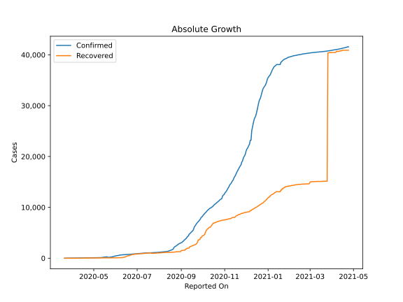
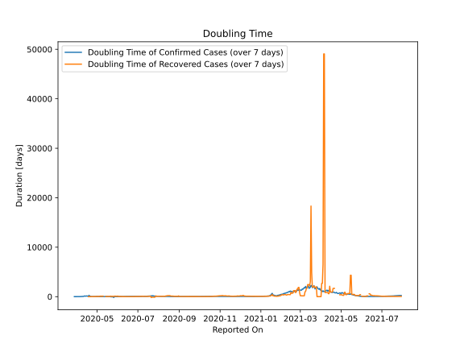

# Country Figures: Doubling Time of Infections for Uganda 

The doubling time below are calculated based on
* an exponential growth assumption
* for time difference of past seven (7) days.
The doubling time's unit is "days".

The first doubling time indicates the increase of confirmed (infected)
cases. There, the *higher* the number is, the better is to take control
of the disease.

The second doubling time indicates the increase of recovered (healed)
cases. There, the *lower* the number is, the better it is to take
control of the disease.

| Reported On | Confirmed | Doubling Time (Confirmed) | Recovered | Doubling Time (Recovered) |
|-------------|-----------|---------------------------|-----------|---------------------------|
| 2020-04-25 | 75 |  16.0 days  | 46 |  6.9 days  | 
| 2020-04-24 | 75 |  17.0 days  | 46 |  6.2 days  | 
| 2020-04-23 | 74 |  16.7 days  | 46 |  6.2 days  | 
| 2020-04-22 | 63 |  36.1 days  | 45 |  4.0 days  | 
| 2020-04-21 | 61 |  47.2 days  | 38 |  3.4 days  | 
| 2020-04-20 | 56 |  133.8 days  | 38 |  3.2 days  | 
| 2020-04-19 | 55 |  264.8 days  | 28 |  2.8 days  | 
| 2020-04-18 | 55 |  131.3 days  | 22 |  3.2 days  | 
| 2020-04-17 | 56 |  88.5 days  | 20 |  None  | 
| 2020-04-16 | 55 |  131.3 days  | 20 |  None  | 
| 2020-04-15 | 55 |  131.3 days  | 12 |  None  | 
| 2020-04-14 | 55 |  86.9 days  | 8 |  None  | 
| 2020-04-13 | 54 |  128.9 days  | 7 |  None  | 
| 2020-04-12 | 54 |  128.9 days  | 4 |  None  | 
| 2020-04-11 | 53 |  49.3 days  | 4 |  None  | 
| 2020-04-10 | 53 |  49.3 days  | 0 |  None  | 
| 2020-04-09 | 53 |  30.0 days  | 0 |  None  | 
| 2020-04-08 | 53 |  26.4 days  | 0 |  None  | 
| 2020-04-07 | 52 |  29.4 days  | 0 |  None  | 
| 2020-04-06 | 52 |  11.0 days  | 0 |  None  | 
| 2020-04-05 | 52 |  11.0 days  | 0 |  None  | 
| 2020-04-04 | 48 |  10.7 days  | 0 |  None  | 
| 2020-04-03 | 48 |  6.9 days  | 0 |  None  | 
| 2020-04-02 | 45 |  4.5 days  | 0 |  None  | 
| 2020-04-01 | 44 |  4.6 days  | 0 |  None  | 
| 2020-03-31 | 44 |  3.4 days  | 0 |  None  | 
| 2020-03-30 | 33 |  4.1 days  | 0 |  None  | 
| 2020-03-29 | 33 |  1.7 days  | 0 |  None  | 
| 2020-03-28 | 30 |  1.8 days  | 0 |  None  | 
| 2020-03-27 | 23 |  None  | 0 |  None  | 
| 2020-03-26 | 14 |  None  | 0 |  None  | 
| 2020-03-25 | 14 |  None  | 0 |  None  | 
| 2020-03-24 | 9 |  None  | 0 |  None  | 
| 2020-03-23 | 9 |  None  | 0 |  None  | 
| 2020-03-22 | 1 |  None  | 0 |  None  | 
| 2020-03-21 | 1 |  None  | 0 |  None  | 

