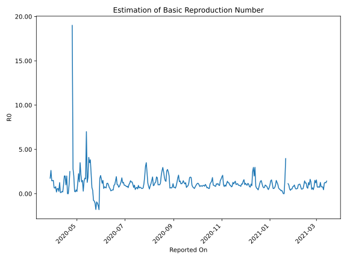

# Country Figures: Time Series for Basic Reproduction Number of Uganda 

| Reported On | &Delta; Confirmed | Total &Delta; Confirmed First Interval | Total &Delta; Confirmed Second Interval | Estimated Basic Reproduction Number R0 | 
|-------------|-------------------|----------------------------------------|-----------------------------------------|---------------------------------------------------|
| 2020-05-04 | 8 |  8  |  6  |  1.33  | 
| 2020-05-03 | 1 |  9  |  4  |  2.25  | 
| 2020-05-02 | 3 |  6  |  5  |  1.20  | 
| 2020-05-01 | 2 |  4  |  16  |  0.25  | 
| 2020-04-30 | 2 |  6  |  14  |  0.43  | 
| 2020-04-29 | 2 |  4  |  19  |  0.21  | 
| 2020-04-28 | 0 |  5  |  19  |  0.26  | 
| 2020-04-27 | 0 |  16  |  8  |  2.00  | 
| 2020-04-26 | 4 |  14  |  5  |  2.80  | 
| 2020-04-25 | 0 |  19  |  1  |  19.00  | 
| 2020-04-24 | 1 |  19  |  None  |  None  | 
| 2020-04-23 | 11 |  8  |  None  |  None  | 
| 2020-04-22 | 2 |  5  |  2  |  2.50  | 
| 2020-04-21 | 5 |  1  |  1  |  1.00  | 
| 2020-04-20 | 1 |  None  |  2  |  None  | 
| 2020-04-19 | 0 |  None  |  2  |  None  | 
| 2020-04-18 | -1 |  2  |  1  |  2.00  | 
| 2020-04-17 | 1 |  1  |  1  |  1.00  | 
| 2020-04-16 | 0 |  2  |  1  |  2.00  | 
| 2020-04-15 | 0 |  2  |  1  |  2.00  | 
| 2020-04-14 | 1 |  1  |  1  |  1.00  | 
| 2020-04-13 | 0 |  1  |  5  |  0.20  | 
| 2020-04-12 | 1 |  1  |  4  |  0.25  | 
| 2020-04-11 | 0 |  1  |  7  |  0.14  | 
| 2020-04-10 | 0 |  1  |  8  |  0.12  | 
| 2020-04-09 | 0 |  5  |  4  |  1.25  | 
| 2020-04-08 | 1 |  4  |  15  |  0.27  | 
| 2020-04-07 | 0 |  7  |  12  |  0.58  | 
| 2020-04-06 | 0 |  8  |  14  |  0.57  | 
| 2020-04-05 | 4 |  4  |  21  |  0.19  | 
| 2020-04-04 | 0 |  15  |  19  |  0.79  | 
| 2020-04-03 | 3 |  12  |  19  |  0.63  | 
| 2020-04-02 | 1 |  14  |  21  |  0.67  | 
| 2020-04-01 | 0 |  21  |  14  |  1.50  | 
| 2020-03-31 | 11 |  19  |  13  |  1.46  | 
| 2020-03-30 | 0 |  19  |  13  |  1.46  | 
| 2020-03-29 | 3 |  21  |  8  |  2.62  | 
| 2020-03-28 | 7 |  14  |  8  |  1.75  | 
| 2020-03-27 | 9 |  13  |  None  |  None  | 
| 2020-03-26 | 0 |  13  |  None  |  None  | 
| 2020-03-25 | 5 |  8  |  None  |  None  | 
| 2020-03-24 | 0 |  8  |  None  |  None  | 
| 2020-03-23 | 8 |  None  |  None  |  None  | 
| 2020-03-22 | 0 |  None  |  None  |  None  | 
| 2020-03-21 | None |  None  |  None  |  None  | 

