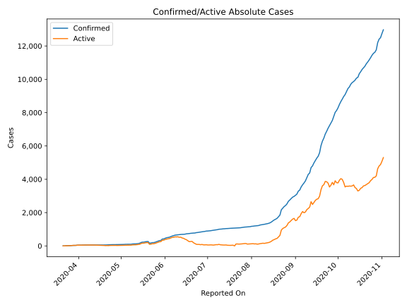
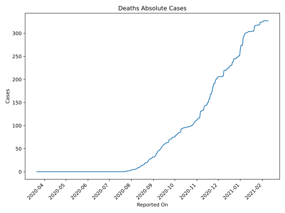
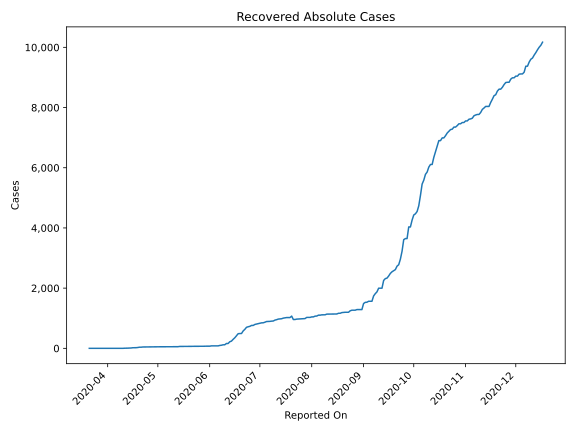
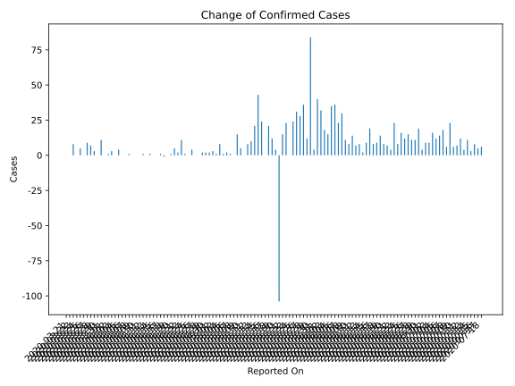
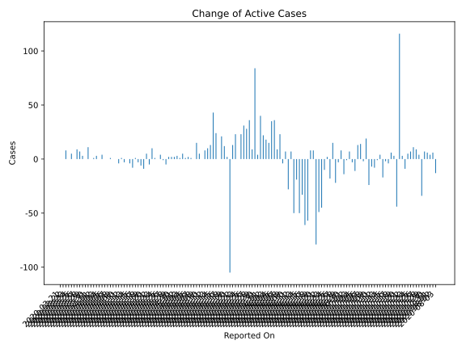
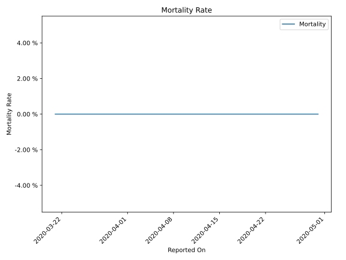

# Country Figures: Time Series for Uganda 

| Reported On | Confirmed | Deaths | Recovered | Active | Mortality | &Delta; Confirmed | &Delta; Deaths | &Delta; Recovered | &Delta; Active | % Active of Population |
|-------------|-----------|--------|-----------|--------|-----------|-------------------|----------------|-------------------|----------------|------------------------|
| 2020-05-04 | 97 | 0 | 55 | 42 |  None  | 8 | 0 | 3 | 5 |  0.000 %  | 
| 2020-05-03 | 89 | 0 | 52 | 37 |  None  | 1 | 0 | 0 | 1 |  0.000 %  | 
| 2020-05-02 | 88 | 0 | 52 | 36 |  None  | 3 | 0 | 0 | 3 |  0.000 %  | 
| 2020-05-01 | 85 | 0 | 52 | 33 |  None  | 2 | 0 | 0 | 2 |  0.000 %  | 
| 2020-04-30 | 83 | 0 | 52 | 31 |  None  | 2 | 0 | 0 | 2 |  0.000 %  | 
| 2020-04-29 | 81 | 0 | 52 | 29 |  None  | 2 | 0 | 0 | 2 |  0.000 %  | 
| 2020-04-28 | 79 | 0 | 52 | 27 |  None  | 0 | 0 | 5 | -5 |  0.000 %  | 
| 2020-04-27 | 79 | 0 | 47 | 32 |  None  | 0 | 0 | 1 | -1 |  0.000 %  | 
| 2020-04-26 | 79 | 0 | 46 | 33 |  None  | 4 | 0 | 0 | 4 |  0.000 %  | 
| 2020-04-25 | 75 | 0 | 46 | 29 |  None  | 0 | 0 | 0 | 0 |  0.000 %  | 
| 2020-04-24 | 75 | 0 | 46 | 29 |  None  | 1 | 0 | 0 | 1 |  0.000 %  | 
| 2020-04-23 | 74 | 0 | 46 | 28 |  None  | 11 | 0 | 1 | 10 |  0.000 %  | 
| 2020-04-22 | 63 | 0 | 45 | 18 |  None  | 2 | 0 | 7 | -5 |  0.000 %  | 
| 2020-04-21 | 61 | 0 | 38 | 23 |  None  | 5 | 0 | 0 | 5 |  0.000 %  | 
| 2020-04-20 | 56 | 0 | 38 | 18 |  None  | 1 | 0 | 10 | -9 |  0.000 %  | 
| 2020-04-19 | 55 | 0 | 28 | 27 |  None  | 0 | 0 | 6 | -6 |  0.000 %  | 
| 2020-04-18 | 55 | 0 | 22 | 33 |  None  | -1 | 0 | 2 | -3 |  0.000 %  | 
| 2020-04-17 | 56 | 0 | 20 | 36 |  None  | 1 | 0 | 0 | 1 |  0.000 %  | 
| 2020-04-16 | 55 | 0 | 20 | 35 |  None  | 0 | 0 | 8 | -8 |  0.000 %  | 
| 2020-04-15 | 55 | 0 | 12 | 43 |  None  | 0 | 0 | 4 | -4 |  0.000 %  | 
| 2020-04-14 | 55 | 0 | 8 | 47 |  None  | 1 | 0 | 1 | 0 |  0.000 %  | 
| 2020-04-13 | 54 | 0 | 7 | 47 |  None  | 0 | 0 | 3 | -3 |  0.000 %  | 
| 2020-04-12 | 54 | 0 | 4 | 50 |  None  | 1 | 0 | 0 | 1 |  0.000 %  | 
| 2020-04-11 | 53 | 0 | 4 | 49 |  None  | 0 | 0 | 4 | -4 |  0.000 %  | 
| 2020-04-10 | 53 | 0 | 0 | 53 |  None  | 0 | 0 | 0 | 0 |  0.000 %  | 
| 2020-04-09 | 53 | 0 | 0 | 53 |  None  | 0 | 0 | 0 | 0 |  0.000 %  | 
| 2020-04-08 | 53 | 0 | 0 | 53 |  None  | 1 | 0 | 0 | 1 |  0.000 %  | 
| 2020-04-07 | 52 | 0 | 0 | 52 |  None  | 0 | 0 | 0 | 0 |  0.000 %  | 
| 2020-04-06 | 52 | 0 | 0 | 52 |  None  | 0 | 0 | 0 | 0 |  0.000 %  | 
| 2020-04-05 | 52 | 0 | 0 | 52 |  None  | 4 | 0 | 0 | 4 |  0.000 %  | 
| 2020-04-04 | 48 | 0 | 0 | 48 |  None  | 0 | 0 | 0 | 0 |  0.000 %  | 
| 2020-04-03 | 48 | 0 | 0 | 48 |  None  | 3 | 0 | 0 | 3 |  0.000 %  | 
| 2020-04-02 | 45 | 0 | 0 | 45 |  None  | 1 | 0 | 0 | 1 |  0.000 %  | 
| 2020-04-01 | 44 | 0 | 0 | 44 |  None  | 0 | 0 | 0 | 0 |  0.000 %  | 
| 2020-03-31 | 44 | 0 | 0 | 44 |  None  | 11 | 0 | 0 | 11 |  0.000 %  | 
| 2020-03-30 | 33 | 0 | 0 | 33 |  None  | 0 | 0 | 0 | 0 |  0.000 %  | 
| 2020-03-29 | 33 | 0 | 0 | 33 |  None  | 3 | 0 | 0 | 3 |  0.000 %  | 
| 2020-03-28 | 30 | 0 | 0 | 30 |  None  | 7 | 0 | 0 | 7 |  0.000 %  | 
| 2020-03-27 | 23 | 0 | 0 | 23 |  None  | 9 | 0 | 0 | 9 |  0.000 %  | 
| 2020-03-26 | 14 | 0 | 0 | 14 |  None  | 0 | 0 | 0 | 0 |  0.000 %  | 
| 2020-03-25 | 14 | 0 | 0 | 14 |  None  | 5 | 0 | 0 | 5 |  0.000 %  | 
| 2020-03-24 | 9 | 0 | 0 | 9 |  None  | 0 | 0 | 0 | 0 |  0.000 %  | 
| 2020-03-23 | 9 | 0 | 0 | 9 |  None  | 8 | 0 | 0 | 8 |  0.000 %  | 
| 2020-03-22 | 1 | 0 | 0 | 1 |  None  | 0 | 0 | 0 | 0 |  0.000 %  | 
| 2020-03-21 | 1 | 0 | 0 | 1 |  None  | None | None | None | None |  0.000 %  | 

