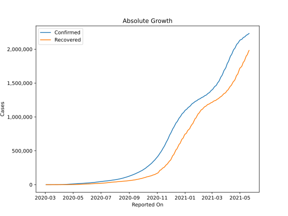
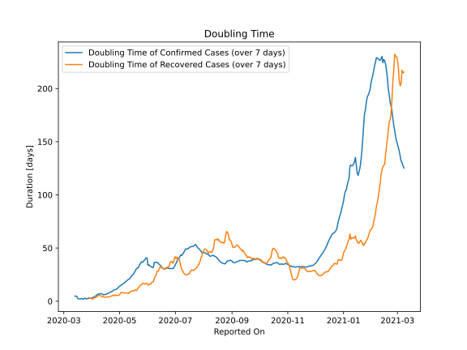

# Country Figures: Doubling Time of Infections for Ukraine 

The doubling time below are calculated based on
* an exponential growth assumption
* for time difference of past seven (7) days.
The doubling time's unit is "days".

The first doubling time indicates the increase of confirmed (infected)
cases. There, the *higher* the number is, the better is to take control
of the disease.

The second doubling time indicates the increase of recovered (healed)
cases. There, the *lower* the number is, the better it is to take
control of the disease.

| Reported On | Confirmed | Doubling Time (Confirmed) | Recovered | Doubling Time (Recovered) |
|-------------|-----------|---------------------------|-----------|---------------------------|
| 2020-04-07 | 1462 |  6.3 days  | 28 |  5.1 days  | 
| 2020-04-06 | 1319 |  5.9 days  | 28 |  4.2 days  | 
| 2020-04-05 | 1308 |  5.1 days  | 28 |  3.5 days  | 
| 2020-04-04 | 1225 |  4.3 days  | 25 |  3.3 days  | 
| 2020-04-03 | 1072 |  4.2 days  | 22 |  3.6 days  | 
| 2020-04-02 | 897 |  3.5 days  | 19 |  2.0 days  | 
| 2020-04-01 | 794 |  3.2 days  | 13 |  2.2 days  | 
| 2020-03-31 | 645 |  2.9 days  | 10 |  2.4 days  | 
| 2020-03-30 | 548 |  2.7 days  | 8 |  2.7 days  | 
| 2020-03-29 | 475 |  2.9 days  | 6 |  3.0 days  | 
| 2020-03-28 | 356 |  2.7 days  | 5 |  3.3 days  | 
| 2020-03-27 | 310 |  2.4 days  | 5 |  None  | 
| 2020-03-26 | 196 |  2.3 days  | 1 |  None  | 
| 2020-03-25 | 145 |  2.4 days  | 1 |  None  | 
| 2020-03-24 | 97 |  2.8 days  | 1 |  None  | 
| 2020-03-23 | 73 |  2.4 days  | 1 |  None  | 
| 2020-03-22 | 73 |  1.8 days  | 1 |  None  | 
| 2020-03-21 | 47 |  2.1 days  | 1 |  None  | 
| 2020-03-20 | 29 |  2.5 days  | 0 |  None  | 
| 2020-03-19 | 16 |  2.1 days  | 0 |  None  | 
| 2020-03-18 | 14 |  2.2 days  | 0 |  None  | 
| 2020-03-17 | 14 |  2.2 days  | 0 |  None  | 
| 2020-03-16 | 7 |  2.8 days  | 0 |  None  | 
| 2020-03-15 | 3 |  4.8 days  | 0 |  None  | 
| 2020-03-14 | 3 |  4.8 days  | 0 |  None  | 
| 2020-03-13 | 3 |  4.8 days  | 0 |  None  | 
| 2020-03-12 | 1 |  None  | 0 |  None  | 
| 2020-03-11 | 1 |  None  | 0 |  None  | 
| 2020-03-10 | 1 |  None  | 0 |  None  | 
| 2020-03-09 | 1 |  None  | 0 |  None  | 
| 2020-03-08 | 1 |  None  | 0 |  None  | 
| 2020-03-07 | 1 |  None  | 0 |  None  | 
| 2020-03-06 | 1 |  None  | 0 |  None  | 
| 2020-03-05 | 1 |  None  | 0 |  None  | 
| 2020-03-04 | 1 |  None  | 0 |  None  | 
| 2020-03-03 | 1 |  None  | 0 |  None  | 

