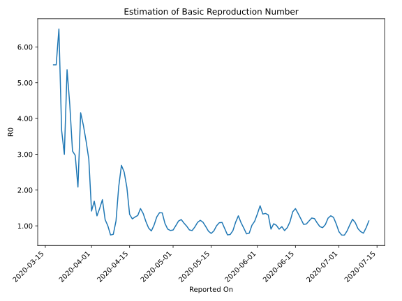

# Country Figures: Time Series for Basic Reproduction Number of Ukraine 

| Reported On | &Delta; Confirmed | Total &Delta; Confirmed First Interval | Total &Delta; Confirmed Second Interval | Estimated Basic Reproduction Number R0 | 
|-------------|-------------------|----------------------------------------|-----------------------------------------|---------------------------------------------------|
| 2020-04-27 | 392 |  2025  |  1486  |  1.36  | 
| 2020-04-26 | 492 |  2000  |  1463  |  1.37  | 
| 2020-04-25 | 478 |  1937  |  1549  |  1.25  | 
| 2020-04-24 | 477 |  1721  |  1685  |  1.02  | 
| 2020-04-23 | 578 |  1486  |  1734  |  0.86  | 
| 2020-04-22 | 467 |  1463  |  1560  |  0.94  | 
| 2020-04-21 | 415 |  1549  |  1384  |  1.12  | 
| 2020-04-20 | 261 |  1685  |  1253  |  1.34  | 
| 2020-04-19 | 343 |  1734  |  1169  |  1.48  | 
| 2020-04-18 | 444 |  1560  |  1210  |  1.29  | 
| 2020-04-17 | 501 |  1384  |  1109  |  1.25  | 
| 2020-04-16 | 397 |  1253  |  1049  |  1.19  | 
| 2020-04-15 | 392 |  1169  |  884  |  1.32  | 
| 2020-04-14 | 270 |  1210  |  584  |  2.07  | 
| 2020-04-13 | 325 |  1109  |  443  |  2.50  | 
| 2020-04-12 | 266 |  1049  |  390  |  2.69  | 
| 2020-04-11 | 308 |  884  |  422  |  2.09  | 
| 2020-04-10 | 311 |  584  |  514  |  1.14  | 
| 2020-04-09 | 224 |  443  |  580  |  0.76  | 
| 2020-04-08 | 206 |  390  |  524  |  0.74  | 
| 2020-04-07 | 143 |  422  |  422  |  1.00  | 
| 2020-04-06 | 11 |  514  |  438  |  1.17  | 
| 2020-04-05 | 83 |  580  |  335  |  1.73  | 
| 2020-04-04 | 153 |  524  |  352  |  1.49  | 
| 2020-04-03 | 175 |  422  |  330  |  1.28  | 
| 2020-04-02 | 103 |  438  |  259  |  1.69  | 
| 2020-04-01 | 149 |  335  |  237  |  1.41  | 
| 2020-03-31 | 97 |  352  |  123  |  2.86  | 
| 2020-03-30 | 73 |  330  |  98  |  3.37  | 
| 2020-03-29 | 119 |  259  |  68  |  3.81  | 
| 2020-03-28 | 46 |  237  |  57  |  4.16  | 
| 2020-03-27 | 114 |  123  |  59  |  2.08  | 
| 2020-03-26 | 51 |  98  |  33  |  2.97  | 
| 2020-03-25 | 48 |  68  |  22  |  3.09  | 
| 2020-03-24 | 24 |  57  |  13  |  4.38  | 
| 2020-03-23 | 0 |  59  |  11  |  5.36  | 
| 2020-03-22 | 26 |  33  |  11  |  3.00  | 
| 2020-03-21 | 18 |  22  |  6  |  3.67  | 
| 2020-03-20 | 13 |  13  |  2  |  6.50  | 
| 2020-03-19 | 2 |  11  |  2  |  5.50  | 
| 2020-03-18 | 0 |  11  |  2  |  5.50  | 
| 2020-03-17 | 7 |  6  |  None  |  None  | 
| 2020-03-16 | 4 |  2  |  None  |  None  | 
| 2020-03-15 | 0 |  2  |  None  |  None  | 
| 2020-03-14 | 0 |  2  |  None  |  None  | 
| 2020-03-13 | 2 |  None  |  None  |  None  | 
| 2020-03-12 | 0 |  None  |  None  |  None  | 
| 2020-03-11 | 0 |  None  |  None  |  None  | 
| 2020-03-10 | 0 |  None  |  None  |  None  | 
| 2020-03-09 | 0 |  None  |  None  |  None  | 
| 2020-03-08 | 0 |  None  |  None  |  None  | 
| 2020-03-07 | 0 |  None  |  None  |  None  | 
| 2020-03-06 | 0 |  None  |  None  |  None  | 
| 2020-03-05 | 0 |  None  |  None  |  None  | 
| 2020-03-04 | 0 |  None  |  None  |  None  | 
| 2020-03-03 | None |  None  |  None  |  None  | 

