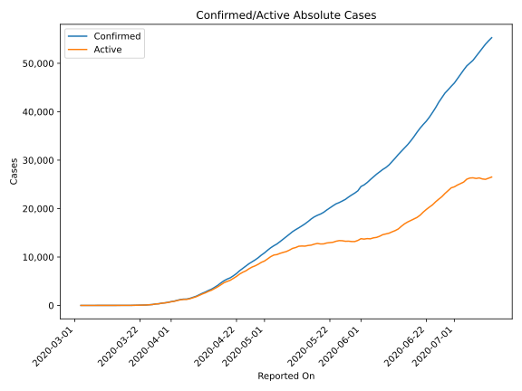
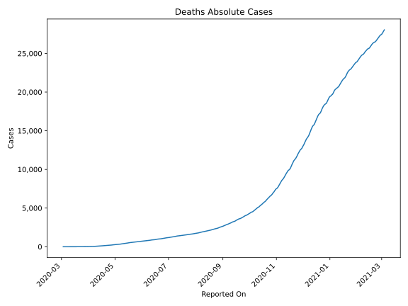
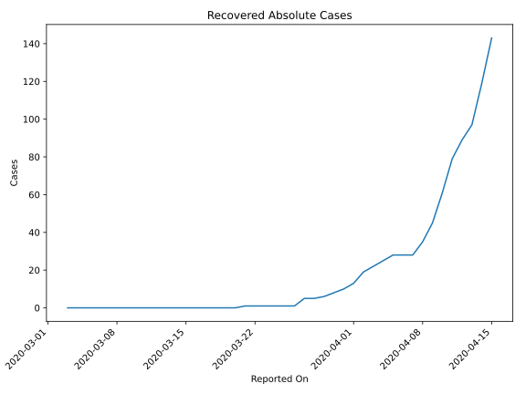
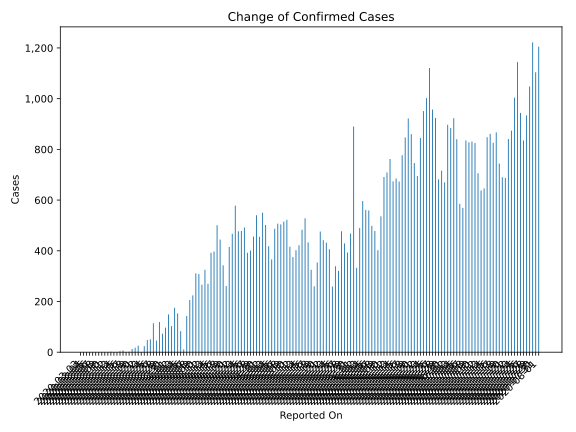
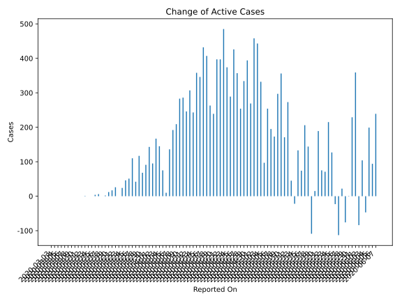
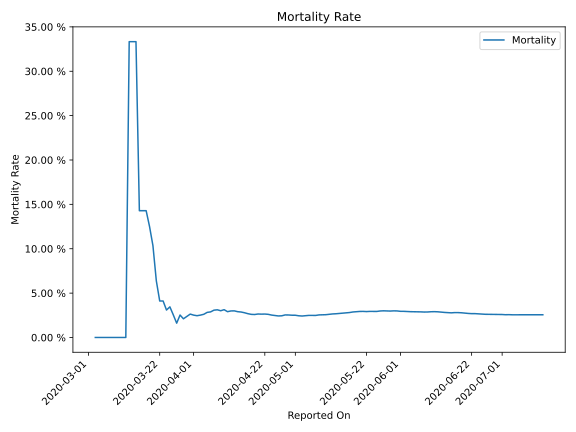

# Country Figures: Time Series for Ukraine 

| Reported On | Confirmed | Deaths | Recovered | Active | Mortality | &Delta; Confirmed | &Delta; Deaths | &Delta; Recovered | &Delta; Active | % Active of Population |
|-------------|-----------|--------|-----------|--------|-----------|-------------------|----------------|-------------------|----------------|------------------------|
| 2020-04-09 | 1892 | 57 | 45 | 1790 |  3.01 %  | 224 | 5 | 10 | 209 |  0.004 %  | 
| 2020-04-08 | 1668 | 52 | 35 | 1581 |  3.12 %  | 206 | 7 | 7 | 192 |  0.004 %  | 
| 2020-04-07 | 1462 | 45 | 28 | 1389 |  3.08 %  | 143 | 7 | 0 | 136 |  0.003 %  | 
| 2020-04-06 | 1319 | 38 | 28 | 1253 |  2.88 %  | 11 | 1 | 0 | 10 |  0.003 %  | 
| 2020-04-05 | 1308 | 37 | 28 | 1243 |  2.83 %  | 83 | 5 | 3 | 75 |  0.003 %  | 
| 2020-04-04 | 1225 | 32 | 25 | 1168 |  2.61 %  | 153 | 5 | 3 | 145 |  0.003 %  | 
| 2020-04-03 | 1072 | 27 | 22 | 1023 |  2.52 %  | 175 | 5 | 3 | 167 |  0.002 %  | 
| 2020-04-02 | 897 | 22 | 19 | 856 |  2.45 %  | 103 | 2 | 6 | 95 |  0.002 %  | 
| 2020-04-01 | 794 | 20 | 13 | 761 |  2.52 %  | 149 | 3 | 3 | 143 |  0.002 %  | 
| 2020-03-31 | 645 | 17 | 10 | 618 |  2.64 %  | 97 | 4 | 2 | 91 |  0.001 %  | 
| 2020-03-30 | 548 | 13 | 8 | 527 |  2.37 %  | 73 | 3 | 2 | 68 |  0.001 %  | 
| 2020-03-29 | 475 | 10 | 6 | 459 |  2.11 %  | 119 | 1 | 1 | 117 |  0.001 %  | 
| 2020-03-28 | 356 | 9 | 5 | 342 |  2.53 %  | 46 | 4 | 0 | 42 |  0.001 %  | 
| 2020-03-27 | 310 | 5 | 5 | 300 |  1.61 %  | 114 | 0 | 4 | 110 |  0.001 %  | 
| 2020-03-26 | 196 | 5 | 1 | 190 |  2.55 %  | 51 | 0 | 0 | 51 |  0.000 %  | 
| 2020-03-25 | 145 | 5 | 1 | 139 |  3.45 %  | 48 | 2 | 0 | 46 |  0.000 %  | 
| 2020-03-24 | 97 | 3 | 1 | 93 |  3.09 %  | 24 | 0 | 0 | 24 |  0.000 %  | 
| 2020-03-23 | 73 | 3 | 1 | 69 |  4.11 %  | 0 | 0 | 0 | 0 |  0.000 %  | 
| 2020-03-22 | 73 | 3 | 1 | 69 |  4.11 %  | 26 | 0 | 0 | 26 |  0.000 %  | 
| 2020-03-21 | 47 | 3 | 1 | 43 |  6.38 %  | 18 | 0 | 1 | 17 |  0.000 %  | 
| 2020-03-20 | 29 | 3 | 0 | 26 |  10.34 %  | 13 | 1 | 0 | 12 |  0.000 %  | 
| 2020-03-19 | 16 | 2 | 0 | 14 |  12.50 %  | 2 | 0 | 0 | 2 |  0.000 %  | 
| 2020-03-18 | 14 | 2 | 0 | 12 |  14.29 %  | 0 | 0 | 0 | 0 |  0.000 %  | 
| 2020-03-17 | 14 | 2 | 0 | 12 |  14.29 %  | 7 | 1 | 0 | 6 |  0.000 %  | 
| 2020-03-16 | 7 | 1 | 0 | 6 |  14.29 %  | 4 | 0 | 0 | 4 |  0.000 %  | 
| 2020-03-15 | 3 | 1 | 0 | 2 |  33.33 %  | 0 | 0 | 0 | 0 |  0.000 %  | 
| 2020-03-14 | 3 | 1 | 0 | 2 |  33.33 %  | 0 | 0 | 0 | 0 |  0.000 %  | 
| 2020-03-13 | 3 | 1 | 0 | 2 |  33.33 %  | 2 | 1 | 0 | 1 |  0.000 %  | 
| 2020-03-12 | 1 | 0 | 0 | 1 |  None  | 0 | 0 | 0 | 0 |  0.000 %  | 
| 2020-03-11 | 1 | 0 | 0 | 1 |  None  | 0 | 0 | 0 | 0 |  0.000 %  | 
| 2020-03-10 | 1 | 0 | 0 | 1 |  None  | 0 | 0 | 0 | 0 |  0.000 %  | 
| 2020-03-09 | 1 | 0 | 0 | 1 |  None  | 0 | 0 | 0 | 0 |  0.000 %  | 
| 2020-03-08 | 1 | 0 | 0 | 1 |  None  | 0 | 0 | 0 | 0 |  0.000 %  | 
| 2020-03-07 | 1 | 0 | 0 | 1 |  None  | 0 | 0 | 0 | 0 |  0.000 %  | 
| 2020-03-06 | 1 | 0 | 0 | 1 |  None  | 0 | 0 | 0 | 0 |  0.000 %  | 
| 2020-03-05 | 1 | 0 | 0 | 1 |  None  | 0 | 0 | 0 | 0 |  0.000 %  | 
| 2020-03-04 | 1 | 0 | 0 | 1 |  None  | 0 | 0 | 0 | 0 |  0.000 %  | 
| 2020-03-03 | 1 | 0 | 0 | 1 |  None  | None | None | None | None |  0.000 %  | 

