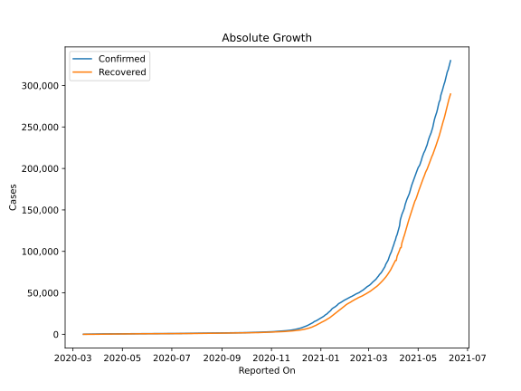
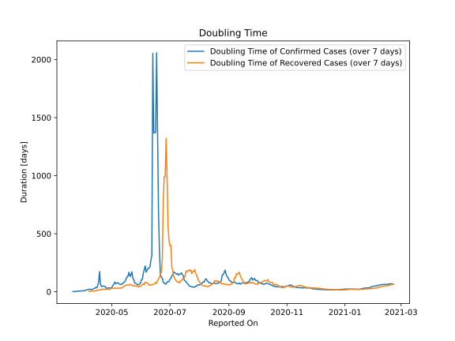

# Country Figures: Doubling Time of Infections for Uruguay 

The doubling time below are calculated based on
* an exponential growth assumption
* for time difference of past seven (7) days.
The doubling time's unit is "days".

The first doubling time indicates the increase of confirmed (infected)
cases. There, the *higher* the number is, the better is to take control
of the disease.

The second doubling time indicates the increase of recovered (healed)
cases. There, the *lower* the number is, the better it is to take
control of the disease.

| Reported On | Confirmed | Doubling Time (Confirmed) | Recovered | Doubling Time (Recovered) |
|-------------|-----------|---------------------------|-----------|---------------------------|
| 2020-04-12 | 480 |  27.0 days  | 231 |  5.7 days  | 
| 2020-04-11 | 494 |  23.3 days  | 214 |  6.2 days  | 
| 2020-04-10 | 473 |  19.9 days  | 206 |  4.7 days  | 
| 2020-04-09 | 456 |  18.7 days  | 192 |  4.6 days  | 
| 2020-04-08 | 424 |  21.7 days  | 150 |  4.1 days  | 
| 2020-04-07 | 424 |  21.7 days  | 150 |  4.1 days  | 
| 2020-04-06 | 406 |  18.3 days  | 104 |  None  | 
| 2020-04-05 | 400 |  18.0 days  | 93 |  None  | 
| 2020-04-04 | 400 |  13.2 days  | 93 |  None  | 
| 2020-04-03 | 369 |  11.4 days  | 68 |  None  | 
| 2020-04-02 | 350 |  10.5 days  | 62 |  None  | 
| 2020-04-01 | 338 |  8.7 days  | 41 |  None  | 
| 2020-03-31 | 338 |  6.9 days  | 41 |  None  | 
| 2020-03-30 | 310 |  7.5 days  | 0 |  None  | 
| 2020-03-29 | 304 |  6.3 days  | 0 |  None  | 
| 2020-03-28 | 274 |  5.7 days  | 0 |  None  | 
| 2020-03-27 | 238 |  5.6 days  | 0 |  None  | 
| 2020-03-26 | 217 |  5.1 days  | 0 |  None  | 
| 2020-03-25 | 189 |  4.0 days  | 0 |  None  | 
| 2020-03-24 | 162 |  3.2 days  | 0 |  None  | 
| 2020-03-23 | 158 |  2.0 days  | 0 |  None  | 
| 2020-03-22 | 135 |  1.7 days  | 0 |  None  | 
| 2020-03-21 | 110 |  1.8 days  | 0 |  None  | 
| 2020-03-20 | 94 |  None  | 0 |  None  | 
| 2020-03-19 | 79 |  None  | 0 |  None  | 
| 2020-03-18 | 50 |  None  | 0 |  None  | 
| 2020-03-17 | 29 |  None  | 0 |  None  | 
| 2020-03-16 | 8 |  None  | 0 |  None  | 
| 2020-03-15 | 4 |  None  | 0 |  None  | 
| 2020-03-14 | 4 |  None  | 0 |  None  | 

