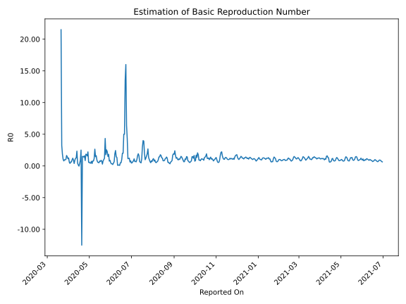

# Country Figures: Time Series for Basic Reproduction Number of Uruguay 

| Reported On | &Delta; Confirmed | Total &Delta; Confirmed First Interval | Total &Delta; Confirmed Second Interval | Estimated Basic Reproduction Number R0 | 
|-------------|-------------------|----------------------------------------|-----------------------------------------|---------------------------------------------------|
| 2020-04-27 | 14 |  63  |  35  |  1.80  | 
| 2020-04-26 | 10 |  61  |  33  |  1.85  | 
| 2020-04-25 | 33 |  28  |  33  |  0.85  | 
| 2020-04-24 | 6 |  40  |  25  |  1.60  | 
| 2020-04-23 | 14 |  35  |  25  |  1.40  | 
| 2020-04-22 | 8 |  33  |  22  |  1.50  | 
| 2020-04-21 | 0 |  33  |  22  |  1.50  | 
| 2020-04-20 | 18 |  25  |  -2  |  -12.50  | 
| 2020-04-19 | 9 |  25  |  10  |  2.50  | 
| 2020-04-18 | 6 |  22  |  24  |  0.92  | 
| 2020-04-17 | 0 |  22  |  56  |  0.39  | 
| 2020-04-16 | 10 |  -2  |  70  |  -0.03  | 
| 2020-04-15 | 9 |  10  |  67  |  0.15  | 
| 2020-04-14 | 3 |  24  |  56  |  0.43  | 
| 2020-04-13 | 0 |  56  |  24  |  2.33  | 
| 2020-04-12 | -14 |  70  |  55  |  1.27  | 
| 2020-04-11 | 21 |  67  |  56  |  1.20  | 
| 2020-04-10 | 17 |  56  |  62  |  0.90  | 
| 2020-04-09 | 32 |  24  |  62  |  0.39  | 
| 2020-04-08 | 0 |  55  |  59  |  0.93  | 
| 2020-04-07 | 18 |  56  |  46  |  1.22  | 
| 2020-04-06 | 6 |  62  |  64  |  0.97  | 
| 2020-04-05 | 0 |  62  |  100  |  0.62  | 
| 2020-04-04 | 31 |  59  |  93  |  0.63  | 
| 2020-04-03 | 19 |  46  |  115  |  0.40  | 
| 2020-04-02 | 12 |  64  |  112  |  0.57  | 
| 2020-04-01 | 0 |  100  |  80  |  1.25  | 
| 2020-03-31 | 28 |  93  |  82  |  1.13  | 
| 2020-03-30 | 6 |  115  |  79  |  1.46  | 
| 2020-03-29 | 30 |  112  |  68  |  1.65  | 
| 2020-03-28 | 36 |  80  |  79  |  1.01  | 
| 2020-03-27 | 21 |  82  |  85  |  0.96  | 
| 2020-03-26 | 28 |  79  |  81  |  0.98  | 
| 2020-03-25 | 27 |  68  |  86  |  0.79  | 
| 2020-03-24 | 4 |  79  |  75  |  1.05  | 
| 2020-03-23 | 23 |  85  |  46  |  1.85  | 
| 2020-03-22 | 25 |  81  |  25  |  3.24  | 
| 2020-03-21 | 16 |  86  |  4  |  21.50  | 
| 2020-03-20 | 15 |  75  |  None  |  None  | 
| 2020-03-19 | 29 |  46  |  None  |  None  | 
| 2020-03-18 | 21 |  25  |  None  |  None  | 
| 2020-03-17 | 21 |  4  |  None  |  None  | 
| 2020-03-16 | 4 |  None  |  None  |  None  | 
| 2020-03-15 | 0 |  None  |  None  |  None  | 
| 2020-03-14 | None |  None  |  None  |  None  | 

