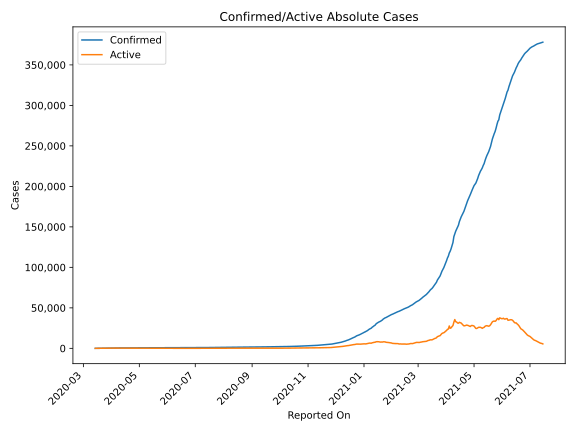
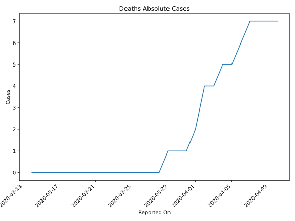
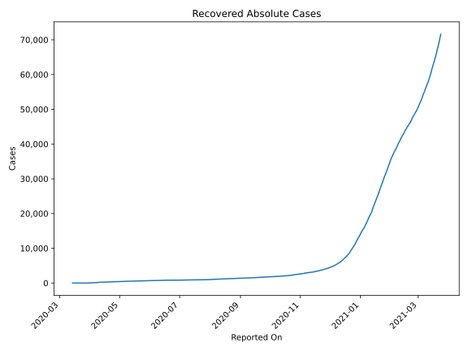
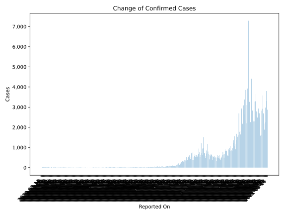
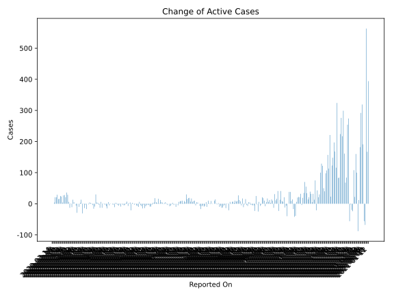
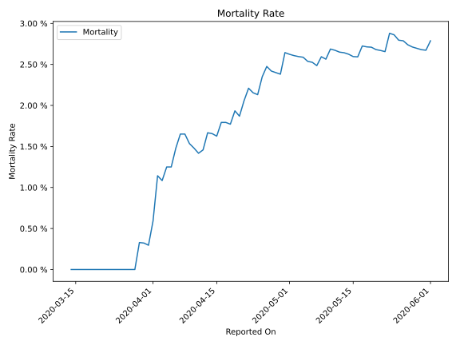

# Country Figures: Time Series for Uruguay 

| Reported On | Confirmed | Deaths | Recovered | Active | Mortality | &Delta; Confirmed | &Delta; Deaths | &Delta; Recovered | &Delta; Active | % Active of Population |
|-------------|-----------|--------|-----------|--------|-----------|-------------------|----------------|-------------------|----------------|------------------------|
| 2020-04-14 | 483 | 8 | 248 | 227 |  1.66 %  | 3 | 0 | 17 | -14 |  0.007 %  | 
| 2020-04-13 | 480 | 8 | 231 | 241 |  1.67 %  | 0 | 1 | 0 | -1 |  0.007 %  | 
| 2020-04-12 | 480 | 7 | 231 | 242 |  1.46 %  | -14 | 0 | 17 | -31 |  0.007 %  | 
| 2020-04-11 | 494 | 7 | 214 | 273 |  1.42 %  | 21 | 0 | 8 | 13 |  0.008 %  | 
| 2020-04-10 | 473 | 7 | 206 | 260 |  1.48 %  | 17 | 0 | 14 | 3 |  0.008 %  | 
| 2020-04-09 | 456 | 7 | 192 | 257 |  1.54 %  | 32 | 0 | 42 | -10 |  0.007 %  | 
| 2020-04-08 | 424 | 7 | 150 | 267 |  1.65 %  | 0 | 0 | 0 | 0 |  0.008 %  | 
| 2020-04-07 | 424 | 7 | 150 | 267 |  1.65 %  | 18 | 1 | 46 | -29 |  0.008 %  | 
| 2020-04-06 | 406 | 6 | 104 | 296 |  1.48 %  | 6 | 1 | 11 | -6 |  0.009 %  | 
| 2020-04-05 | 400 | 5 | 93 | 302 |  1.25 %  | 0 | 0 | 0 | 0 |  0.009 %  | 
| 2020-04-04 | 400 | 5 | 93 | 302 |  1.25 %  | 31 | 1 | 25 | 5 |  0.009 %  | 
| 2020-04-03 | 369 | 4 | 68 | 297 |  1.08 %  | 19 | 0 | 6 | 13 |  0.009 %  | 
| 2020-04-02 | 350 | 4 | 62 | 284 |  1.14 %  | 12 | 2 | 21 | -11 |  0.008 %  | 
| 2020-04-01 | 338 | 2 | 41 | 295 |  0.59 %  | 0 | 1 | 0 | -1 |  0.009 %  | 
| 2020-03-31 | 338 | 1 | 41 | 296 |  0.30 %  | 28 | 0 | 41 | -13 |  0.009 %  | 
| 2020-03-30 | 310 | 1 | 0 | 309 |  0.32 %  | 6 | 0 | 0 | 6 |  0.009 %  | 
| 2020-03-29 | 304 | 1 | 0 | 303 |  0.33 %  | 30 | 1 | 0 | 29 |  0.009 %  | 
| 2020-03-28 | 274 | 0 | 0 | 274 |  None  | 36 | 0 | 0 | 36 |  0.008 %  | 
| 2020-03-27 | 238 | 0 | 0 | 238 |  None  | 21 | 0 | 0 | 21 |  0.007 %  | 
| 2020-03-26 | 217 | 0 | 0 | 217 |  None  | 28 | 0 | 0 | 28 |  0.006 %  | 
| 2020-03-25 | 189 | 0 | 0 | 189 |  None  | 27 | 0 | 0 | 27 |  0.005 %  | 
| 2020-03-24 | 162 | 0 | 0 | 162 |  None  | 4 | 0 | 0 | 4 |  0.005 %  | 
| 2020-03-23 | 158 | 0 | 0 | 158 |  None  | 23 | 0 | 0 | 23 |  0.005 %  | 
| 2020-03-22 | 135 | 0 | 0 | 135 |  None  | 25 | 0 | 0 | 25 |  0.004 %  | 
| 2020-03-21 | 110 | 0 | 0 | 110 |  None  | 16 | 0 | 0 | 16 |  0.003 %  | 
| 2020-03-20 | 94 | 0 | 0 | 94 |  None  | 15 | 0 | 0 | 15 |  0.003 %  | 
| 2020-03-19 | 79 | 0 | 0 | 79 |  None  | 29 | 0 | 0 | 29 |  0.002 %  | 
| 2020-03-18 | 50 | 0 | 0 | 50 |  None  | 21 | 0 | 0 | 21 |  0.001 %  | 
| 2020-03-17 | 29 | 0 | 0 | 29 |  None  | 21 | 0 | 0 | 21 |  0.001 %  | 
| 2020-03-16 | 8 | 0 | 0 | 8 |  None  | 4 | 0 | 0 | 4 |  0.000 %  | 
| 2020-03-15 | 4 | 0 | 0 | 4 |  None  | 0 | 0 | 0 | 0 |  0.000 %  | 
| 2020-03-14 | 4 | 0 | 0 | 4 |  None  | None | None | None | None |  0.000 %  | 

