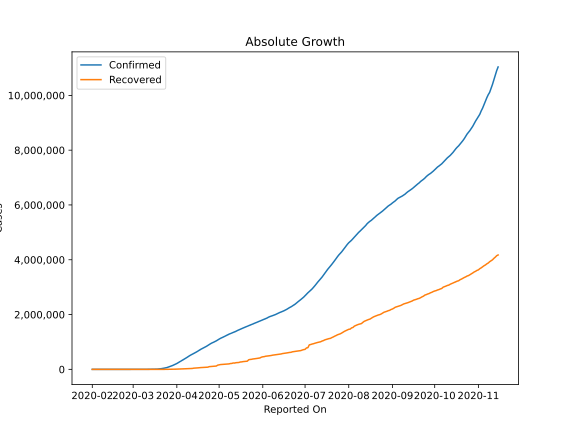
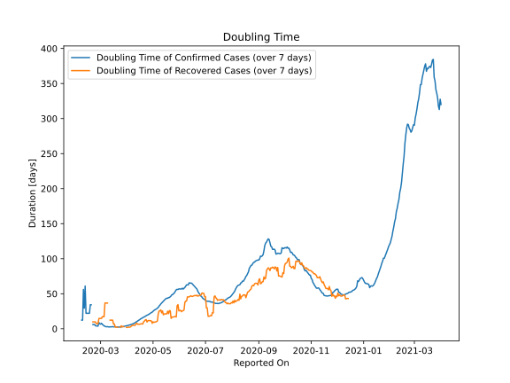

# Country Figures: Doubling Time of Infections for US 

The doubling time below are calculated based on
* an exponential growth assumption
* for time difference of past seven (7) days.
The doubling time's unit is "days".

The first doubling time indicates the increase of confirmed (infected)
cases. There, the *higher* the number is, the better is to take control
of the disease.

The second doubling time indicates the increase of recovered (healed)
cases. There, the *lower* the number is, the better it is to take
control of the disease.

| Reported On | Confirmed | Doubling Time (Confirmed) | Recovered | Doubling Time (Recovered) |
|-------------|-----------|---------------------------|-----------|---------------------------|
| 2020-05-01 | 1103461 |  24.9 days  | 164015 |  10.0 days  | 
| 2020-04-30 | 1069424 |  23.7 days  | 153947 |  7.8 days  | 
| 2020-04-29 | 1039909 |  23.1 days  | 120720 |  11.2 days  | 
| 2020-04-28 | 1012582 |  22.3 days  | 115936 |  11.6 days  | 
| 2020-04-27 | 988197 |  21.3 days  | 111424 |  11.6 days  | 
| 2020-04-26 | 965783 |  20.5 days  | 106988 |  11.9 days  | 
| 2020-04-25 | 938154 |  19.9 days  | 100372 |  11.4 days  | 
| 2020-04-24 | 905333 |  19.2 days  | 99079 |  9.6 days  | 
| 2020-04-23 | 869170 |  18.8 days  | 80203 |  13.0 days  | 
| 2020-04-22 | 840220 |  17.8 days  | 77366 |  12.6 days  | 
| 2020-04-21 | 811865 |  17.1 days  | 75204 |  11.0 days  | 
| 2020-04-20 | 784326 |  16.5 days  | 72329 |  9.9 days  | 
| 2020-04-19 | 759086 |  15.9 days  | 70337 |  6.7 days  | 
| 2020-04-18 | 732197 |  15.0 days  | 64840 |  7.0 days  | 
| 2020-04-17 | 699706 |  14.5 days  | 58545 |  7.2 days  | 
| 2020-04-16 | 667801 |  13.5 days  | 54703 |  6.7 days  | 
| 2020-04-15 | 636350 |  12.7 days  | 52096 |  6.5 days  | 
| 2020-04-14 | 607670 |  11.7 days  | 47763 |  6.5 days  | 
| 2020-04-13 | 580619 |  10.9 days  | 43482 |  6.4 days  | 
| 2020-04-12 | 555313 |  10.1 days  | 32988 |  8.0 days  | 
| 2020-04-11 | 526396 |  9.4 days  | 31270 |  6.7 days  | 
| 2020-04-10 | 496535 |  8.6 days  | 28790 |  4.8 days  | 
| 2020-04-09 | 461437 |  7.9 days  | 25410 |  5.0 days  | 
| 2020-04-08 | 429052 |  7.3 days  | 23559 |  5.1 days  | 
| 2020-04-07 | 396223 |  6.9 days  | 21763 |  4.6 days  | 
| 2020-04-06 | 366667 |  6.3 days  | 19581 |  4.2 days  | 
| 2020-04-05 | 337072 |  5.9 days  | 17448 |  2.9 days  | 
| 2020-04-04 | 308853 |  5.5 days  | 14652 |  2.2 days  | 
| 2020-04-03 | 275586 |  5.2 days  | 9707 |  2.3 days  | 
| 2020-04-02 | 243599 |  4.9 days  | 9001 |  2.2 days  | 
| 2020-04-01 | 213372 |  4.5 days  | 8474 |  1.9 days  | 
| 2020-03-31 | 188172 |  4.2 days  | 7024 |  1.9 days  | 
| 2020-03-30 | 161831 |  4.0 days  | 5644 |  None  | 
| 2020-03-29 | 140909 |  3.7 days  | 2665 |  None  | 
| 2020-03-28 | 121465 |  3.4 days  | 1072 |  3.0 days  | 
| 2020-03-27 | 101657 |  3.2 days  | 869 |  3.1 days  | 
| 2020-03-26 | 83836 |  3.0 days  | 681 |  3.0 days  | 
| 2020-03-25 | 65778 |  2.6 days  | 361 |  4.3 days  | 
| 2020-03-24 | 53736 |  2.6 days  | 348 |  1.9 days  | 
| 2020-03-23 | 43663 |  2.5 days  | 0 |  None  | 
| 2020-03-22 | 33848 |  2.5 days  | 0 |  None  | 
| 2020-03-21 | 25514 |  2.5 days  | 171 |  2.2 days  | 
| 2020-03-20 | 19101 |  2.6 days  | 147 |  2.3 days  | 
| 2020-03-19 | 13680 |  2.6 days  | 108 |  2.5 days  | 
| 2020-03-18 | 7786 |  3.0 days  | 106 |  2.2 days  | 
| 2020-03-17 | 6421 |  2.9 days  | 17 |  6.8 days  | 
| 2020-03-16 | 4632 |  2.7 days  | 17 |  6.8 days  | 
| 2020-03-15 | 3499 |  2.9 days  | 12 |  12.3 days  | 
| 2020-03-14 | 2726 |  2.9 days  | 12 |  12.3 days  | 
| 2020-03-13 | 2179 |  2.7 days  | 12 |  12.3 days  | 
| 2020-03-12 | 1663 |  2.7 days  | 12 |  12.3 days  | 
| 2020-03-11 | 1281 |  2.6 days  | 8 |  None  | 
| 2020-03-10 | 959 |  2.7 days  | 8 |  None  | 
| 2020-03-09 | 605 |  3.0 days  | 8 |  36.7 days  | 
| 2020-03-08 | 537 |  2.8 days  | 8 |  36.7 days  | 
| 2020-03-07 | 417 |  3.1 days  | 8 |  36.7 days  | 
| 2020-03-06 | 278 |  3.6 days  | 8 |  36.7 days  | 
| 2020-03-05 | 221 |  4.1 days  | 8 |  17.2 days  | 
| 2020-03-04 | 153 |  5.4 days  | 8 |  17.2 days  | 
| 2020-03-03 | 122 |  6.2 days  | 8 |  17.2 days  | 
| 2020-03-02 | 101 |  7.9 days  | 7 |  14.8 days  | 
| 2020-03-01 | 76 |  6.6 days  | 7 |  14.8 days  | 
| 2020-02-29 | 70 |  7.3 days  | 7 |  14.8 days  | 
| 2020-02-28 | 62 |  8.8 days  | 7 |  14.8 days  | 
| 2020-02-27 | 60 |  3.8 days  | 6 |  7.3 days  | 
| 2020-02-26 | 59 |  3.9 days  | 6 |  7.3 days  | 
| 2020-02-25 | 53 |  4.2 days  | 6 |  7.3 days  | 
| 2020-02-24 | 53 |  4.2 days  | 5 |  9.8 days  | 
| 2020-02-23 | 35 |  6.1 days  | 5 |  9.8 days  | 
| 2020-02-22 | 35 |  6.1 days  | 5 |  9.8 days  | 
| 2020-02-21 | 35 |  6.1 days  | 5 |  9.8 days  | 
| 2020-02-20 | 15 |  None  | 3 |  None  | 
| 2020-02-19 | 15 |  34.3 days  | 3 |  None  | 
| 2020-02-18 | 15 |  34.3 days  | 3 |  None  | 
| 2020-02-17 | 15 |  22.1 days  | 3 |  None  | 
| 2020-02-16 | 15 |  22.1 days  | 3 |  None  | 
| 2020-02-15 | 15 |  22.1 days  | 3 |  None  | 
| 2020-02-14 | 15 |  22.1 days  | 3 |  None  | 
| 2020-02-13 | 15 |  22.1 days  | 3 |  None  | 
| 2020-02-12 | 13 |  61.0 days  | 3 |  None  | 
| 2020-02-11 | 13 |  29.4 days  | 3 |  None  | 
| 2020-02-10 | 12 |  56.1 days  | 3 |  None  | 
| 2020-02-09 | 12 |  12.3 days  | 3 |  None  | 
| 2020-02-08 | 12 |  12.3 days  | 0 |  None  | 
| 2020-02-07 | 12 |  None  | 0 |  None  | 
| 2020-02-06 | 12 |  None  | 0 |  None  | 
| 2020-02-05 | 12 |  None  | 0 |  None  | 
| 2020-02-04 | 11 |  None  | 0 |  None  | 
| 2020-02-03 | 11 |  None  | 0 |  None  | 
| 2020-02-02 | 8 |  None  | 0 |  None  | 
| 2020-02-01 | 8 |  None  | 0 |  None  | 

