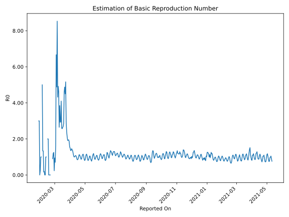

# Country Figures: Time Series for Basic Reproduction Number of US 

| Reported On | &Delta; Confirmed | Total &Delta; Confirmed First Interval | Total &Delta; Confirmed Second Interval | Estimated Basic Reproduction Number R0 | 
|-------------|-------------------|----------------------------------------|-----------------------------------------|---------------------------------------------------|
| 2020-05-08 | 26906 |  98983  |  118131  |  0.84  | 
| 2020-05-07 | 28420 |  96064  |  119957  |  0.80  | 
| 2020-05-06 | 24252 |  100890  |  115264  |  0.88  | 
| 2020-05-05 | 23976 |  110951  |  103641  |  1.07  | 
| 2020-05-04 | 22335 |  118131  |  101755  |  1.16  | 
| 2020-05-03 | 25501 |  119957  |  107249  |  1.12  | 
| 2020-05-02 | 29078 |  115264  |  119027  |  0.97  | 
| 2020-05-01 | 34037 |  103641  |  125563  |  0.83  | 
| 2020-04-30 | 29515 |  101755  |  126289  |  0.81  | 
| 2020-04-29 | 27327 |  107249  |  121007  |  0.89  | 
| 2020-04-28 | 24385 |  119027  |  110084  |  1.08  | 
| 2020-04-27 | 22414 |  125563  |  108023  |  1.16  | 
| 2020-04-26 | 27629 |  126289  |  112159  |  1.13  | 
| 2020-04-25 | 32821 |  121007  |  116525  |  1.04  | 
| 2020-04-24 | 36163 |  110084  |  122736  |  0.90  | 
| 2020-04-23 | 28950 |  108023  |  124527  |  0.87  | 
| 2020-04-22 | 28355 |  112159  |  119087  |  0.94  | 
| 2020-04-21 | 27539 |  116525  |  112488  |  1.04  | 
| 2020-04-20 | 25240 |  122736  |  109954  |  1.12  | 
| 2020-04-19 | 26889 |  124527  |  111135  |  1.12  | 
| 2020-04-18 | 32491 |  119087  |  119182  |  1.00  | 
| 2020-04-17 | 31905 |  112488  |  126261  |  0.89  | 
| 2020-04-16 | 31451 |  109954  |  130173  |  0.84  | 
| 2020-04-15 | 28680 |  111135  |  129868  |  0.86  | 
| 2020-04-14 | 27051 |  119182  |  124365  |  0.96  | 
| 2020-04-13 | 25306 |  126261  |  120199  |  1.05  | 
| 2020-04-12 | 28917 |  130173  |  120637  |  1.08  | 
| 2020-04-11 | 29861 |  129868  |  123068  |  1.06  | 
| 2020-04-10 | 35098 |  124365  |  123700  |  1.01  | 
| 2020-04-09 | 32385 |  120199  |  120681  |  1.00  | 
| 2020-04-08 | 32829 |  120637  |  113755  |  1.06  | 
| 2020-04-07 | 29556 |  123068  |  102690  |  1.20  | 
| 2020-04-06 | 29595 |  123700  |  91907  |  1.35  | 
| 2020-04-05 | 28219 |  120681  |  86515  |  1.39  | 
| 2020-04-04 | 33267 |  113755  |  77995  |  1.46  | 
| 2020-04-03 | 31987 |  102690  |  75131  |  1.37  | 
| 2020-04-02 | 30227 |  91907  |  67729  |  1.36  | 
| 2020-04-01 | 25200 |  86515  |  57994  |  1.49  | 
| 2020-03-31 | 26341 |  77995  |  49988  |  1.56  | 
| 2020-03-30 | 20922 |  75131  |  40264  |  1.87  | 
| 2020-03-29 | 19444 |  67729  |  34635  |  1.96  | 
| 2020-03-28 | 19808 |  57994  |  29983  |  1.93  | 
| 2020-03-27 | 17821 |  49988  |  26062  |  1.92  | 
| 2020-03-26 | 18058 |  40264  |  19093  |  2.11  | 
| 2020-03-25 | 12042 |  34635  |  14469  |  2.39  | 
| 2020-03-24 | 10073 |  29983  |  10181  |  2.94  | 
| 2020-03-23 | 9815 |  26062  |  5060  |  5.15  | 
| 2020-03-22 | 8334 |  19093  |  4242  |  4.50  | 
| 2020-03-21 | 6413 |  14469  |  2969  |  4.87  | 
| 2020-03-20 | 5421 |  10181  |  2218  |  4.59  | 
| 2020-03-19 | 5894 |  5060  |  1767  |  2.86  | 
| 2020-03-18 | 1365 |  4242  |  1574  |  2.70  | 
| 2020-03-17 | 1789 |  2969  |  1126  |  2.64  | 
| 2020-03-16 | 1133 |  2218  |  864  |  2.57  | 
| 2020-03-15 | 773 |  1767  |  681  |  2.59  | 
| 2020-03-14 | 547 |  1574  |  384  |  4.10  | 
| 2020-03-13 | 516 |  1126  |  384  |  2.93  | 
| 2020-03-12 | 382 |  864  |  295  |  2.93  | 
| 2020-03-11 | 322 |  681  |  177  |  3.85  | 
| 2020-03-10 | 354 |  384  |  145  |  2.65  | 
| 2020-03-09 | 68 |  384  |  83  |  4.63  | 
| 2020-03-08 | 120 |  295  |  60  |  4.92  | 
| 2020-03-07 | 139 |  177  |  41  |  4.32  | 
| 2020-03-06 | 57 |  145  |  17  |  8.53  | 
| 2020-03-05 | 68 |  83  |  17  |  4.88  | 
| 2020-03-04 | 31 |  60  |  9  |  6.67  | 
| 2020-03-03 | 21 |  41  |  25  |  1.64  | 
| 2020-03-02 | 25 |  17  |  24  |  0.71  | 
| 2020-03-01 | 6 |  17  |  18  |  0.94  | 
| 2020-02-29 | 8 |  9  |  38  |  0.24  | 
| 2020-02-28 | 2 |  25  |  20  |  1.25  | 
| 2020-02-27 | 1 |  24  |  20  |  1.20  | 
| 2020-02-26 | 6 |  18  |  20  |  0.90  | 
| 2020-02-25 | 0 |  38  |  None  |  None  | 
| 2020-02-24 | 18 |  20  |  None  |  None  | 
| 2020-02-23 | 0 |  20  |  None  |  None  | 
| 2020-02-22 | 0 |  20  |  None  |  None  | 
| 2020-02-21 | 20 |  None  |  2  |  None  | 
| 2020-02-20 | 0 |  None  |  2  |  None  | 
| 2020-02-19 | 0 |  None  |  3  |  None  | 
| 2020-02-18 | 0 |  None  |  3  |  None  | 
| 2020-02-17 | 0 |  2  |  1  |  2.00  | 
| 2020-02-16 | 0 |  2  |  1  |  2.00  | 
| 2020-02-15 | 0 |  3  |  None  |  None  | 
| 2020-02-14 | 0 |  3  |  None  |  None  | 
| 2020-02-13 | 2 |  1  |  1  |  1.00  | 
| 2020-02-12 | 0 |  1  |  1  |  1.00  | 
| 2020-02-11 | 1 |  None  |  4  |  None  | 
| 2020-02-10 | 0 |  None  |  4  |  None  | 
| 2020-02-09 | 0 |  1  |  5  |  0.20  | 
| 2020-02-08 | 0 |  1  |  6  |  0.17  | 
| 2020-02-07 | 0 |  4  |  3  |  1.33  | 
| 2020-02-06 | 0 |  4  |  3  |  1.33  | 
| 2020-02-05 | 1 |  5  |  1  |  5.00  | 
| 2020-02-04 | 0 |  6  |  None  |  None  | 
| 2020-02-03 | 3 |  3  |  3  |  1.00  | 
| 2020-02-02 | 0 |  3  |  3  |  1.00  | 
| 2020-02-01 | 2 |  1  |  4  |  0.25  | 
| 2020-01-31 | 1 |  None  |  4  |  None  | 
| 2020-01-30 | 0 |  3  |  1  |  3.00  | 
| 2020-01-29 | 0 |  3  |  1  |  3.00  | 
| 2020-01-28 | 0 |  4  |  None  |  None  | 
| 2020-01-27 | 0 |  4  |  None  |  None  | 
| 2020-01-26 | 3 |  1  |  None  |  None  | 
| 2020-01-25 | 0 |  1  |  None  |  None  | 
| 2020-01-24 | 1 |  None  |  None  |  None  | 
| 2020-01-23 | 0 |  None  |  None  |  None  | 
| 2020-01-22 | None |  None  |  None  |  None  | 

