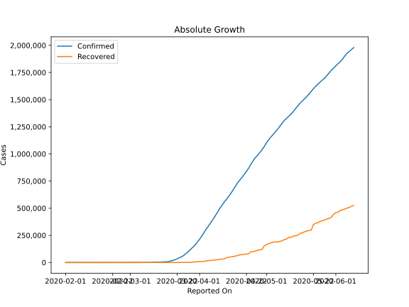
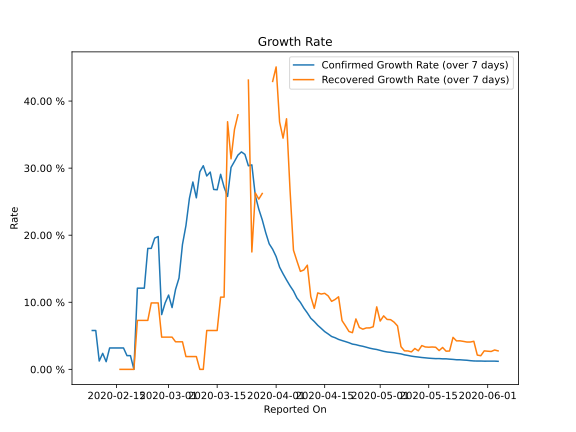

# Country Figures: Growth Rate for US 

The growth rates below are calculated based on
* an exponential growth assumption
* for time difference of past seven (7) days.
The growth rate is to be understood as on "growth per day".

The first growth rate indicates the increase of confirmed (infected) cases.

The second growth rate indicates the increase of recovered (healed) cases.

| Reported On | Confirmed | Growth Rate (Confirmed) | Recovered | Growth Rate (Recovered) |
|-------------|-----------|-------------------------|-----------|-------------------------|
| 2020-04-11 | 526396 |  7.62 %  | 31270 |  10.830 %  | 
| 2020-04-10 | 496535 |  8.41 %  | 28790 |  15.531 %  | 
| 2020-04-09 | 461437 |  9.13 %  | 25410 |  14.826 %  | 
| 2020-04-08 | 429052 |  9.98 %  | 23559 |  14.607 %  | 
| 2020-04-07 | 396223 |  10.64 %  | 21763 |  16.155 %  | 
| 2020-04-06 | 366667 |  11.68 %  | 19581 |  17.771 %  | 
| 2020-04-05 | 337072 |  12.46 %  | 17448 |  26.843 %  | 
| 2020-04-04 | 308853 |  13.33 %  | 14652 |  37.358 %  | 
| 2020-04-03 | 275586 |  14.25 %  | 9707 |  34.475 %  | 
| 2020-04-02 | 243599 |  15.24 %  | 9001 |  36.879 %  | 
| 2020-04-01 | 213372 |  16.81 %  | 8474 |  45.084 %  | 
| 2020-03-31 | 188172 |  17.90 %  | 7024 |  42.927 %  | 
| 2020-03-30 | 161831 |  18.71 %  | 5644 |  None  | 
| 2020-03-29 | 140909 |  20.37 %  | 2665 |  None  | 
| 2020-03-28 | 121465 |  22.29 %  | 1072 |  26.223 %  | 
| 2020-03-27 | 101657 |  23.88 %  | 869 |  25.384 %  | 
| 2020-03-26 | 83836 |  25.90 %  | 681 |  26.306 %  | 
| 2020-03-25 | 65778 |  30.49 %  | 361 |  17.506 %  | 
| 2020-03-24 | 53740 |  30.35 %  | 348 |  43.128 %  | 
| 2020-03-23 | 43667 |  32.05 %  | 0 |  None  | 
| 2020-03-22 | 33848 |  32.42 %  | 0 |  None  | 
| 2020-03-21 | 25514 |  31.95 %  | 171 |  37.954 %  | 
| 2020-03-20 | 19101 |  31.01 %  | 147 |  35.793 %  | 
| 2020-03-19 | 13680 |  30.10 %  | 108 |  31.389 %  | 
| 2020-03-18 | 7786 |  25.78 %  | 106 |  36.914 %  | 
| 2020-03-17 | 6421 |  27.16 %  | 17 |  10.768 %  | 
| 2020-03-16 | 4632 |  29.08 %  | 17 |  10.768 %  | 
| 2020-03-15 | 3499 |  26.77 %  | 12 |  5.792 %  | 
| 2020-03-14 | 2726 |  26.82 %  | 12 |  5.792 %  | 
| 2020-03-13 | 2179 |  29.41 %  | 12 |  5.792 %  | 
| 2020-03-12 | 1663 |  28.83 %  | 12 |  5.792 %  | 
| 2020-03-11 | 1281 |  30.36 %  | 8 |  None  | 
| 2020-03-10 | 959 |  29.46 %  | 8 |  None  | 
| 2020-03-09 | 605 |  25.57 %  | 8 |  1.908 %  | 
| 2020-03-08 | 537 |  27.93 %  | 8 |  1.908 %  | 
| 2020-03-07 | 417 |  25.49 %  | 8 |  1.908 %  | 
| 2020-03-06 | 278 |  21.44 %  | 8 |  1.908 %  | 
| 2020-03-05 | 221 |  18.63 %  | 8 |  4.110 %  | 
| 2020-03-04 | 153 |  13.61 %  | 8 |  4.110 %  | 
| 2020-03-03 | 122 |  11.91 %  | 8 |  4.110 %  | 
| 2020-03-02 | 101 |  9.21 %  | 7 |  4.807 %  | 
| 2020-03-01 | 76 |  11.08 %  | 7 |  4.807 %  | 
| 2020-02-29 | 70 |  9.90 %  | 7 |  4.807 %  | 
| 2020-02-28 | 62 |  8.17 %  | 7 |  4.807 %  | 
| 2020-02-27 | 60 |  19.80 %  | 6 |  9.902 %  | 
| 2020-02-26 | 59 |  19.56 %  | 6 |  9.902 %  | 
| 2020-02-25 | 53 |  18.03 %  | 6 |  9.902 %  | 
| 2020-02-24 | 53 |  18.03 %  | 5 |  7.298 %  | 
| 2020-02-23 | 35 |  12.10 %  | 5 |  7.298 %  | 
| 2020-02-22 | 35 |  12.10 %  | 5 |  7.298 %  | 
| 2020-02-21 | 35 |  12.10 %  | 5 |  7.298 %  | 
| 2020-02-20 | 15 |  None  | 3 |  None  | 
| 2020-02-19 | 15 |  2.04 %  | 3 |  None  | 
| 2020-02-18 | 15 |  2.04 %  | 3 |  None  | 
| 2020-02-17 | 15 |  3.19 %  | 3 |  None  | 
| 2020-02-16 | 15 |  3.19 %  | 3 |  None  | 
| 2020-02-15 | 15 |  3.19 %  | 3 |  None  | 
| 2020-02-14 | 15 |  3.19 %  | 3 |  None  | 
| 2020-02-13 | 15 |  3.19 %  | 3 |  None  | 
| 2020-02-12 | 13 |  1.14 %  | 3 |  None  | 
| 2020-02-11 | 13 |  2.39 %  | 3 |  None  | 
| 2020-02-10 | 12 |  1.24 %  | 3 |  None  | 
| 2020-02-09 | 12 |  5.79 %  | 3 |  None  | 
| 2020-02-08 | 12 |  5.79 %  | 0 |  None  | 
| 2020-02-07 | 12 |  None  | 0 |  None  | 
| 2020-02-06 | 12 |  None  | 0 |  None  | 
| 2020-02-05 | 12 |  None  | 0 |  None  | 
| 2020-02-04 | 11 |  None  | 0 |  None  | 
| 2020-02-03 | 11 |  None  | 0 |  None  | 
| 2020-02-02 | 8 |  None  | 0 |  None  | 
| 2020-02-01 | 8 |  None  | 0 |  None  | 

