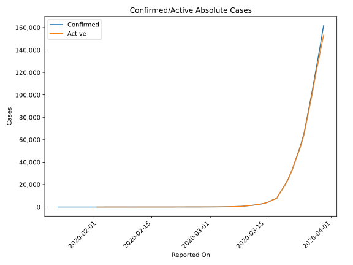
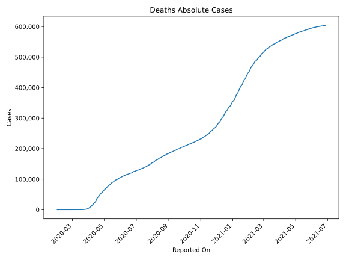
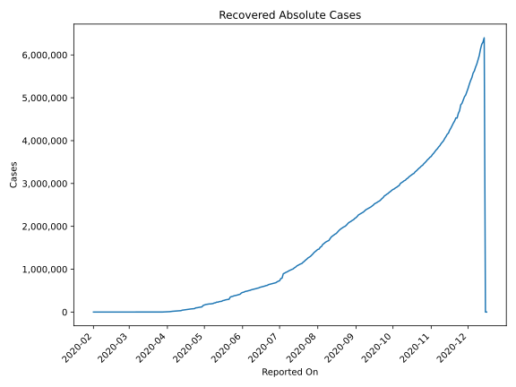
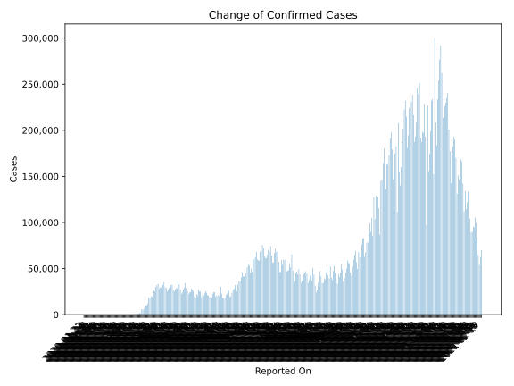
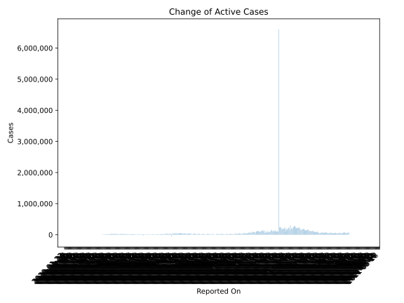
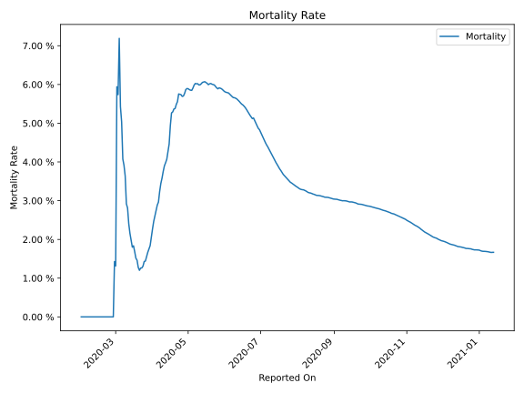

# Country Figures: Time Series for US 

| Reported On | Confirmed | Deaths | Recovered | Active | Mortality | &Delta; Confirmed | &Delta; Deaths | &Delta; Recovered | &Delta; Active | % Active of Population |
|-------------|-----------|--------|-----------|--------|-----------|-------------------|----------------|-------------------|----------------|------------------------|
| 2020-05-03 | 1158040 | 67682 | 180152 | 910206 |  5.84 %  | 25501 | 1313 | 4770 | 19418 |  0.278 %  | 
| 2020-05-02 | 1132539 | 66369 | 175382 | 890788 |  5.86 %  | 29078 | 1426 | 11367 | 16285 |  0.272 %  | 
| 2020-05-01 | 1103461 | 64943 | 164015 | 874503 |  5.89 %  | 34037 | 1947 | 10068 | 22022 |  0.267 %  | 
| 2020-04-30 | 1069424 | 62996 | 153947 | 852481 |  5.89 %  | 29515 | 2029 | 33227 | -5741 |  0.261 %  | 
| 2020-04-29 | 1039909 | 60967 | 120720 | 858222 |  5.86 %  | 27327 | 2612 | 4784 | 19931 |  0.262 %  | 
| 2020-04-28 | 1012582 | 58355 | 115936 | 838291 |  5.76 %  | 24385 | 2096 | 4512 | 17777 |  0.256 %  | 
| 2020-04-27 | 988197 | 56259 | 111424 | 820514 |  5.69 %  | 22414 | 1378 | 4436 | 16600 |  0.251 %  | 
| 2020-04-26 | 965783 | 54881 | 106988 | 803914 |  5.68 %  | 27629 | 1126 | 6616 | 19887 |  0.246 %  | 
| 2020-04-25 | 938154 | 53755 | 100372 | 784027 |  5.73 %  | 32821 | 1806 | 1293 | 29722 |  0.240 %  | 
| 2020-04-24 | 905333 | 51949 | 99079 | 754305 |  5.74 %  | 36163 | 1995 | 18876 | 15292 |  0.231 %  | 
| 2020-04-23 | 869170 | 49954 | 80203 | 739013 |  5.75 %  | 28950 | 3332 | 2837 | 22781 |  0.226 %  | 
| 2020-04-22 | 840220 | 46622 | 77366 | 716232 |  5.55 %  | 28355 | 2178 | 2162 | 24015 |  0.219 %  | 
| 2020-04-21 | 811865 | 44444 | 75204 | 692217 |  5.47 %  | 27539 | 2350 | 2875 | 22314 |  0.212 %  | 
| 2020-04-20 | 784326 | 42094 | 72329 | 669903 |  5.37 %  | 25240 | 1433 | 1992 | 21815 |  0.205 %  | 
| 2020-04-19 | 759086 | 40661 | 70337 | 648088 |  5.36 %  | 26889 | 1997 | 5497 | 19395 |  0.198 %  | 
| 2020-04-18 | 732197 | 38664 | 64840 | 628693 |  5.28 %  | 32491 | 1891 | 6295 | 24305 |  0.192 %  | 
| 2020-04-17 | 699706 | 36773 | 58545 | 604388 |  5.26 %  | 31905 | 3857 | 3842 | 24206 |  0.185 %  | 
| 2020-04-16 | 667801 | 32916 | 54703 | 580182 |  4.93 %  | 31451 | 4591 | 2607 | 24253 |  0.177 %  | 
| 2020-04-15 | 636350 | 28325 | 52096 | 555929 |  4.45 %  | 28680 | 2494 | 4333 | 21853 |  0.170 %  | 
| 2020-04-14 | 607670 | 25831 | 47763 | 534076 |  4.25 %  | 27051 | 2303 | 4281 | 20467 |  0.163 %  | 
| 2020-04-13 | 580619 | 23528 | 43482 | 513609 |  4.05 %  | 25306 | 1509 | 10494 | 13303 |  0.157 %  | 
| 2020-04-12 | 555313 | 22019 | 32988 | 500306 |  3.97 %  | 28917 | 1557 | 1718 | 25642 |  0.153 %  | 
| 2020-04-11 | 526396 | 20462 | 31270 | 474664 |  3.89 %  | 29861 | 1876 | 2480 | 25505 |  0.145 %  | 
| 2020-04-10 | 496535 | 18586 | 28790 | 449159 |  3.74 %  | 35098 | 2108 | 3380 | 29610 |  0.137 %  | 
| 2020-04-09 | 461437 | 16478 | 25410 | 419549 |  3.57 %  | 32385 | 1783 | 1851 | 28751 |  0.128 %  | 
| 2020-04-08 | 429052 | 14695 | 23559 | 390798 |  3.42 %  | 32829 | 1973 | 1796 | 29060 |  0.119 %  | 
| 2020-04-07 | 396223 | 12722 | 21763 | 361738 |  3.21 %  | 29556 | 1939 | 2182 | 25435 |  0.111 %  | 
| 2020-04-06 | 366667 | 10783 | 19581 | 336303 |  2.94 %  | 29595 | 1164 | 2133 | 26298 |  0.103 %  | 
| 2020-04-05 | 337072 | 9619 | 17448 | 310005 |  2.85 %  | 28219 | 1212 | 2796 | 24211 |  0.095 %  | 
| 2020-04-04 | 308853 | 8407 | 14652 | 285794 |  2.72 %  | 33267 | 1320 | 4945 | 27002 |  0.087 %  | 
| 2020-04-03 | 275586 | 7087 | 9707 | 258792 |  2.57 %  | 31987 | 1161 | 706 | 30120 |  0.079 %  | 
| 2020-04-02 | 243599 | 5926 | 9001 | 228672 |  2.43 %  | 30227 | 1169 | 527 | 28531 |  0.070 %  | 
| 2020-04-01 | 213372 | 4757 | 8474 | 200141 |  2.23 %  | 25200 | 884 | 1450 | 22866 |  0.061 %  | 
| 2020-03-31 | 188172 | 3873 | 7024 | 177275 |  2.06 %  | 26341 | 895 | 1380 | 24066 |  0.054 %  | 
| 2020-03-30 | 161831 | 2978 | 5644 | 153209 |  1.84 %  | 20922 | 511 | 2979 | 17432 |  0.047 %  | 
| 2020-03-29 | 140909 | 2467 | 2665 | 135777 |  1.75 %  | 19444 | 441 | 1593 | 17410 |  0.042 %  | 
| 2020-03-28 | 121465 | 2026 | 1072 | 118367 |  1.67 %  | 19808 | 445 | 203 | 19160 |  0.036 %  | 
| 2020-03-27 | 101657 | 1581 | 869 | 99207 |  1.56 %  | 17821 | 372 | 188 | 17261 |  0.030 %  | 
| 2020-03-26 | 83836 | 1209 | 681 | 81946 |  1.44 %  | 18058 | 267 | 320 | 17471 |  0.025 %  | 
| 2020-03-25 | 65778 | 942 | 361 | 64475 |  1.43 %  | 12042 | 236 | 13 | 11793 |  0.020 %  | 
| 2020-03-24 | 53736 | 706 | 348 | 52682 |  1.31 %  | 10073 | 154 | 348 | 9571 |  0.016 %  | 
| 2020-03-23 | 43663 | 552 | 0 | 43111 |  1.26 %  | 9815 | 125 | 0 | 9690 |  0.013 %  | 
| 2020-03-22 | 33848 | 427 | 0 | 33421 |  1.26 %  | 8334 | 120 | -171 | 8385 |  0.010 %  | 
| 2020-03-21 | 25514 | 307 | 171 | 25036 |  1.20 %  | 6413 | 63 | 24 | 6326 |  0.008 %  | 
| 2020-03-20 | 19101 | 244 | 147 | 18710 |  1.28 %  | 5421 | 44 | 39 | 5338 |  0.006 %  | 
| 2020-03-19 | 13680 | 200 | 108 | 13372 |  1.46 %  | 5894 | 82 | 2 | 5810 |  0.004 %  | 
| 2020-03-18 | 7786 | 118 | 106 | 7562 |  1.52 %  | 1365 | 10 | 89 | 1266 |  0.002 %  | 
| 2020-03-17 | 6421 | 108 | 17 | 6296 |  1.68 %  | 1789 | 23 | 0 | 1766 |  0.002 %  | 
| 2020-03-16 | 4632 | 85 | 17 | 4530 |  1.84 %  | 1133 | 22 | 5 | 1106 |  0.001 %  | 
| 2020-03-15 | 3499 | 63 | 12 | 3424 |  1.80 %  | 773 | 9 | 0 | 764 |  0.001 %  | 
| 2020-03-14 | 2726 | 54 | 12 | 2660 |  1.98 %  | 547 | 7 | 0 | 540 |  0.001 %  | 
| 2020-03-13 | 2179 | 47 | 12 | 2120 |  2.16 %  | 516 | 7 | 0 | 509 |  0.001 %  | 
| 2020-03-12 | 1663 | 40 | 12 | 1611 |  2.41 %  | 382 | 4 | 4 | 374 |  0.000 %  | 
| 2020-03-11 | 1281 | 36 | 8 | 1237 |  2.81 %  | 322 | 8 | 0 | 314 |  0.000 %  | 
| 2020-03-10 | 959 | 28 | 8 | 923 |  2.92 %  | 354 | 6 | 0 | 348 |  0.000 %  | 
| 2020-03-09 | 605 | 22 | 8 | 575 |  3.64 %  | 68 | 1 | 0 | 67 |  0.000 %  | 
| 2020-03-08 | 537 | 21 | 8 | 508 |  3.91 %  | 120 | 4 | 0 | 116 |  0.000 %  | 
| 2020-03-07 | 417 | 17 | 8 | 392 |  4.08 %  | 139 | 3 | 0 | 136 |  0.000 %  | 
| 2020-03-06 | 278 | 14 | 8 | 256 |  5.04 %  | 57 | 2 | 0 | 55 |  0.000 %  | 
| 2020-03-05 | 221 | 12 | 8 | 201 |  5.43 %  | 68 | 1 | 0 | 67 |  0.000 %  | 
| 2020-03-04 | 153 | 11 | 8 | 134 |  7.19 %  | 31 | 4 | 0 | 27 |  0.000 %  | 
| 2020-03-03 | 122 | 7 | 8 | 107 |  5.74 %  | 21 | 1 | 1 | 19 |  0.000 %  | 
| 2020-03-02 | 101 | 6 | 7 | 88 |  5.94 %  | 25 | 5 | 0 | 20 |  0.000 %  | 
| 2020-03-01 | 76 | 1 | 7 | 68 |  1.32 %  | 6 | 0 | 0 | 6 |  0.000 %  | 
| 2020-02-29 | 70 | 1 | 7 | 62 |  1.43 %  | 8 | 1 | 0 | 7 |  0.000 %  | 
| 2020-02-28 | 62 | 0 | 7 | 55 |  None  | 2 | 0 | 1 | 1 |  0.000 %  | 
| 2020-02-27 | 60 | 0 | 6 | 54 |  None  | 1 | 0 | 0 | 1 |  0.000 %  | 
| 2020-02-26 | 59 | 0 | 6 | 53 |  None  | 6 | 0 | 0 | 6 |  0.000 %  | 
| 2020-02-25 | 53 | 0 | 6 | 47 |  None  | 0 | 0 | 1 | -1 |  0.000 %  | 
| 2020-02-24 | 53 | 0 | 5 | 48 |  None  | 18 | 0 | 0 | 18 |  0.000 %  | 
| 2020-02-23 | 35 | 0 | 5 | 30 |  None  | 0 | 0 | 0 | 0 |  0.000 %  | 
| 2020-02-22 | 35 | 0 | 5 | 30 |  None  | 0 | 0 | 0 | 0 |  0.000 %  | 
| 2020-02-21 | 35 | 0 | 5 | 30 |  None  | 20 | 0 | 2 | 18 |  0.000 %  | 
| 2020-02-20 | 15 | 0 | 3 | 12 |  None  | 0 | 0 | 0 | 0 |  0.000 %  | 
| 2020-02-19 | 15 | 0 | 3 | 12 |  None  | 0 | 0 | 0 | 0 |  0.000 %  | 
| 2020-02-18 | 15 | 0 | 3 | 12 |  None  | 0 | 0 | 0 | 0 |  0.000 %  | 
| 2020-02-17 | 15 | 0 | 3 | 12 |  None  | 0 | 0 | 0 | 0 |  0.000 %  | 
| 2020-02-16 | 15 | 0 | 3 | 12 |  None  | 0 | 0 | 0 | 0 |  0.000 %  | 
| 2020-02-15 | 15 | 0 | 3 | 12 |  None  | 0 | 0 | 0 | 0 |  0.000 %  | 
| 2020-02-14 | 15 | 0 | 3 | 12 |  None  | 0 | 0 | 0 | 0 |  0.000 %  | 
| 2020-02-13 | 15 | 0 | 3 | 12 |  None  | 2 | 0 | 0 | 2 |  0.000 %  | 
| 2020-02-12 | 13 | 0 | 3 | 10 |  None  | 0 | 0 | 0 | 0 |  0.000 %  | 
| 2020-02-11 | 13 | 0 | 3 | 10 |  None  | 1 | 0 | 0 | 1 |  0.000 %  | 
| 2020-02-10 | 12 | 0 | 3 | 9 |  None  | 0 | 0 | 0 | 0 |  0.000 %  | 
| 2020-02-09 | 12 | 0 | 3 | 9 |  None  | 0 | 0 | 3 | -3 |  0.000 %  | 
| 2020-02-08 | 12 | 0 | 0 | 12 |  None  | 0 | 0 | 0 | 0 |  0.000 %  | 
| 2020-02-07 | 12 | 0 | 0 | 12 |  None  | 0 | 0 | 0 | 0 |  0.000 %  | 
| 2020-02-06 | 12 | 0 | 0 | 12 |  None  | 0 | 0 | 0 | 0 |  0.000 %  | 
| 2020-02-05 | 12 | 0 | 0 | 12 |  None  | 1 | 0 | 0 | 1 |  0.000 %  | 
| 2020-02-04 | 11 | 0 | 0 | 11 |  None  | 0 | 0 | 0 | 0 |  0.000 %  | 
| 2020-02-03 | 11 | 0 | 0 | 11 |  None  | 3 | 0 | 0 | 3 |  0.000 %  | 
| 2020-02-02 | 8 | 0 | 0 | 8 |  None  | 0 | 0 | 0 | 0 |  0.000 %  | 
| 2020-02-01 | 8 | 0 | 0 | 8 |  None  | 2 | None | None | None |  0.000 %  | 
| 2020-01-31 | 6 | None | None | None |  None  | 1 | None | None | None |  n/a  | 
| 2020-01-30 | 5 | None | None | None |  None  | 0 | None | None | None |  n/a  | 
| 2020-01-29 | 5 | None | None | None |  None  | 0 | None | None | None |  n/a  | 
| 2020-01-28 | 5 | None | None | None |  None  | 0 | None | None | None |  n/a  | 
| 2020-01-27 | 5 | None | None | None |  None  | 0 | None | None | None |  n/a  | 
| 2020-01-26 | 5 | None | None | None |  None  | 3 | None | None | None |  n/a  | 
| 2020-01-25 | 2 | None | None | None |  None  | 0 | None | None | None |  n/a  | 
| 2020-01-24 | 2 | None | None | None |  None  | 1 | None | None | None |  n/a  | 
| 2020-01-23 | 1 | None | None | None |  None  | 0 | None | None | None |  n/a  | 
| 2020-01-22 | 1 | None | None | None |  None  | None | None | None | None |  n/a  | 

