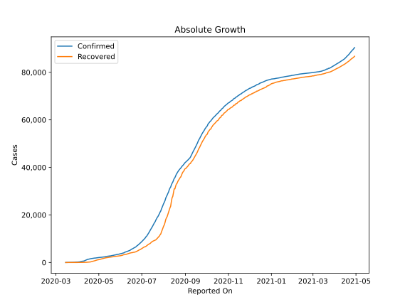
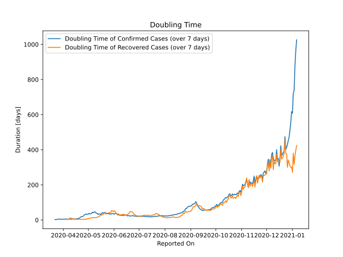

# Country Figures: Doubling Time of Infections for Uzbekistan 

The doubling time below are calculated based on
* an exponential growth assumption
* for time difference of past seven (7) days.
The doubling time's unit is "days".

The first doubling time indicates the increase of confirmed (infected)
cases. There, the *higher* the number is, the better is to take control
of the disease.

The second doubling time indicates the increase of recovered (healed)
cases. There, the *lower* the number is, the better it is to take
control of the disease.

| Reported On | Confirmed | Doubling Time (Confirmed) | Recovered | Doubling Time (Recovered) |
|-------------|-----------|---------------------------|-----------|---------------------------|
| 2020-04-03 | 227 |  5.5 days  | 25 |  3.3 days  | 
| 2020-04-02 | 205 |  5.2 days  | 25 |  None  | 
| 2020-04-01 | 181 |  4.7 days  | 12 |  None  | 
| 2020-03-31 | 172 |  4.3 days  | 7 |  None  | 
| 2020-03-30 | 149 |  4.5 days  | 7 |  None  | 
| 2020-03-29 | 144 |  4.4 days  | 7 |  None  | 
| 2020-03-28 | 104 |  5.8 days  | 5 |  None  | 
| 2020-03-27 | 88 |  5.3 days  | 5 |  None  | 
| 2020-03-26 | 75 |  4.4 days  | 0 |  None  | 
| 2020-03-25 | 60 |  3.8 days  | 0 |  None  | 
| 2020-03-24 | 50 |  3.3 days  | 0 |  None  | 
| 2020-03-23 | 46 |  2.7 days  | 0 |  None  | 
| 2020-03-22 | 43 |  1.6 days  | 0 |  None  | 
| 2020-03-21 | 43 |  None  | 0 |  None  | 
| 2020-03-20 | 33 |  None  | 0 |  None  | 
| 2020-03-19 | 23 |  None  | 0 |  None  | 
| 2020-03-18 | 15 |  None  | 0 |  None  | 
| 2020-03-17 | 10 |  None  | 0 |  None  | 
| 2020-03-16 | 6 |  None  | 0 |  None  | 
| 2020-03-15 | 1 |  None  | 0 |  None  | 

