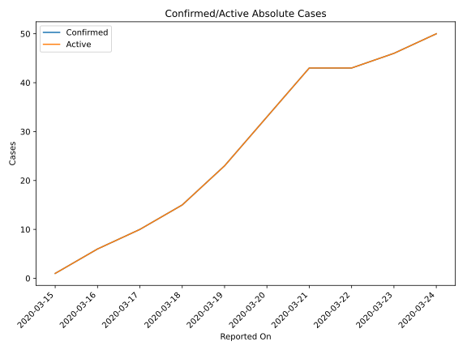
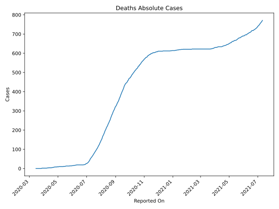
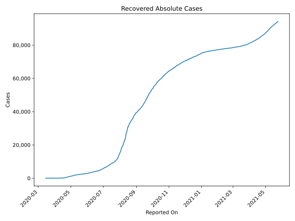
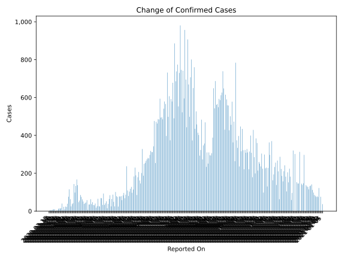
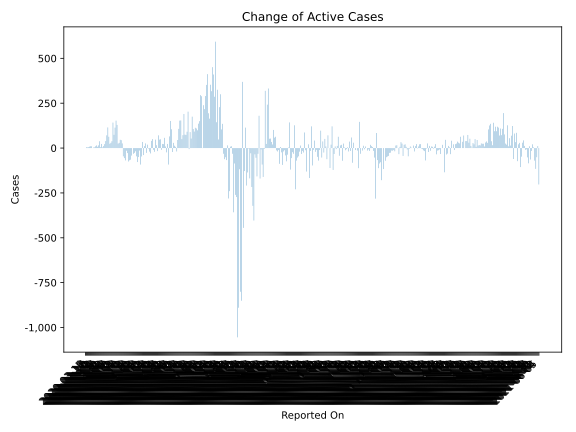
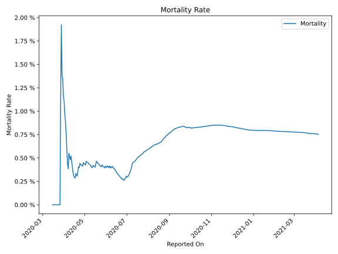

# Country Figures: Time Series for Uzbekistan 

| Reported On | Confirmed | Deaths | Recovered | Active | Mortality | &Delta; Confirmed | &Delta; Deaths | &Delta; Active | % Active of Population |
|-------------|-----------|--------|-----------|--------|-----------|-------------------|----------------|----------------|------------------------|
| 2020-03-27 | 88 | 1 | 5 | 82 |  1.14 %  | 13 | 1 | 7 |  0.000 %  | 
| 2020-03-26 | 75 | 0 | 0 | 75 |  None  | 15 | 0 | 15 |  0.000 %  | 
| 2020-03-25 | 60 | 0 | 0 | 60 |  None  | 10 | 0 | 10 |  0.000 %  | 
| 2020-03-24 | 50 | 0 | 0 | 50 |  None  | 4 | 0 | 4 |  0.000 %  | 
| 2020-03-23 | 46 | 0 | 0 | 46 |  None  | 3 | 0 | 3 |  0.000 %  | 
| 2020-03-22 | 43 | 0 | 0 | 43 |  None  | 0 | 0 | 0 |  0.000 %  | 
| 2020-03-21 | 43 | 0 | 0 | 43 |  None  | 10 | 0 | 10 |  0.000 %  | 
| 2020-03-20 | 33 | 0 | 0 | 33 |  None  | 10 | 0 | 10 |  0.000 %  | 
| 2020-03-19 | 23 | 0 | 0 | 23 |  None  | 8 | 0 | 8 |  0.000 %  | 
| 2020-03-18 | 15 | 0 | 0 | 15 |  None  | 5 | 0 | 5 |  0.000 %  | 
| 2020-03-17 | 10 | 0 | 0 | 10 |  None  | 4 | 0 | 4 |  0.000 %  | 
| 2020-03-16 | 6 | 0 | 0 | 6 |  None  | 5 | 0 | 5 |  0.000 %  | 
| 2020-03-15 | 1 | 0 | 0 | 1 |  None  | None | None | None |  0.000 %  | 

