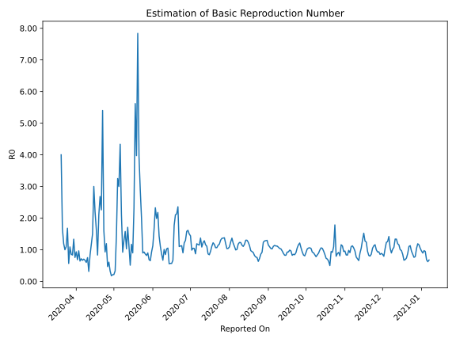

# Country Figures: Time Series for Basic Reproduction Number of Venezuela 

| Reported On | &Delta; Confirmed | Total &Delta; Confirmed First Interval | Total &Delta; Confirmed Second Interval | Estimated Basic Reproduction Number R0 | 
|-------------|-------------------|----------------------------------------|-----------------------------------------|---------------------------------------------------|
| 2020-05-01 | 2 |  8  |  37  |  0.22  | 
| 2020-04-30 | 2 |  8  |  38  |  0.21  | 
| 2020-04-29 | 2 |  11  |  62  |  0.18  | 
| 2020-04-28 | 0 |  18  |  55  |  0.33  | 
| 2020-04-27 | 4 |  37  |  61  |  0.61  | 
| 2020-04-26 | 2 |  38  |  81  |  0.47  | 
| 2020-04-25 | 5 |  62  |  52  |  1.19  | 
| 2020-04-24 | 7 |  55  |  59  |  0.93  | 
| 2020-04-23 | 23 |  61  |  38  |  1.61  | 
| 2020-04-22 | 3 |  81  |  15  |  5.40  | 
| 2020-04-21 | 29 |  52  |  23  |  2.26  | 
| 2020-04-20 | 0 |  59  |  22  |  2.68  | 
| 2020-04-19 | 29 |  38  |  18  |  2.11  | 
| 2020-04-18 | 23 |  15  |  18  |  0.83  | 
| 2020-04-17 | 0 |  23  |  14  |  1.64  | 
| 2020-04-16 | 7 |  22  |  10  |  2.20  | 
| 2020-04-15 | 8 |  18  |  6  |  3.00  | 
| 2020-04-14 | 0 |  18  |  12  |  1.50  | 
| 2020-04-13 | 8 |  14  |  12  |  1.17  | 
| 2020-04-12 | 6 |  10  |  12  |  0.83  | 
| 2020-04-11 | 4 |  6  |  19  |  0.32  | 
| 2020-04-10 | 0 |  12  |  16  |  0.75  | 
| 2020-04-09 | 4 |  12  |  20  |  0.60  | 
| 2020-04-08 | 2 |  12  |  18  |  0.67  | 
| 2020-04-07 | 0 |  19  |  27  |  0.70  | 
| 2020-04-06 | 6 |  16  |  24  |  0.67  | 
| 2020-04-05 | 4 |  20  |  28  |  0.71  | 
| 2020-04-04 | 2 |  18  |  28  |  0.64  | 
| 2020-04-03 | 7 |  27  |  28  |  0.96  | 
| 2020-04-02 | 3 |  24  |  35  |  0.69  | 
| 2020-04-01 | 8 |  28  |  30  |  0.93  | 
| 2020-03-31 | 0 |  28  |  37  |  0.76  | 
| 2020-03-30 | 16 |  28  |  21  |  1.33  | 
| 2020-03-29 | 0 |  35  |  42  |  0.83  | 
| 2020-03-28 | 12 |  30  |  35  |  0.86  | 
| 2020-03-27 | 0 |  37  |  34  |  1.09  | 
| 2020-03-26 | 16 |  21  |  37  |  0.57  | 
| 2020-03-25 | 7 |  42  |  25  |  1.68  | 
| 2020-03-24 | 7 |  35  |  32  |  1.09  | 
| 2020-03-23 | 7 |  34  |  34  |  1.00  | 
| 2020-03-22 | 0 |  37  |  31  |  1.19  | 
| 2020-03-21 | 28 |  25  |  15  |  1.67  | 
| 2020-03-20 | 0 |  32  |  8  |  4.00  | 
| 2020-03-19 | 6 |  34  |  None  |  None  | 
| 2020-03-18 | 3 |  31  |  None  |  None  | 
| 2020-03-17 | 16 |  15  |  None  |  None  | 
| 2020-03-16 | 7 |  8  |  None  |  None  | 
| 2020-03-15 | 8 |  None  |  None  |  None  | 
| 2020-03-14 | None |  None  |  None  |  None  | 

