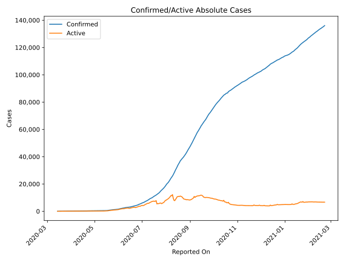
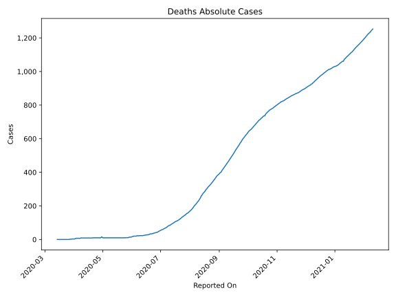
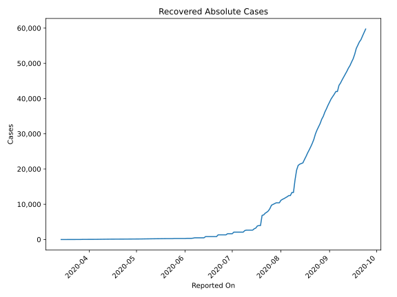
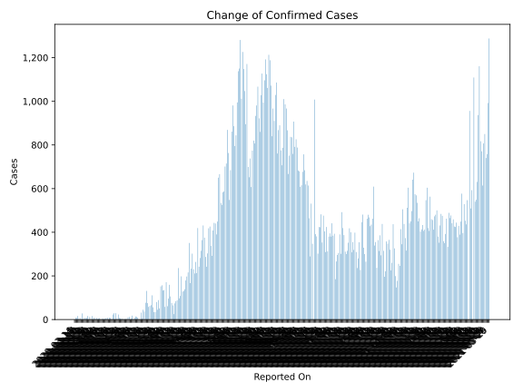
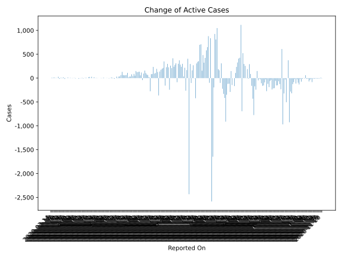
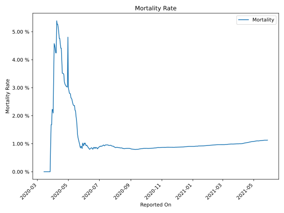

# Country Figures: Time Series for Venezuela 

| Reported On | Confirmed | Deaths | Recovered | Active | Mortality | &Delta; Confirmed | &Delta; Deaths | &Delta; Recovered | &Delta; Active | % Active of Population |
|-------------|-----------|--------|-----------|--------|-----------|-------------------|----------------|-------------------|----------------|------------------------|
| 2020-04-28 | 329 | 10 | 142 | 177 |  3.04 %  | 0 | 0 | 0 | 0 |  0.001 %  | 
| 2020-04-27 | 329 | 10 | 142 | 177 |  3.04 %  | 4 | 0 | 5 | -1 |  0.001 %  | 
| 2020-04-26 | 325 | 10 | 137 | 178 |  3.08 %  | 2 | 0 | 5 | -3 |  0.001 %  | 
| 2020-04-25 | 323 | 10 | 132 | 181 |  3.10 %  | 5 | 0 | 0 | 5 |  0.001 %  | 
| 2020-04-24 | 318 | 10 | 132 | 176 |  3.14 %  | 7 | 0 | 6 | 1 |  0.001 %  | 
| 2020-04-23 | 311 | 10 | 126 | 175 |  3.22 %  | 23 | 0 | 4 | 19 |  0.001 %  | 
| 2020-04-22 | 288 | 10 | 122 | 156 |  3.47 %  | 3 | 0 | 5 | -2 |  0.001 %  | 
| 2020-04-21 | 285 | 10 | 117 | 158 |  3.51 %  | 29 | 1 | 0 | 28 |  0.001 %  | 
| 2020-04-20 | 256 | 9 | 117 | 130 |  3.52 %  | 0 | 0 | 0 | 0 |  0.000 %  | 
| 2020-04-19 | 256 | 9 | 117 | 130 |  3.52 %  | 29 | 0 | 4 | 25 |  0.000 %  | 
| 2020-04-18 | 227 | 9 | 113 | 105 |  3.96 %  | 23 | 0 | 2 | 21 |  0.000 %  | 
| 2020-04-17 | 204 | 9 | 111 | 84 |  4.41 %  | 0 | 0 | 0 | 0 |  0.000 %  | 
| 2020-04-16 | 204 | 9 | 111 | 84 |  4.41 %  | 7 | 0 | 0 | 7 |  0.000 %  | 
| 2020-04-15 | 197 | 9 | 111 | 77 |  4.57 %  | 8 | 0 | 1 | 7 |  0.000 %  | 
| 2020-04-14 | 189 | 9 | 110 | 70 |  4.76 %  | 0 | 0 | 0 | 0 |  0.000 %  | 
| 2020-04-13 | 189 | 9 | 110 | 70 |  4.76 %  | 8 | 0 | 17 | -9 |  0.000 %  | 
| 2020-04-12 | 181 | 9 | 93 | 79 |  4.97 %  | 6 | 0 | 0 | 6 |  0.000 %  | 
| 2020-04-11 | 175 | 9 | 93 | 73 |  5.14 %  | 4 | 0 | 9 | -5 |  0.000 %  | 
| 2020-04-10 | 171 | 9 | 84 | 78 |  5.26 %  | 0 | 0 | 0 | 0 |  0.000 %  | 
| 2020-04-09 | 171 | 9 | 84 | 78 |  5.26 %  | 4 | 0 | 19 | -15 |  0.000 %  | 
| 2020-04-08 | 167 | 9 | 65 | 93 |  5.39 %  | 2 | 2 | 0 | 0 |  0.000 %  | 
| 2020-04-07 | 165 | 7 | 65 | 93 |  4.24 %  | 0 | 0 | 0 | 0 |  0.000 %  | 
| 2020-04-06 | 165 | 7 | 65 | 93 |  4.24 %  | 6 | 0 | 13 | -7 |  0.000 %  | 
| 2020-04-05 | 159 | 7 | 52 | 100 |  4.40 %  | 4 | 0 | 0 | 4 |  0.000 %  | 
| 2020-04-04 | 155 | 7 | 52 | 96 |  4.52 %  | 2 | 0 | 0 | 2 |  0.000 %  | 
| 2020-04-03 | 153 | 7 | 52 | 94 |  4.58 %  | 7 | 2 | 9 | -4 |  0.000 %  | 
| 2020-04-02 | 146 | 5 | 43 | 98 |  3.42 %  | 3 | 2 | 2 | -1 |  0.000 %  | 
| 2020-04-01 | 143 | 3 | 41 | 99 |  2.10 %  | 8 | 0 | 2 | 6 |  0.000 %  | 
| 2020-03-31 | 135 | 3 | 39 | 93 |  2.22 %  | 0 | 0 | 0 | 0 |  0.000 %  | 
| 2020-03-30 | 135 | 3 | 39 | 93 |  2.22 %  | 16 | 1 | 0 | 15 |  0.000 %  | 
| 2020-03-29 | 119 | 2 | 39 | 78 |  1.68 %  | 0 | 0 | 0 | 0 |  0.000 %  | 
| 2020-03-28 | 119 | 2 | 39 | 78 |  1.68 %  | 12 | 1 | 8 | 3 |  0.000 %  | 
| 2020-03-27 | 107 | 1 | 31 | 75 |  0.93 %  | 0 | 1 | 16 | -17 |  0.000 %  | 
| 2020-03-26 | 107 | 0 | 15 | 92 |  None  | 16 | 0 | 0 | 16 |  0.000 %  | 
| 2020-03-25 | 91 | 0 | 15 | 76 |  None  | 7 | 0 | 0 | 7 |  0.000 %  | 
| 2020-03-24 | 84 | 0 | 15 | 69 |  None  | 7 | 0 | 0 | 7 |  0.000 %  | 
| 2020-03-23 | 77 | 0 | 15 | 62 |  None  | 7 | 0 | 0 | 7 |  0.000 %  | 
| 2020-03-22 | 70 | 0 | 15 | 55 |  None  | 0 | 0 | 15 | -15 |  0.000 %  | 
| 2020-03-21 | 70 | 0 | 0 | 70 |  None  | 28 | 0 | 0 | 28 |  0.000 %  | 
| 2020-03-20 | 42 | 0 | 0 | 42 |  None  | 0 | 0 | 0 | 0 |  0.000 %  | 
| 2020-03-19 | 42 | 0 | 0 | 42 |  None  | 6 | 0 | 0 | 6 |  0.000 %  | 
| 2020-03-18 | 36 | 0 | 0 | 36 |  None  | 3 | 0 | 0 | 3 |  0.000 %  | 
| 2020-03-17 | 33 | 0 | 0 | 33 |  None  | 16 | 0 | 0 | 16 |  0.000 %  | 
| 2020-03-16 | 17 | 0 | 0 | 17 |  None  | 7 | 0 | 0 | 7 |  0.000 %  | 
| 2020-03-15 | 10 | 0 | 0 | 10 |  None  | 8 | 0 | 0 | 8 |  0.000 %  | 
| 2020-03-14 | 2 | 0 | 0 | 2 |  None  | None | None | None | None |  0.000 %  | 

