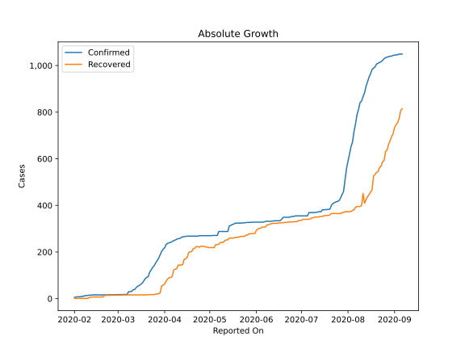
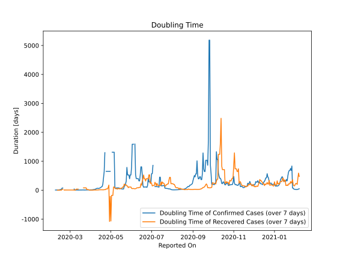

# Country Figures: Doubling Time of Infections for Vietnam 

The doubling time below are calculated based on
* an exponential growth assumption
* for time difference of past seven (7) days.
The doubling time's unit is "days".

The first doubling time indicates the increase of confirmed (infected)
cases. There, the *higher* the number is, the better is to take control
of the disease.

The second doubling time indicates the increase of recovered (healed)
cases. There, the *lower* the number is, the better it is to take
control of the disease.

| Reported On | Confirmed | Doubling Time (Confirmed) | Recovered | Doubling Time (Recovered) |
|-------------|-----------|---------------------------|-----------|---------------------------|
| 2020-04-14 | 266 |  73.8 days  | 169 |  15.6 days  | 
| 2020-04-13 | 265 |  62.2 days  | 146 |  11.6 days  | 
| 2020-04-12 | 262 |  58.4 days  | 144 |  10.7 days  | 
| 2020-04-11 | 258 |  67.4 days  | 144 |  10.7 days  | 
| 2020-04-10 | 257 |  60.2 days  | 144 |  9.5 days  | 
| 2020-04-09 | 255 |  54.1 days  | 128 |  9.4 days  | 
| 2020-04-08 | 251 |  34.8 days  | 126 |  7.3 days  | 
| 2020-04-07 | 249 |  30.5 days  | 123 |  6.8 days  | 
| 2020-04-06 | 245 |  26.1 days  | 95 |  9.2 days  | 
| 2020-04-05 | 241 |  19.9 days  | 90 |  4.1 days  | 
| 2020-04-04 | 240 |  15.4 days  | 90 |  3.7 days  | 
| 2020-04-03 | 237 |  13.3 days  | 85 |  3.7 days  | 
| 2020-04-02 | 233 |  11.9 days  | 75 |  4.0 days  | 
| 2020-04-01 | 218 |  11.5 days  | 63 |  4.0 days  | 
| 2020-03-31 | 212 |  10.9 days  | 58 |  4.3 days  | 
| 2020-03-30 | 203 |  10.0 days  | 55 |  4.5 days  | 
| 2020-03-29 | 188 |  9.9 days  | 25 |  12.9 days  | 
| 2020-03-28 | 174 |  8.2 days  | 21 |  23.3 days  | 
| 2020-03-27 | 163 |  8.7 days  | 20 |  22.1 days  | 
| 2020-03-26 | 153 |  8.6 days  | 20 |  22.1 days  | 
| 2020-03-25 | 141 |  8.0 days  | 17 |  80.4 days  | 
| 2020-03-24 | 134 |  7.2 days  | 17 |  80.4 days  | 
| 2020-03-23 | 123 |  7.3 days  | 17 |  80.4 days  | 
| 2020-03-22 | 113 |  7.3 days  | 17 |  80.4 days  | 
| 2020-03-21 | 94 |  8.8 days  | 17 |  80.4 days  | 
| 2020-03-20 | 91 |  7.7 days  | 16 |  None  | 
| 2020-03-19 | 85 |  6.6 days  | 16 |  None  | 
| 2020-03-18 | 75 |  7.5 days  | 16 |  None  | 
| 2020-03-17 | 66 |  6.8 days  | 16 |  None  | 
| 2020-03-16 | 61 |  7.2 days  | 16 |  None  | 
| 2020-03-15 | 56 |  8.1 days  | 16 |  None  | 
| 2020-03-14 | 53 |  4.8 days  | 16 |  None  | 
| 2020-03-13 | 47 |  4.8 days  | 16 |  36.7 days  | 
| 2020-03-12 | 39 |  5.8 days  | 16 |  36.7 days  | 
| 2020-03-11 | 38 |  5.9 days  | 16 |  36.7 days  | 
| 2020-03-10 | 31 |  7.7 days  | 16 |  36.7 days  | 
| 2020-03-09 | 30 |  8.1 days  | 16 |  6.2 days  | 
| 2020-03-08 | 30 |  8.1 days  | 16 |  6.2 days  | 
| 2020-03-07 | 18 |  41.5 days  | 16 |  6.2 days  | 
| 2020-02-24 | 16 |  None  | 14 |  7.3 days  | 
| 2020-02-23 | 16 |  None  | 14 |  7.3 days  | 
| 2020-02-22 | 16 |  None  | 14 |  7.3 days  | 
| 2020-02-21 | 16 |  None  | 14 |  7.3 days  | 
| 2020-02-20 | 16 |  None  | 7 |  None  | 
| 2020-02-19 | 16 |  75.5 days  | 7 |  31.8 days  | 
| 2020-02-18 | 16 |  75.5 days  | 7 |  31.8 days  | 
| 2020-02-17 | 16 |  36.7 days  | 7 |  2.8 days  | 
| 2020-02-16 | 16 |  23.7 days  | 7 |  2.8 days  | 
| 2020-02-15 | 16 |  23.7 days  | 7 |  2.8 days  | 
| 2020-02-14 | 16 |  10.7 days  | 7 |  2.8 days  | 
| 2020-02-13 | 16 |  10.7 days  | 7 |  2.8 days  | 
| 2020-02-12 | 15 |  8.1 days  | 6 |  3.0 days  | 
| 2020-02-11 | 15 |  8.1 days  | 6 |  3.0 days  | 
| 2020-02-10 | 14 |  9.0 days  | 1 |  None  | 
| 2020-02-09 | 13 |  6.6 days  | 1 |  None  | 
| 2020-02-08 | 13 |  6.6 days  | 1 |  None  | 
| 2020-02-07 | 10 |  None  | 1 |  None  | 
| 2020-02-06 | 10 |  None  | 1 |  None  | 
| 2020-02-05 | 8 |  None  | 1 |  None  | 
| 2020-02-04 | 8 |  None  | 1 |  None  | 
| 2020-02-03 | 8 |  None  | 1 |  None  | 
| 2020-02-02 | 6 |  None  | 1 |  None  | 
| 2020-02-01 | 6 |  None  | 1 |  None  | 

