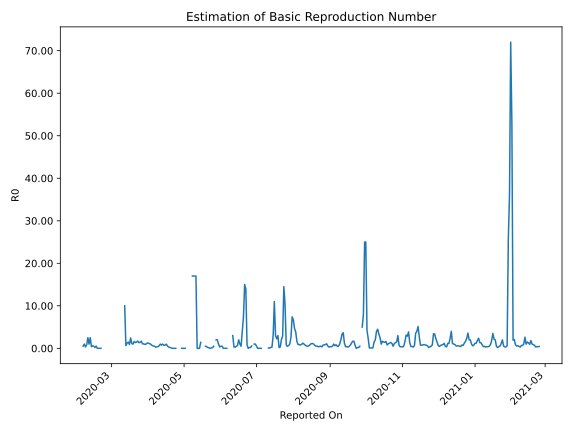

# Country Figures: Time Series for Basic Reproduction Number of Vietnam 

| Reported On | &Delta; Confirmed | Total &Delta; Confirmed First Interval | Total &Delta; Confirmed Second Interval | Estimated Basic Reproduction Number R0 | 
|-------------|-------------------|----------------------------------------|-----------------------------------------|---------------------------------------------------|
| 2020-05-04 | 0 |  1  |  None  |  None  | 
| 2020-05-03 | 1 |  None  |  None  |  None  | 
| 2020-05-02 | 0 |  None  |  2  |  None  | 
| 2020-05-01 | 0 |  None  |  2  |  None  | 
| 2020-04-30 | 0 |  None  |  2  |  None  | 
| 2020-04-29 | 0 |  None  |  2  |  None  | 
| 2020-04-28 | 0 |  2  |  None  |  None  | 
| 2020-04-27 | 0 |  2  |  None  |  None  | 
| 2020-04-26 | 0 |  2  |  None  |  None  | 
| 2020-04-25 | 0 |  2  |  None  |  None  | 
| 2020-04-24 | 2 |  None  |  1  |  None  | 
| 2020-04-23 | 0 |  None  |  2  |  None  | 
| 2020-04-22 | 0 |  None  |  3  |  None  | 
| 2020-04-21 | 0 |  None  |  6  |  None  | 
| 2020-04-20 | 0 |  1  |  9  |  0.11  | 
| 2020-04-19 | 0 |  2  |  9  |  0.22  | 
| 2020-04-18 | 0 |  3  |  10  |  0.30  | 
| 2020-04-17 | 0 |  6  |  11  |  0.55  | 
| 2020-04-16 | 1 |  9  |  9  |  1.00  | 
| 2020-04-15 | 1 |  9  |  12  |  0.75  | 
| 2020-04-14 | 1 |  10  |  14  |  0.71  | 
| 2020-04-13 | 3 |  11  |  11  |  1.00  | 
| 2020-04-12 | 4 |  9  |  12  |  0.75  | 
| 2020-04-11 | 1 |  12  |  12  |  1.00  | 
| 2020-04-10 | 2 |  14  |  23  |  0.61  | 
| 2020-04-09 | 4 |  11  |  28  |  0.39  | 
| 2020-04-08 | 2 |  12  |  34  |  0.35  | 
| 2020-04-07 | 4 |  12  |  45  |  0.27  | 
| 2020-04-06 | 4 |  23  |  44  |  0.52  | 
| 2020-04-05 | 1 |  28  |  49  |  0.57  | 
| 2020-04-04 | 3 |  34  |  50  |  0.68  | 
| 2020-04-03 | 4 |  45  |  47  |  0.96  | 
| 2020-04-02 | 15 |  44  |  40  |  1.10  | 
| 2020-04-01 | 6 |  49  |  40  |  1.23  | 
| 2020-03-31 | 9 |  50  |  40  |  1.25  | 
| 2020-03-30 | 15 |  47  |  47  |  1.00  | 
| 2020-03-29 | 14 |  40  |  43  |  0.93  | 
| 2020-03-28 | 11 |  40  |  38  |  1.05  | 
| 2020-03-27 | 10 |  40  |  38  |  1.05  | 
| 2020-03-26 | 12 |  47  |  28  |  1.68  | 
| 2020-03-25 | 7 |  43  |  30  |  1.43  | 
| 2020-03-24 | 11 |  38  |  29  |  1.31  | 
| 2020-03-23 | 10 |  38  |  22  |  1.73  | 
| 2020-03-22 | 19 |  28  |  19  |  1.47  | 
| 2020-03-21 | 3 |  30  |  22  |  1.36  | 
| 2020-03-20 | 6 |  29  |  18  |  1.61  | 
| 2020-03-19 | 10 |  22  |  22  |  1.00  | 
| 2020-03-18 | 9 |  19  |  17  |  1.12  | 
| 2020-03-17 | 5 |  22  |  9  |  2.44  | 
| 2020-03-16 | 5 |  18  |  20  |  0.90  | 
| 2020-03-15 | 3 |  22  |  15  |  1.47  | 
| 2020-03-14 | 6 |  17  |  14  |  1.21  | 
| 2020-03-13 | 8 |  9  |  14  |  0.64  | 
| 2020-03-12 | 1 |  20  |  2  |  10.00  | 
| 2020-03-11 | 7 |  15  |  None  |  None  | 
| 2020-03-10 | 1 |  14  |  None  |  None  | 
| 2020-03-09 | 0 |  14  |  None  |  None  | 
| 2020-03-08 | 12 |  2  |  None  |  None  | 
| 2020-03-07 | 2 |  None  |  None  |  None  | 
| 2020-03-06 | 0 |  None  |  None  |  None  | 
| 2020-03-05 | 0 |  None  |  None  |  None  | 
| 2020-03-04 | 0 |  None  |  None  |  None  | 
| 2020-03-03 | 0 |  None  |  None  |  None  | 
| 2020-03-02 | 0 |  None  |  None  |  None  | 
| 2020-03-01 | 0 |  None  |  None  |  None  | 
| 2020-02-29 | 0 |  None  |  None  |  None  | 
| 2020-02-28 | 0 |  None  |  None  |  None  | 
| 2020-02-27 | 0 |  None  |  None  |  None  | 
| 2020-02-26 | 0 |  None  |  None  |  None  | 
| 2020-02-25 | 0 |  None  |  None  |  None  | 
| 2020-02-24 | 0 |  None  |  None  |  None  | 
| 2020-02-23 | 0 |  None  |  None  |  None  | 
| 2020-02-22 | 0 |  None  |  None  |  None  | 
| 2020-02-21 | 0 |  None  |  1  |  None  | 
| 2020-02-20 | 0 |  None  |  1  |  None  | 
| 2020-02-19 | 0 |  None  |  2  |  None  | 
| 2020-02-18 | 0 |  None  |  3  |  None  | 
| 2020-02-17 | 0 |  1  |  2  |  0.50  | 
| 2020-02-16 | 0 |  1  |  5  |  0.20  | 
| 2020-02-15 | 0 |  2  |  4  |  0.50  | 
| 2020-02-14 | 0 |  3  |  5  |  0.60  | 
| 2020-02-13 | 1 |  2  |  5  |  0.40  | 
| 2020-02-12 | 0 |  5  |  2  |  2.50  | 
| 2020-02-11 | 1 |  4  |  4  |  1.00  | 
| 2020-02-10 | 1 |  5  |  2  |  2.50  | 
| 2020-02-09 | 0 |  5  |  6  |  0.83  | 
| 2020-02-08 | 3 |  2  |  6  |  0.33  | 
| 2020-02-07 | 0 |  4  |  4  |  1.00  | 
| 2020-02-06 | 2 |  2  |  4  |  0.50  | 
| 2020-02-05 | 0 |  6  |  None  |  None  | 
| 2020-02-04 | 0 |  6  |  None  |  None  | 
| 2020-02-03 | 2 |  4  |  None  |  None  | 
| 2020-02-02 | 0 |  4  |  None  |  None  | 
| 2020-02-01 | 4 |  None  |  None  |  None  | 
| 2020-01-31 | 0 |  None  |  None  |  None  | 
| 2020-01-30 | 0 |  None  |  None  |  None  | 
| 2020-01-29 | 0 |  None  |  None  |  None  | 
| 2020-01-28 | 0 |  None  |  None  |  None  | 
| 2020-01-27 | 0 |  None  |  None  |  None  | 
| 2020-01-26 | 0 |  None  |  None  |  None  | 
| 2020-01-25 | 0 |  None  |  None  |  None  | 
| 2020-01-24 | 0 |  None  |  None  |  None  | 
| 2020-01-23 | None |  None  |  None  |  None  | 

