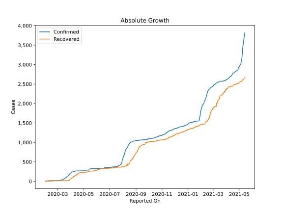
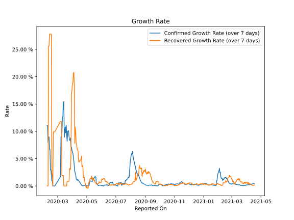

# Country Figures: Growth Rate for Vietnam 

The growth rates below are calculated based on
* an exponential growth assumption
* for time difference of past seven (7) days.
The growth rate is to be understood as on "growth per day".

The first growth rate indicates the increase of confirmed (infected) cases.

The second growth rate indicates the increase of recovered (healed) cases.

| Reported On | Confirmed | Growth Rate (Confirmed) | Recovered | Growth Rate (Recovered) |
|-------------|-----------|-------------------------|-----------|-------------------------|
| 2020-04-20 | 268 |  0.16 %  | 214 |  5.462 %  | 
| 2020-04-19 | 268 |  0.32 %  | 202 |  4.835 %  | 
| 2020-04-18 | 268 |  0.54 %  | 201 |  4.764 %  | 
| 2020-04-17 | 268 |  0.60 %  | 198 |  4.549 %  | 
| 2020-04-16 | 268 |  0.71 %  | 177 |  4.630 %  | 
| 2020-04-15 | 267 |  0.88 %  | 171 |  4.363 %  | 
| 2020-04-14 | 266 |  0.94 %  | 169 |  4.539 %  | 
| 2020-04-13 | 265 |  1.12 %  | 146 |  6.139 %  | 
| 2020-04-12 | 262 |  1.19 %  | 144 |  6.714 %  | 
| 2020-04-11 | 258 |  1.03 %  | 144 |  6.714 %  | 
| 2020-04-10 | 257 |  1.16 %  | 144 |  7.531 %  | 
| 2020-04-09 | 255 |  1.29 %  | 128 |  7.636 %  | 
| 2020-04-08 | 251 |  2.01 %  | 126 |  9.902 %  | 
| 2020-04-07 | 249 |  2.30 %  | 123 |  10.739 %  | 
| 2020-04-06 | 245 |  2.69 %  | 95 |  7.808 %  | 
| 2020-04-05 | 241 |  3.55 %  | 90 |  18.299 %  | 
| 2020-04-04 | 240 |  4.59 %  | 90 |  20.790 %  | 
| 2020-04-03 | 237 |  5.35 %  | 85 |  20.670 %  | 
| 2020-04-02 | 233 |  6.01 %  | 75 |  18.882 %  | 
| 2020-04-01 | 218 |  6.22 %  | 63 |  18.713 %  | 
| 2020-03-31 | 212 |  6.55 %  | 58 |  17.532 %  | 
| 2020-03-30 | 203 |  7.16 %  | 55 |  16.773 %  | 
| 2020-03-29 | 188 |  7.27 %  | 25 |  5.509 %  | 
| 2020-03-28 | 174 |  8.80 %  | 21 |  3.019 %  | 
| 2020-03-27 | 163 |  8.33 %  | 20 |  3.188 %  | 
| 2020-03-26 | 153 |  8.40 %  | 20 |  3.188 %  | 
| 2020-03-25 | 141 |  9.02 %  | 17 |  0.866 %  | 
| 2020-03-24 | 134 |  10.12 %  | 17 |  0.866 %  | 
| 2020-03-23 | 123 |  10.02 %  | 17 |  0.866 %  | 
| 2020-03-22 | 113 |  10.03 %  | 17 |  0.866 %  | 
| 2020-03-21 | 94 |  8.19 %  | 17 |  0.866 %  | 
| 2020-03-20 | 91 |  9.44 %  | 16 |  None  | 
| 2020-03-19 | 85 |  11.13 %  | 16 |  None  | 
| 2020-03-18 | 75 |  9.71 %  | 16 |  None  | 
| 2020-03-17 | 66 |  10.80 %  | 16 |  None  | 
| 2020-03-16 | 61 |  10.14 %  | 16 |  None  | 
| 2020-03-15 | 56 |  8.92 %  | 16 |  None  | 
| 2020-03-14 | 53 |  15.43 %  | 16 |  None  | 
| 2020-03-13 | 47 |  15.39 %  | 16 |  1.908 %  | 
| 2020-03-12 | 39 |  12.73 %  | 16 |  1.908 %  | 
| 2020-03-11 | 38 |  12.36 %  | 16 |  1.908 %  | 
| 2020-03-10 | 31 |  9.45 %  | 16 |  1.908 %  | 
| 2020-03-09 | 30 |  8.98 %  | 16 |  11.810 %  | 
| 2020-03-08 | 30 |  8.98 %  | 16 |  11.810 %  | 
| 2020-03-07 | 18 |  1.68 %  | 16 |  11.810 %  | 
| 2020-02-24 | 16 |  None  | 14 |  9.902 %  | 
| 2020-02-23 | 16 |  None  | 14 |  9.902 %  | 
| 2020-02-22 | 16 |  None  | 14 |  9.902 %  | 
| 2020-02-21 | 16 |  None  | 14 |  9.902 %  | 
| 2020-02-20 | 16 |  None  | 7 |  None  | 
| 2020-02-19 | 16 |  0.92 %  | 7 |  2.202 %  | 
| 2020-02-18 | 16 |  0.92 %  | 7 |  2.202 %  | 
| 2020-02-17 | 16 |  1.91 %  | 7 |  27.799 %  | 
| 2020-02-16 | 16 |  2.97 %  | 7 |  27.799 %  | 
| 2020-02-15 | 16 |  2.97 %  | 7 |  27.799 %  | 
| 2020-02-14 | 16 |  6.71 %  | 7 |  27.799 %  | 
| 2020-02-13 | 16 |  6.71 %  | 7 |  27.799 %  | 
| 2020-02-12 | 15 |  8.98 %  | 6 |  25.597 %  | 
| 2020-02-11 | 15 |  8.98 %  | 6 |  25.597 %  | 
| 2020-02-10 | 14 |  7.99 %  | 1 |  None  | 
| 2020-02-09 | 13 |  11.05 %  | 1 |  None  | 
| 2020-02-08 | 13 |  11.05 %  | 1 |  None  | 
| 2020-02-07 | 10 |  None  | 1 |  None  | 
| 2020-02-06 | 10 |  None  | 1 |  None  | 
| 2020-02-05 | 8 |  None  | 1 |  None  | 
| 2020-02-04 | 8 |  None  | 1 |  None  | 
| 2020-02-03 | 8 |  None  | 1 |  None  | 
| 2020-02-02 | 6 |  None  | 1 |  None  | 
| 2020-02-01 | 6 |  None  | 1 |  None  | 

