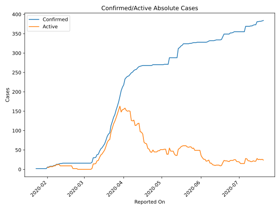
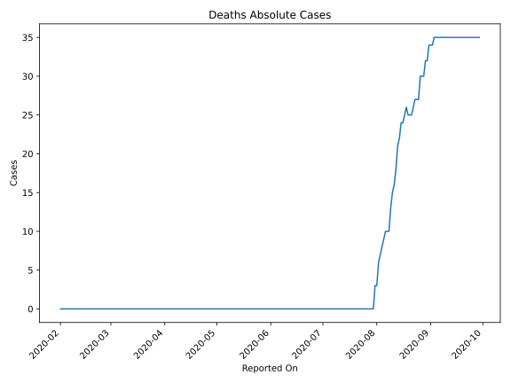
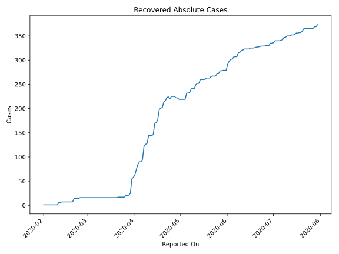
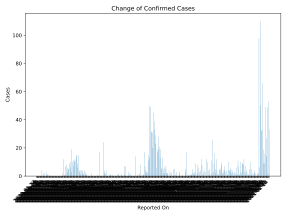
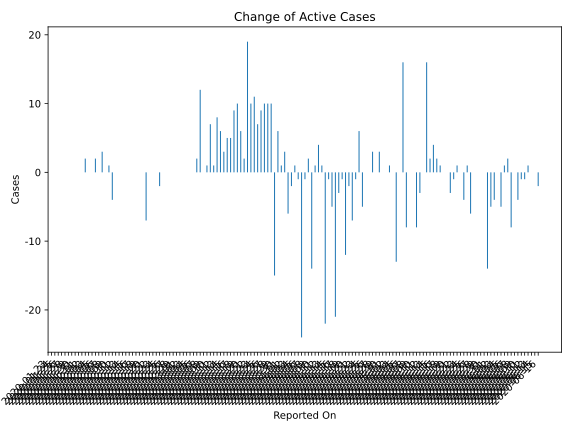
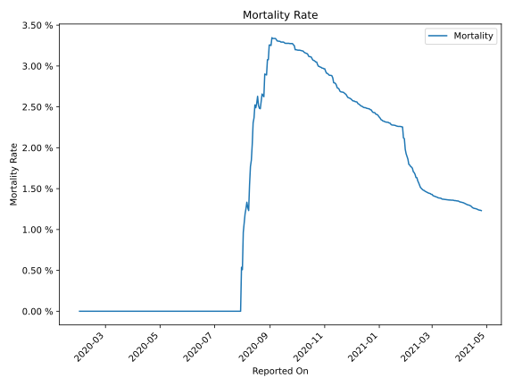

# Country Figures: Time Series for Vietnam 

| Reported On | Confirmed | Deaths | Recovered | Active | Mortality | &Delta; Confirmed | &Delta; Deaths | &Delta; Recovered | &Delta; Active | % Active of Population |
|-------------|-----------|--------|-----------|--------|-----------|-------------------|----------------|-------------------|----------------|------------------------|
| 2020-04-16 | 268 | 0 | 177 | 91 |  None  | 1 | 0 | 6 | -5 |  0.000 %  | 
| 2020-04-15 | 267 | 0 | 171 | 96 |  None  | 1 | 0 | 2 | -1 |  0.000 %  | 
| 2020-04-14 | 266 | 0 | 169 | 97 |  None  | 1 | 0 | 23 | -22 |  0.000 %  | 
| 2020-04-13 | 265 | 0 | 146 | 119 |  None  | 3 | 0 | 2 | 1 |  0.000 %  | 
| 2020-04-12 | 262 | 0 | 144 | 118 |  None  | 4 | 0 | 0 | 4 |  0.000 %  | 
| 2020-04-11 | 258 | 0 | 144 | 114 |  None  | 1 | 0 | 0 | 1 |  0.000 %  | 
| 2020-04-10 | 257 | 0 | 144 | 113 |  None  | 2 | 0 | 16 | -14 |  0.000 %  | 
| 2020-04-09 | 255 | 0 | 128 | 127 |  None  | 4 | 0 | 2 | 2 |  0.000 %  | 
| 2020-04-08 | 251 | 0 | 126 | 125 |  None  | 2 | 0 | 3 | -1 |  0.000 %  | 
| 2020-04-07 | 249 | 0 | 123 | 126 |  None  | 4 | 0 | 28 | -24 |  0.000 %  | 
| 2020-04-06 | 245 | 0 | 95 | 150 |  None  | 4 | 0 | 5 | -1 |  0.000 %  | 
| 2020-04-05 | 241 | 0 | 90 | 151 |  None  | 1 | 0 | 0 | 1 |  0.000 %  | 
| 2020-04-04 | 240 | 0 | 90 | 150 |  None  | 3 | 0 | 5 | -2 |  0.000 %  | 
| 2020-04-03 | 237 | 0 | 85 | 152 |  None  | 4 | 0 | 10 | -6 |  0.000 %  | 
| 2020-04-02 | 233 | 0 | 75 | 158 |  None  | 15 | 0 | 12 | 3 |  0.000 %  | 
| 2020-04-01 | 218 | 0 | 63 | 155 |  None  | 6 | 0 | 5 | 1 |  0.000 %  | 
| 2020-03-31 | 212 | 0 | 58 | 154 |  None  | 9 | 0 | 3 | 6 |  0.000 %  | 
| 2020-03-30 | 203 | 0 | 55 | 148 |  None  | 15 | 0 | 30 | -15 |  0.000 %  | 
| 2020-03-29 | 188 | 0 | 25 | 163 |  None  | 14 | 0 | 4 | 10 |  0.000 %  | 
| 2020-03-28 | 174 | 0 | 21 | 153 |  None  | 11 | 0 | 1 | 10 |  0.000 %  | 
| 2020-03-27 | 163 | 0 | 20 | 143 |  None  | 10 | 0 | 0 | 10 |  0.000 %  | 
| 2020-03-26 | 153 | 0 | 20 | 133 |  None  | 12 | 0 | 3 | 9 |  0.000 %  | 
| 2020-03-25 | 141 | 0 | 17 | 124 |  None  | 7 | 0 | 0 | 7 |  0.000 %  | 
| 2020-03-24 | 134 | 0 | 17 | 117 |  None  | 11 | 0 | 0 | 11 |  0.000 %  | 
| 2020-03-23 | 123 | 0 | 17 | 106 |  None  | 10 | 0 | 0 | 10 |  0.000 %  | 
| 2020-03-22 | 113 | 0 | 17 | 96 |  None  | 19 | 0 | 0 | 19 |  0.000 %  | 
| 2020-03-21 | 94 | 0 | 17 | 77 |  None  | 3 | 0 | 1 | 2 |  0.000 %  | 
| 2020-03-20 | 91 | 0 | 16 | 75 |  None  | 6 | 0 | 0 | 6 |  0.000 %  | 
| 2020-03-19 | 85 | 0 | 16 | 69 |  None  | 10 | 0 | 0 | 10 |  0.000 %  | 
| 2020-03-18 | 75 | 0 | 16 | 59 |  None  | 9 | 0 | 0 | 9 |  0.000 %  | 
| 2020-03-17 | 66 | 0 | 16 | 50 |  None  | 5 | 0 | 0 | 5 |  0.000 %  | 
| 2020-03-16 | 61 | 0 | 16 | 45 |  None  | 5 | 0 | 0 | 5 |  0.000 %  | 
| 2020-03-15 | 56 | 0 | 16 | 40 |  None  | 3 | 0 | 0 | 3 |  0.000 %  | 
| 2020-03-14 | 53 | 0 | 16 | 37 |  None  | 6 | 0 | 0 | 6 |  0.000 %  | 
| 2020-03-13 | 47 | 0 | 16 | 31 |  None  | 8 | 0 | 0 | 8 |  0.000 %  | 
| 2020-03-12 | 39 | 0 | 16 | 23 |  None  | 1 | 0 | 0 | 1 |  0.000 %  | 
| 2020-03-11 | 38 | 0 | 16 | 22 |  None  | 7 | 0 | 0 | 7 |  0.000 %  | 
| 2020-03-10 | 31 | 0 | 16 | 15 |  None  | 1 | 0 | 0 | 1 |  0.000 %  | 
| 2020-03-09 | 30 | 0 | 16 | 14 |  None  | 0 | 0 | 0 | 0 |  0.000 %  | 
| 2020-03-08 | 30 | 0 | 16 | 14 |  None  | 12 | 0 | 0 | 12 |  0.000 %  | 
| 2020-03-07 | 18 | 0 | 16 | 2 |  None  | 2 | 0 | 0 | 2 |  0.000 %  | 
| 2020-03-06 | 16 | 0 | 16 | 0 |  None  | 0 | 0 | 0 | 0 |  n/a  | 
| 2020-03-05 | 16 | 0 | 16 | 0 |  None  | 0 | 0 | 0 | 0 |  n/a  | 
| 2020-03-04 | 16 | 0 | 16 | 0 |  None  | 0 | 0 | 0 | 0 |  n/a  | 
| 2020-03-03 | 16 | 0 | 16 | 0 |  None  | 0 | 0 | 0 | 0 |  n/a  | 
| 2020-03-02 | 16 | 0 | 16 | 0 |  None  | 0 | 0 | 0 | 0 |  n/a  | 
| 2020-03-01 | 16 | 0 | 16 | 0 |  None  | 0 | 0 | 0 | 0 |  n/a  | 
| 2020-02-29 | 16 | 0 | 16 | 0 |  None  | 0 | 0 | 0 | 0 |  n/a  | 
| 2020-02-28 | 16 | 0 | 16 | 0 |  None  | 0 | 0 | 0 | 0 |  n/a  | 
| 2020-02-27 | 16 | 0 | 16 | 0 |  None  | 0 | 0 | 0 | 0 |  n/a  | 
| 2020-02-26 | 16 | 0 | 16 | 0 |  None  | 0 | 0 | 0 | 0 |  n/a  | 
| 2020-02-25 | 16 | 0 | 16 | 0 |  None  | 0 | 0 | 2 | -2 |  n/a  | 
| 2020-02-24 | 16 | 0 | 14 | 2 |  None  | 0 | 0 | 0 | 0 |  0.000 %  | 
| 2020-02-23 | 16 | 0 | 14 | 2 |  None  | 0 | 0 | 0 | 0 |  0.000 %  | 
| 2020-02-22 | 16 | 0 | 14 | 2 |  None  | 0 | 0 | 0 | 0 |  0.000 %  | 
| 2020-02-21 | 16 | 0 | 14 | 2 |  None  | 0 | 0 | 7 | -7 |  0.000 %  | 
| 2020-02-20 | 16 | 0 | 7 | 9 |  None  | 0 | 0 | 0 | 0 |  0.000 %  | 
| 2020-02-19 | 16 | 0 | 7 | 9 |  None  | 0 | 0 | 0 | 0 |  0.000 %  | 
| 2020-02-18 | 16 | 0 | 7 | 9 |  None  | 0 | 0 | 0 | 0 |  0.000 %  | 
| 2020-02-17 | 16 | 0 | 7 | 9 |  None  | 0 | 0 | 0 | 0 |  0.000 %  | 
| 2020-02-16 | 16 | 0 | 7 | 9 |  None  | 0 | 0 | 0 | 0 |  0.000 %  | 
| 2020-02-15 | 16 | 0 | 7 | 9 |  None  | 0 | 0 | 0 | 0 |  0.000 %  | 
| 2020-02-14 | 16 | 0 | 7 | 9 |  None  | 0 | 0 | 0 | 0 |  0.000 %  | 
| 2020-02-13 | 16 | 0 | 7 | 9 |  None  | 1 | 0 | 1 | 0 |  0.000 %  | 
| 2020-02-12 | 15 | 0 | 6 | 9 |  None  | 0 | 0 | 0 | 0 |  0.000 %  | 
| 2020-02-11 | 15 | 0 | 6 | 9 |  None  | 1 | 0 | 5 | -4 |  0.000 %  | 
| 2020-02-10 | 14 | 0 | 1 | 13 |  None  | 1 | 0 | 0 | 1 |  0.000 %  | 
| 2020-02-09 | 13 | 0 | 1 | 12 |  None  | 0 | 0 | 0 | 0 |  0.000 %  | 
| 2020-02-08 | 13 | 0 | 1 | 12 |  None  | 3 | 0 | 0 | 3 |  0.000 %  | 
| 2020-02-07 | 10 | 0 | 1 | 9 |  None  | 0 | 0 | 0 | 0 |  0.000 %  | 
| 2020-02-06 | 10 | 0 | 1 | 9 |  None  | 2 | 0 | 0 | 2 |  0.000 %  | 
| 2020-02-05 | 8 | 0 | 1 | 7 |  None  | 0 | 0 | 0 | 0 |  0.000 %  | 
| 2020-02-04 | 8 | 0 | 1 | 7 |  None  | 0 | 0 | 0 | 0 |  0.000 %  | 
| 2020-02-03 | 8 | 0 | 1 | 7 |  None  | 2 | 0 | 0 | 2 |  0.000 %  | 
| 2020-02-02 | 6 | 0 | 1 | 5 |  None  | 0 | 0 | 0 | 0 |  0.000 %  | 
| 2020-02-01 | 6 | 0 | 1 | 5 |  None  | 4 | None | None | None |  0.000 %  | 
| 2020-01-31 | 2 | None | None | None |  None  | 0 | None | None | None |  n/a  | 
| 2020-01-30 | 2 | None | None | None |  None  | 0 | None | None | None |  n/a  | 
| 2020-01-29 | 2 | None | None | None |  None  | 0 | None | None | None |  n/a  | 
| 2020-01-28 | 2 | None | None | None |  None  | 0 | None | None | None |  n/a  | 
| 2020-01-27 | 2 | None | None | None |  None  | 0 | None | None | None |  n/a  | 
| 2020-01-26 | 2 | None | None | None |  None  | 0 | None | None | None |  n/a  | 
| 2020-01-25 | 2 | None | None | None |  None  | 0 | None | None | None |  n/a  | 
| 2020-01-24 | 2 | None | None | None |  None  | 0 | None | None | None |  n/a  | 
| 2020-01-23 | 2 | None | None | None |  None  | None | None | None | None |  n/a  | 

