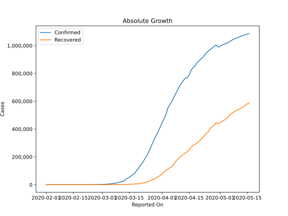
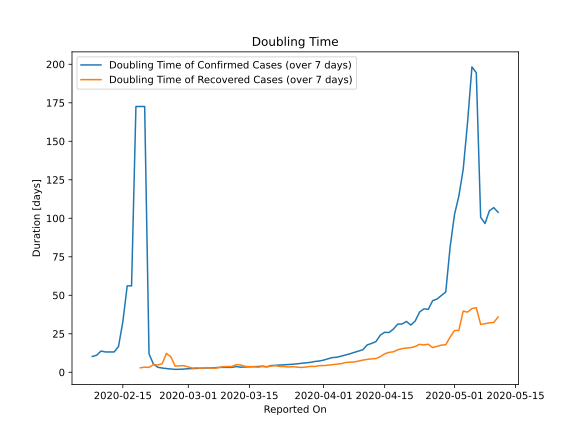

# Country Figures: Doubling Time of Infections for Schengen Area 

The doubling time below are calculated based on
* an exponential growth assumption
* for time difference of past seven (7) days.
The doubling time's unit is "days".

The first doubling time indicates the increase of confirmed (infected)
cases. There, the *higher* the number is, the better is to take control
of the disease.

The second doubling time indicates the increase of recovered (healed)
cases. There, the *lower* the number is, the better it is to take
control of the disease.

| Reported On | Confirmed | Doubling Time (Confirmed) | Recovered | Doubling Time (Recovered) |
|-------------|-----------|---------------------------|-----------|---------------------------|
| 2020-05-08 | 1046422 |  96.6 days  | 521288 |  31.5 days  | 
| 2020-05-07 | 1038340 |  100.7 days  | 512736 |  31.1 days  | 
| 2020-05-06 | 1030638 |  194.5 days  | 501924 |  41.9 days  | 
| 2020-05-05 | 1020927 |  198.3 days  | 483186 |  41.4 days  | 
| 2020-05-04 | 1014416 |  162.3 days  | 473649 |  39.1 days  | 
| 2020-05-03 | 1009486 |  131.7 days  | 462305 |  39.7 days  | 
| 2020-05-02 | 1004257 |  114.4 days  | 456109 |  27.2 days  | 
| 2020-05-01 | 994982 |  102.3 days  | 446143 |  27.1 days  | 
| 2020-04-30 | 989311 |  81.3 days  | 437917 |  22.9 days  | 
| 2020-04-29 | 1005199 |  52.1 days  | 446636 |  17.9 days  | 
| 2020-04-28 | 996202 |  49.9 days  | 429300 |  17.6 days  | 
| 2020-04-27 | 984479 |  47.6 days  | 417901 |  16.9 days  | 
| 2020-04-26 | 972885 |  46.5 days  | 408683 |  16.0 days  | 
| 2020-04-25 | 962434 |  40.9 days  | 380730 |  18.2 days  | 
| 2020-04-24 | 948751 |  41.2 days  | 372146 |  17.8 days  | 
| 2020-04-23 | 931750 |  39.1 days  | 353017 |  18.1 days  | 
| 2020-04-22 | 915292 |  33.3 days  | 338877 |  16.8 days  | 
| 2020-04-21 | 903230 |  30.7 days  | 324229 |  16.0 days  | 
| 2020-04-20 | 888341 |  33.0 days  | 311486 |  15.7 days  | 
| 2020-04-19 | 875839 |  31.4 days  | 300058 |  15.4 days  | 
| 2020-04-18 | 853915 |  31.3 days  | 290248 |  14.6 days  | 
| 2020-04-17 | 842455 |  28.1 days  | 281653 |  13.3 days  | 
| 2020-04-16 | 822164 |  25.8 days  | 268781 |  12.9 days  | 
| 2020-04-15 | 789981 |  26.0 days  | 252210 |  12.0 days  | 
| 2020-04-14 | 769642 |  24.1 days  | 237915 |  10.1 days  | 
| 2020-04-13 | 765744 |  19.9 days  | 227306 |  8.9 days  | 
| 2020-04-12 | 748995 |  18.7 days  | 217259 |  8.7 days  | 
| 2020-04-11 | 729940 |  17.8 days  | 206693 |  8.4 days  | 
| 2020-04-10 | 707187 |  14.6 days  | 193815 |  7.9 days  | 
| 2020-04-09 | 679567 |  13.8 days  | 182829 |  7.3 days  | 
| 2020-04-08 | 653704 |  12.9 days  | 166279 |  6.7 days  | 
| 2020-04-07 | 627504 |  12.0 days  | 144755 |  6.5 days  | 
| 2020-04-06 | 597610 |  11.2 days  | 129166 |  6.4 days  | 
| 2020-04-05 | 575242 |  10.4 days  | 121872 |  5.6 days  | 
| 2020-04-04 | 552505 |  9.8 days  | 112993 |  5.3 days  | 
| 2020-04-03 | 503553 |  9.5 days  | 102069 |  5.0 days  | 
| 2020-04-02 | 473260 |  8.7 days  | 90951 |  4.6 days  | 
| 2020-04-01 | 444093 |  7.9 days  | 77743 |  4.3 days  | 
| 2020-03-31 | 413373 |  7.3 days  | 66095 |  4.3 days  | 
| 2020-03-30 | 382675 |  7.0 days  | 57619 |  3.8 days  | 
| 2020-03-29 | 355685 |  6.4 days  | 48326 |  3.8 days  | 
| 2020-03-28 | 329964 |  6.1 days  | 42125 |  3.4 days  | 
| 2020-03-27 | 297077 |  5.8 days  | 35691 |  3.1 days  | 
| 2020-03-26 | 265634 |  5.5 days  | 29246 |  3.3 days  | 
| 2020-03-25 | 233676 |  5.2 days  | 23134 |  3.6 days  | 
| 2020-03-24 | 206291 |  5.1 days  | 19484 |  3.4 days  | 
| 2020-03-23 | 184824 |  4.9 days  | 14198 |  3.7 days  | 
| 2020-03-22 | 160629 |  4.7 days  | 12143 |  3.8 days  | 
| 2020-03-21 | 143060 |  4.5 days  | 8830 |  4.3 days  | 
| 2020-03-20 | 123077 |  4.4 days  | 6316 |  4.0 days  | 
| 2020-03-19 | 104312 |  3.6 days  | 5784 |  3.6 days  | 
| 2020-03-18 | 86461 |  4.0 days  | 5332 |  3.7 days  | 
| 2020-03-17 | 73777 |  3.8 days  | 4103 |  3.3 days  | 
| 2020-03-16 | 63251 |  3.6 days  | 3417 |  3.7 days  | 
| 2020-03-15 | 53029 |  3.6 days  | 2959 |  3.7 days  | 
| 2020-03-14 | 44730 |  3.4 days  | 2572 |  3.9 days  | 
| 2020-03-13 | 37009 |  3.3 days  | 1709 |  4.7 days  | 
| 2020-03-12 | 23435 |  3.7 days  | 1280 |  5.0 days  | 
| 2020-03-11 | 22744 |  3.2 days  | 1280 |  3.8 days  | 
| 2020-03-10 | 17813 |  3.2 days  | 800 |  3.8 days  | 
| 2020-03-09 | 14536 |  3.2 days  | 796 |  3.6 days  | 
| 2020-03-08 | 11808 |  3.2 days  | 688 |  3.0 days  | 
| 2020-03-07 | 9361 |  2.9 days  | 655 |  2.6 days  | 
| 2020-03-06 | 7264 |  2.9 days  | 560 |  2.8 days  | 
| 2020-03-05 | 5566 |  2.8 days  | 449 |  3.1 days  | 
| 2020-03-04 | 4205 |  2.7 days  | 311 |  2.5 days  | 
| 2020-03-03 | 3276 |  2.5 days  | 194 |  2.9 days  | 
| 2020-03-02 | 2664 |  2.4 days  | 181 |  2.7 days  | 
| 2020-03-01 | 2150 |  2.3 days  | 115 |  3.4 days  | 
| 2020-02-29 | 1427 |  2.1 days  | 78 |  4.3 days  | 
| 2020-02-28 | 1061 |  1.9 days  | 77 |  4.2 days  | 
| 2020-02-27 | 782 |  1.9 days  | 76 |  4.0 days  | 
| 2020-02-26 | 521 |  2.1 days  | 33 |  10.0 days  | 
| 2020-02-25 | 365 |  2.4 days  | 30 |  12.3 days  | 
| 2020-02-24 | 262 |  2.8 days  | 23 |  5.5 days  | 
| 2020-02-23 | 188 |  3.3 days  | 24 |  4.8 days  | 
| 2020-02-22 | 95 |  5.3 days  | 23 |  4.9 days  | 
| 2020-02-21 | 53 |  12.0 days  | 22 |  3.2 days  | 
| 2020-02-20 | 36 |  172.6 days  | 20 |  3.3 days  | 
| 2020-02-19 | 36 |  172.6 days  | 20 |  2.9 days  | 
| 2020-02-18 | 36 |  172.6 days  | 20 |  None  | 
| 2020-02-17 | 36 |  56.1 days  | 9 |  None  | 
| 2020-02-16 | 36 |  56.1 days  | 8 |  None  | 
| 2020-02-15 | 36 |  32.8 days  | 8 |  None  | 
| 2020-02-14 | 35 |  16.7 days  | 4 |  None  | 
| 2020-02-13 | 35 |  13.2 days  | 4 |  None  | 
| 2020-02-12 | 35 |  13.2 days  | 3 |  None  | 
| 2020-02-11 | 35 |  13.2 days  | 0 |  None  | 
| 2020-02-10 | 33 |  13.8 days  | 0 |  None  | 
| 2020-02-09 | 33 |  11.1 days  | 0 |  None  | 
| 2020-02-08 | 31 |  10.3 days  | 0 |  None  | 
| 2020-02-07 | 26 |  None  | 0 |  None  | 
| 2020-02-06 | 24 |  None  | 0 |  None  | 
| 2020-02-05 | 24 |  None  | 0 |  None  | 
| 2020-02-04 | 24 |  None  | 0 |  None  | 
| 2020-02-03 | 23 |  None  | 0 |  None  | 
| 2020-02-02 | 21 |  None  | 0 |  None  | 
| 2020-02-01 | 19 |  None  | 0 |  None  | 

