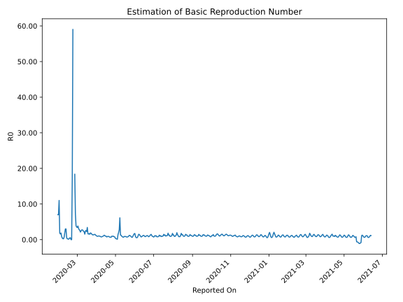

# Country Figures: Time Series for Basic Reproduction Number of Schengen Area 

| Reported On | &Delta; Confirmed | Total &Delta; Confirmed First Interval | Total &Delta; Confirmed Second Interval | Estimated Basic Reproduction Number R0 | 
|-------------|-------------------|----------------------------------------|-----------------------------------------|---------------------------------------------------|
| 2020-04-29 | 8997 |  47451  |  60410  |  0.79  | 
| 2020-04-28 | 11723 |  52729  |  55911  |  0.94  | 
| 2020-04-27 | 11594 |  57593  |  61377  |  0.94  | 
| 2020-04-26 | 10451 |  59204  |  60775  |  0.97  | 
| 2020-04-25 | 13683 |  60410  |  66177  |  0.91  | 
| 2020-04-24 | 17001 |  55911  |  85858  |  0.65  | 
| 2020-04-23 | 16458 |  61377  |  84273  |  0.73  | 
| 2020-04-22 | 12062 |  60775  |  76711  |  0.79  | 
| 2020-04-21 | 14889 |  66177  |  73169  |  0.90  | 
| 2020-04-20 | 12502 |  85858  |  60041  |  1.43  | 
| 2020-04-19 | 21924 |  84273  |  62455  |  1.35  | 
| 2020-04-18 | 11460 |  76711  |  86177  |  0.89  | 
| 2020-04-17 | 20291 |  73169  |  95291  |  0.77  | 
| 2020-04-16 | 32183 |  60041  |  102436  |  0.59  | 
| 2020-04-15 | 20339 |  62455  |  109577  |  0.57  | 
| 2020-04-14 | 3898 |  86177  |  104325  |  0.83  | 
| 2020-04-13 | 16749 |  95291  |  101199  |  0.94  | 
| 2020-04-12 | 19055 |  102436  |  123951  |  0.83  | 
| 2020-04-11 | 22753 |  109577  |  124350  |  0.88  | 
| 2020-04-10 | 27620 |  104325  |  131149  |  0.80  | 
| 2020-04-09 | 25863 |  101199  |  139132  |  0.73  | 
| 2020-04-08 | 26200 |  123951  |  120878  |  1.03  | 
| 2020-04-07 | 29894 |  124350  |  117575  |  1.06  | 
| 2020-04-06 | 22368 |  131149  |  114129  |  1.15  | 
| 2020-04-05 | 22737 |  139132  |  116296  |  1.20  | 
| 2020-04-04 | 48952 |  120878  |  117041  |  1.03  | 
| 2020-04-03 | 30293 |  117575  |  122009  |  0.96  | 
| 2020-04-02 | 29167 |  114129  |  123673  |  0.92  | 
| 2020-04-01 | 30720 |  116296  |  112253  |  1.04  | 
| 2020-03-31 | 30698 |  117041  |  105005  |  1.11  | 
| 2020-03-30 | 26990 |  122009  |  90616  |  1.35  | 
| 2020-03-29 | 25721 |  123673  |  83214  |  1.49  | 
| 2020-03-28 | 32887 |  112253  |  80512  |  1.39  | 
| 2020-03-27 | 31443 |  105005  |  74168  |  1.42  | 
| 2020-03-26 | 31958 |  90616  |  69283  |  1.31  | 
| 2020-03-25 | 27385 |  83214  |  59826  |  1.39  | 
| 2020-03-24 | 21467 |  80512  |  51283  |  1.57  | 
| 2020-03-23 | 24195 |  74168  |  41731  |  1.78  | 
| 2020-03-22 | 17569 |  69283  |  36768  |  1.88  | 
| 2020-03-21 | 19983 |  59826  |  39816  |  1.50  | 
| 2020-03-20 | 18765 |  51283  |  30285  |  1.69  | 
| 2020-03-19 | 17851 |  41731  |  26917  |  1.55  | 
| 2020-03-18 | 12684 |  36768  |  22473  |  1.64  | 
| 2020-03-17 | 10526 |  39816  |  11627  |  3.42  | 
| 2020-03-16 | 10222 |  30285  |  13383  |  2.26  | 
| 2020-03-15 | 8299 |  26917  |  10549  |  2.55  | 
| 2020-03-14 | 7721 |  22473  |  8970  |  2.51  | 
| 2020-03-13 | 13574 |  11627  |  7603  |  1.53  | 
| 2020-03-12 | 691 |  13383  |  6085  |  2.20  | 
| 2020-03-11 | 4931 |  10549  |  4600  |  2.29  | 
| 2020-03-10 | 3277 |  8970  |  3416  |  2.63  | 
| 2020-03-09 | 2728 |  7603  |  2778  |  2.74  | 
| 2020-03-08 | 2447 |  6085  |  2215  |  2.75  | 
| 2020-03-07 | 2097 |  4600  |  1882  |  2.44  | 
| 2020-03-06 | 1698 |  3416  |  1629  |  2.10  | 
| 2020-03-05 | 1361 |  2778  |  1062  |  2.62  | 
| 2020-03-04 | 929 |  2215  |  799  |  2.77  | 
| 2020-03-03 | 612 |  1882  |  594  |  3.17  | 
| 2020-03-02 | 514 |  1629  |  426  |  3.82  | 
| 2020-03-01 | 723 |  1062  |  312  |  3.40  | 
| 2020-02-29 | 366 |  799  |  226  |  3.54  | 
| 2020-02-28 | 279 |  594  |  152  |  3.91  | 
| 2020-02-27 | 261 |  426  |  59  |  7.22  | 
| 2020-02-26 | 156 |  312  |  17  |  18.35  | 
| 2020-02-25 | 103 |  226  |  None  |  None  | 
| 2020-02-24 | 74 |  152  |  None  |  None  | 
| 2020-02-23 | 93 |  59  |  1  |  59.00  | 
| 2020-02-22 | 42 |  17  |  1  |  17.00  | 
| 2020-02-21 | 17 |  None  |  1  |  None  | 
| 2020-02-20 | 0 |  None  |  1  |  None  | 
| 2020-02-19 | 0 |  1  |  2  |  0.50  | 
| 2020-02-18 | 0 |  1  |  2  |  0.50  | 
| 2020-02-17 | 0 |  1  |  4  |  0.25  | 
| 2020-02-16 | 0 |  1  |  9  |  0.11  | 
| 2020-02-15 | 1 |  2  |  9  |  0.22  | 
| 2020-02-14 | 0 |  2  |  9  |  0.22  | 
| 2020-02-13 | 0 |  4  |  7  |  0.57  | 
| 2020-02-12 | 0 |  9  |  3  |  3.00  | 
| 2020-02-11 | 2 |  9  |  3  |  3.00  | 
| 2020-02-10 | 0 |  9  |  5  |  1.80  | 
| 2020-02-09 | 2 |  7  |  10  |  0.70  | 
| 2020-02-08 | 5 |  3  |  13  |  0.23  | 
| 2020-02-07 | 2 |  3  |  11  |  0.27  | 
| 2020-02-06 | 0 |  5  |  11  |  0.45  | 
| 2020-02-05 | 0 |  10  |  11  |  0.91  | 
| 2020-02-04 | 1 |  13  |  7  |  1.86  | 
| 2020-02-03 | 2 |  11  |  7  |  1.57  | 
| 2020-02-02 | 2 |  11  |  6  |  1.83  | 
| 2020-02-01 | 5 |  11  |  1  |  11.00  | 
| 2020-01-31 | 4 |  7  |  1  |  7.00  | 
| 2020-01-30 | 0 |  7  |  1  |  7.00  | 
| 2020-01-29 | 2 |  6  |  None  |  None  | 
| 2020-01-28 | 5 |  1  |  None  |  None  | 
| 2020-01-27 | 0 |  1  |  None  |  None  | 
| 2020-01-26 | 0 |  1  |  None  |  None  | 
| 2020-01-25 | 1 |  None  |  None  |  None  | 
| 2020-01-24 | None |  None  |  None  |  None  | 

