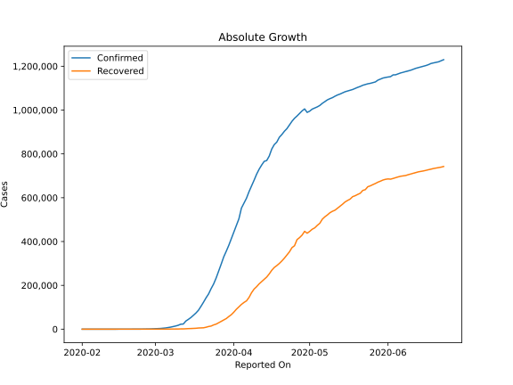
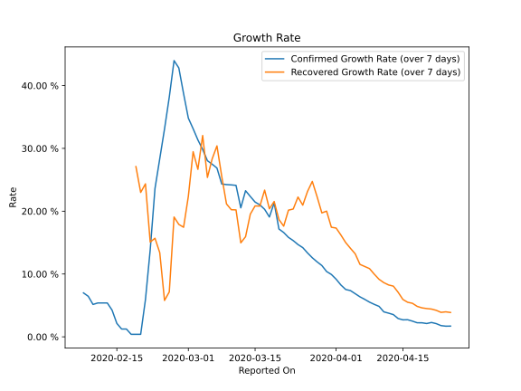

# Country Figures: Growth Rate for Schengen Area 

The growth rates below are calculated based on
* an exponential growth assumption
* for time difference of past seven (7) days.
The growth rate is to be understood as on "growth per day".

The first growth rate indicates the increase of confirmed (infected) cases.

The second growth rate indicates the increase of recovered (healed) cases.

| Reported On | Confirmed | Growth Rate (Confirmed) | Recovered | Growth Rate (Recovered) |
|-------------|-----------|-------------------------|-----------|-------------------------|
| 2020-05-04 | 1014416 |  0.43 %  | 473649 |  1.789 %  | 
| 2020-05-03 | 1009486 |  0.53 %  | 462305 |  1.761 %  | 
| 2020-05-02 | 1004257 |  0.61 %  | 456109 |  2.581 %  | 
| 2020-05-01 | 994982 |  0.68 %  | 446143 |  2.591 %  | 
| 2020-04-30 | 989311 |  0.86 %  | 437917 |  3.079 %  | 
| 2020-04-29 | 1005199 |  1.34 %  | 446636 |  3.944 %  | 
| 2020-04-28 | 996202 |  1.40 %  | 429300 |  4.010 %  | 
| 2020-04-27 | 984479 |  1.47 %  | 417901 |  4.198 %  | 
| 2020-04-26 | 972885 |  1.50 %  | 408683 |  4.414 %  | 
| 2020-04-25 | 962434 |  1.71 %  | 380730 |  3.876 %  | 
| 2020-04-24 | 948751 |  1.70 %  | 372146 |  3.980 %  | 
| 2020-04-23 | 931750 |  1.79 %  | 353017 |  3.895 %  | 
| 2020-04-22 | 915292 |  2.10 %  | 338877 |  4.220 %  | 
| 2020-04-21 | 903230 |  2.29 %  | 324229 |  4.422 %  | 
| 2020-04-20 | 888341 |  2.12 %  | 311486 |  4.501 %  | 
| 2020-04-19 | 875839 |  2.23 %  | 300058 |  4.613 %  | 
| 2020-04-18 | 853915 |  2.24 %  | 290248 |  4.850 %  | 
| 2020-04-17 | 842455 |  2.50 %  | 281653 |  5.340 %  | 
| 2020-04-16 | 822164 |  2.72 %  | 268781 |  5.505 %  | 
| 2020-04-15 | 789981 |  2.71 %  | 252210 |  5.951 %  | 
| 2020-04-14 | 769642 |  2.92 %  | 237915 |  7.098 %  | 
| 2020-04-13 | 765744 |  3.54 %  | 227306 |  8.074 %  | 
| 2020-04-12 | 748995 |  3.77 %  | 217259 |  8.259 %  | 
| 2020-04-11 | 729940 |  3.98 %  | 206693 |  8.627 %  | 
| 2020-04-10 | 707187 |  4.85 %  | 193815 |  9.161 %  | 
| 2020-04-09 | 679567 |  5.17 %  | 182829 |  9.975 %  | 
| 2020-04-08 | 653704 |  5.52 %  | 166279 |  10.861 %  | 
| 2020-04-07 | 627504 |  5.96 %  | 144755 |  11.199 %  | 
| 2020-04-06 | 597610 |  6.37 %  | 129166 |  11.532 %  | 
| 2020-04-05 | 575242 |  6.87 %  | 121872 |  13.214 %  | 
| 2020-04-04 | 552505 |  7.36 %  | 112993 |  14.095 %  | 
| 2020-04-03 | 503553 |  7.54 %  | 102069 |  15.011 %  | 
| 2020-04-02 | 473260 |  8.25 %  | 90951 |  16.208 %  | 
| 2020-04-01 | 444093 |  9.17 %  | 77743 |  17.316 %  | 
| 2020-03-31 | 413373 |  9.93 %  | 66095 |  17.450 %  | 
| 2020-03-30 | 382675 |  10.40 %  | 57619 |  20.011 %  | 
| 2020-03-29 | 355685 |  11.36 %  | 48326 |  19.732 %  | 
| 2020-03-28 | 329964 |  11.94 %  | 42125 |  22.321 %  | 
| 2020-03-27 | 297077 |  12.59 %  | 35691 |  24.740 %  | 
| 2020-03-26 | 265634 |  13.35 %  | 29246 |  23.152 %  | 
| 2020-03-25 | 233676 |  14.20 %  | 23134 |  20.965 %  | 
| 2020-03-24 | 206291 |  14.69 %  | 19484 |  22.255 %  | 
| 2020-03-23 | 184824 |  15.32 %  | 14198 |  20.348 %  | 
| 2020-03-22 | 160629 |  15.83 %  | 12143 |  20.170 %  | 
| 2020-03-21 | 143060 |  16.61 %  | 8830 |  17.621 %  | 
| 2020-03-20 | 123077 |  17.17 %  | 6316 |  18.674 %  | 
| 2020-03-19 | 104312 |  21.33 %  | 5784 |  21.546 %  | 
| 2020-03-18 | 86461 |  19.08 %  | 5332 |  20.384 %  | 
| 2020-03-17 | 73777 |  20.30 %  | 4103 |  23.355 %  | 
| 2020-03-16 | 63251 |  21.01 %  | 3417 |  20.813 %  | 
| 2020-03-15 | 53029 |  21.46 %  | 2959 |  20.840 %  | 
| 2020-03-14 | 44730 |  22.34 %  | 2572 |  19.540 %  | 
| 2020-03-13 | 37009 |  23.26 %  | 1709 |  15.939 %  | 
| 2020-03-12 | 23435 |  20.54 %  | 1280 |  14.966 %  | 
| 2020-03-11 | 22744 |  24.11 %  | 1280 |  20.212 %  | 
| 2020-03-10 | 17813 |  24.19 %  | 800 |  20.239 %  | 
| 2020-03-09 | 14536 |  24.24 %  | 796 |  21.159 %  | 
| 2020-03-08 | 11808 |  24.33 %  | 688 |  25.555 %  | 
| 2020-03-07 | 9361 |  26.87 %  | 655 |  30.399 %  | 
| 2020-03-06 | 7264 |  27.48 %  | 560 |  28.345 %  | 
| 2020-03-05 | 5566 |  28.04 %  | 449 |  25.376 %  | 
| 2020-03-04 | 4205 |  29.83 %  | 311 |  32.047 %  | 
| 2020-03-03 | 3276 |  31.35 %  | 194 |  26.667 %  | 
| 2020-03-02 | 2664 |  33.13 %  | 181 |  29.471 %  | 
| 2020-03-01 | 2150 |  34.81 %  | 115 |  22.384 %  | 
| 2020-02-29 | 1427 |  38.71 %  | 78 |  17.446 %  | 
| 2020-02-28 | 1061 |  42.81 %  | 77 |  17.897 %  | 
| 2020-02-27 | 782 |  43.98 %  | 76 |  19.071 %  | 
| 2020-02-26 | 521 |  38.17 %  | 33 |  7.154 %  | 
| 2020-02-25 | 365 |  33.09 %  | 30 |  5.792 %  | 
| 2020-02-24 | 262 |  28.35 %  | 23 |  13.404 %  | 
| 2020-02-23 | 188 |  23.61 %  | 24 |  15.694 %  | 
| 2020-02-22 | 95 |  13.86 %  | 23 |  15.086 %  | 
| 2020-02-21 | 53 |  5.93 %  | 22 |  24.354 %  | 
| 2020-02-20 | 36 |  0.40 %  | 20 |  22.992 %  | 
| 2020-02-19 | 36 |  0.40 %  | 20 |  27.102 %  | 
| 2020-02-18 | 36 |  0.40 %  | 20 |  None  | 
| 2020-02-17 | 36 |  1.24 %  | 9 |  None  | 
| 2020-02-16 | 36 |  1.24 %  | 8 |  None  | 
| 2020-02-15 | 36 |  2.14 %  | 8 |  None  | 
| 2020-02-14 | 35 |  4.25 %  | 4 |  None  | 
| 2020-02-13 | 35 |  5.39 %  | 4 |  None  | 
| 2020-02-12 | 35 |  5.39 %  | 3 |  None  | 
| 2020-02-11 | 35 |  5.39 %  | 0 |  None  | 
| 2020-02-10 | 33 |  5.16 %  | 0 |  None  | 
| 2020-02-09 | 33 |  6.46 %  | 0 |  None  | 
| 2020-02-08 | 31 |  6.99 %  | 0 |  None  | 
| 2020-02-07 | 26 |  None  | 0 |  None  | 
| 2020-02-06 | 24 |  None  | 0 |  None  | 
| 2020-02-05 | 24 |  None  | 0 |  None  | 
| 2020-02-04 | 24 |  None  | 0 |  None  | 
| 2020-02-03 | 23 |  None  | 0 |  None  | 
| 2020-02-02 | 21 |  None  | 0 |  None  | 
| 2020-02-01 | 19 |  None  | 0 |  None  | 

