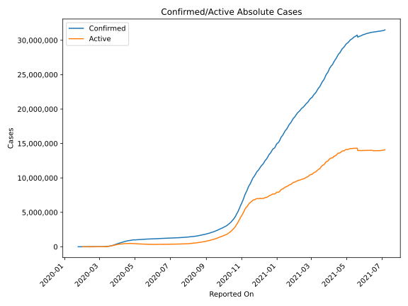
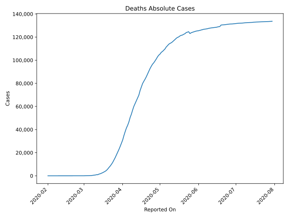
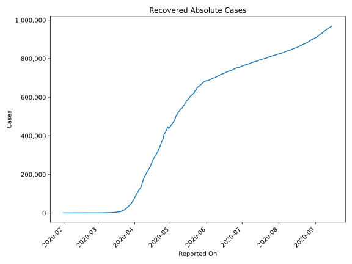
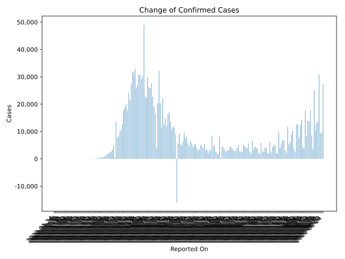
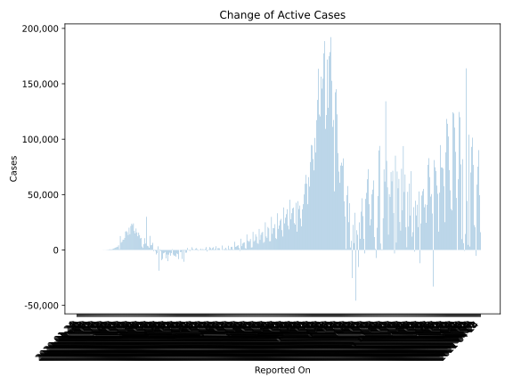
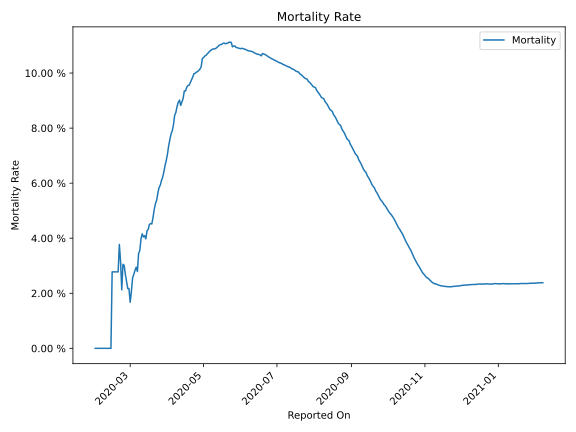

# Country Figures: Time Series for Schengen Area 

| Reported On | Confirmed | Deaths | Recovered | Active | Mortality | &Delta; Confirmed | &Delta; Deaths | &Delta; Recovered | &Delta; Active | % Active of Population |
|-------------|-----------|--------|-----------|--------|-----------|-------------------|----------------|-------------------|----------------|------------------------|
| 2020-05-03 | 1009486 | 107595 | 462305 | 439586 |  10.66 %  | 5229 | 759 | 6196 | -1726 |  0.104 %  | 
| 2020-05-02 | 1004257 | 106836 | 456109 | 441312 |  10.64 %  | 9275 | 1501 | 9966 | -2192 |  0.104 %  | 
| 2020-05-01 | 994982 | 105335 | 446143 | 443504 |  10.59 %  | 5671 | 955 | 8226 | -3510 |  0.105 %  | 
| 2020-04-30 | 989311 | 104380 | 437917 | 447014 |  10.55 %  | -15888 | 1405 | -8719 | -8574 |  0.105 %  | 
| 2020-04-29 | 1005199 | 102975 | 446636 | 455588 |  10.24 %  | 8997 | 1894 | 17336 | -10233 |  0.107 %  | 
| 2020-04-28 | 996202 | 101081 | 429300 | 465821 |  10.15 %  | 11723 | 1639 | 11399 | -1315 |  0.110 %  | 
| 2020-04-27 | 984479 | 99442 | 417901 | 467136 |  10.10 %  | 11594 | 1629 | 9218 | 747 |  0.110 %  | 
| 2020-04-26 | 972885 | 97813 | 408683 | 466389 |  10.05 %  | 10451 | 1218 | 27953 | -18720 |  0.110 %  | 
| 2020-04-25 | 962434 | 96595 | 380730 | 485109 |  10.04 %  | 13683 | 1782 | 8584 | 3317 |  0.114 %  | 
| 2020-04-24 | 948751 | 94813 | 372146 | 481792 |  9.99 %  | 17001 | 1974 | 19129 | -4102 |  0.114 %  | 
| 2020-04-23 | 931750 | 92839 | 353017 | 485894 |  9.96 %  | 16458 | 2334 | 14140 | -16 |  0.115 %  | 
| 2020-04-22 | 915292 | 90505 | 338877 | 485910 |  9.89 %  | 12062 | 2388 | 14648 | -4974 |  0.115 %  | 
| 2020-04-21 | 903230 | 88117 | 324229 | 490884 |  9.76 %  | 14889 | 2398 | 12743 | -252 |  0.116 %  | 
| 2020-04-20 | 888341 | 85719 | 311486 | 491136 |  9.65 %  | 12502 | 2083 | 11428 | -1009 |  0.116 %  | 
| 2020-04-19 | 875839 | 83636 | 300058 | 492145 |  9.55 %  | 21924 | 1835 | 9810 | 10279 |  0.116 %  | 
| 2020-04-18 | 853915 | 81801 | 290248 | 481866 |  9.58 %  | 11460 | 1966 | 8595 | 899 |  0.114 %  | 
| 2020-04-17 | 842455 | 79835 | 281653 | 480967 |  9.48 %  | 20291 | 3019 | 12872 | 4400 |  0.113 %  | 
| 2020-04-16 | 822164 | 76816 | 268781 | 476567 |  9.34 %  | 32183 | 3015 | 16571 | 12597 |  0.112 %  | 
| 2020-04-15 | 789981 | 73801 | 252210 | 463970 |  9.34 %  | 20339 | 4015 | 14295 | 2029 |  0.109 %  | 
| 2020-04-14 | 769642 | 69786 | 237915 | 461941 |  9.07 %  | 3898 | 2420 | 10609 | -9131 |  0.109 %  | 
| 2020-04-13 | 765744 | 67366 | 227306 | 471072 |  8.80 %  | 16749 | 2408 | 10047 | 4294 |  0.111 %  | 
| 2020-04-12 | 748995 | 64958 | 217259 | 466778 |  8.67 %  | 19055 | 2449 | 10566 | 6040 |  0.110 %  | 
| 2020-04-11 | 729940 | 62509 | 206693 | 460738 |  8.56 %  | 22753 | 2395 | 12878 | 7480 |  0.109 %  | 
| 2020-04-10 | 707187 | 60114 | 193815 | 453258 |  8.50 %  | 27620 | 3207 | 10986 | 13427 |  0.107 %  | 
| 2020-04-09 | 679567 | 56907 | 182829 | 439831 |  8.37 %  | 25863 | 3585 | 16550 | 5728 |  0.104 %  | 
| 2020-04-08 | 653704 | 53322 | 166279 | 434103 |  8.16 %  | 26200 | 2850 | 21524 | 1826 |  0.102 %  | 
| 2020-04-07 | 627504 | 50472 | 144755 | 432277 |  8.04 %  | 29894 | 3886 | 15589 | 10419 |  0.102 %  | 
| 2020-04-06 | 597610 | 46586 | 129166 | 421858 |  7.80 %  | 22368 | 2903 | 7294 | 12171 |  0.099 %  | 
| 2020-04-05 | 575242 | 43683 | 121872 | 409687 |  7.59 %  | 22737 | 2356 | 8879 | 11502 |  0.097 %  | 
| 2020-04-04 | 552505 | 41327 | 112993 | 398185 |  7.48 %  | 48952 | 3148 | 10924 | 34880 |  0.094 %  | 
| 2020-04-03 | 503553 | 38179 | 102069 | 363305 |  7.58 %  | 30293 | 3409 | 11118 | 15766 |  0.086 %  | 
| 2020-04-02 | 473260 | 34770 | 90951 | 347539 |  7.35 %  | 29167 | 3825 | 13208 | 12134 |  0.082 %  | 
| 2020-04-01 | 444093 | 30945 | 77743 | 335405 |  6.97 %  | 30720 | 2773 | 11648 | 16299 |  0.079 %  | 
| 2020-03-31 | 413373 | 28172 | 66095 | 319106 |  6.82 %  | 30698 | 2780 | 8476 | 19442 |  0.075 %  | 
| 2020-03-30 | 382675 | 25392 | 57619 | 299664 |  6.64 %  | 26990 | 2607 | 9293 | 15090 |  0.071 %  | 
| 2020-03-29 | 355685 | 22785 | 48326 | 284574 |  6.41 %  | 25721 | 2294 | 6201 | 17226 |  0.067 %  | 
| 2020-03-28 | 329964 | 20491 | 42125 | 267348 |  6.21 %  | 32887 | 2401 | 6434 | 24052 |  0.063 %  | 
| 2020-03-27 | 297077 | 18090 | 35691 | 243296 |  6.09 %  | 31443 | 2370 | 6445 | 22628 |  0.057 %  | 
| 2020-03-26 | 265634 | 15720 | 29246 | 220668 |  5.92 %  | 31958 | 2085 | 6112 | 23761 |  0.052 %  | 
| 2020-03-25 | 233676 | 13635 | 23134 | 196907 |  5.84 %  | 27385 | 2027 | 3650 | 21708 |  0.046 %  | 
| 2020-03-24 | 206291 | 11608 | 19484 | 175199 |  5.63 %  | 21467 | 1663 | 5286 | 14518 |  0.041 %  | 
| 2020-03-23 | 184824 | 9945 | 14198 | 160681 |  5.38 %  | 24195 | 1477 | 2055 | 20663 |  0.038 %  | 
| 2020-03-22 | 160629 | 8468 | 12143 | 140018 |  5.27 %  | 17569 | 1247 | 3313 | 13009 |  0.033 %  | 
| 2020-03-21 | 143060 | 7221 | 8830 | 127009 |  5.05 %  | 19983 | 1366 | 2514 | 16103 |  0.030 %  | 
| 2020-03-20 | 123077 | 5855 | 6316 | 110906 |  4.76 %  | 18765 | 1141 | 532 | 17092 |  0.026 %  | 
| 2020-03-19 | 104312 | 4714 | 5784 | 93814 |  4.52 %  | 17851 | 794 | 452 | 16605 |  0.022 %  | 
| 2020-03-18 | 86461 | 3920 | 5332 | 77209 |  4.53 %  | 12684 | 599 | 1229 | 10856 |  0.018 %  | 
| 2020-03-17 | 73777 | 3321 | 4103 | 66353 |  4.50 %  | 10526 | 586 | 686 | 9254 |  0.016 %  | 
| 2020-03-16 | 63251 | 2735 | 3417 | 57099 |  4.32 %  | 10222 | 473 | 458 | 9291 |  0.013 %  | 
| 2020-03-15 | 53029 | 2262 | 2959 | 47808 |  4.27 %  | 8299 | 482 | 387 | 7430 |  0.011 %  | 
| 2020-03-14 | 44730 | 1780 | 2572 | 40378 |  3.98 %  | 7721 | 266 | 863 | 6592 |  0.010 %  | 
| 2020-03-13 | 37009 | 1514 | 1709 | 33786 |  4.09 %  | 13574 | 565 | 429 | 12580 |  0.008 %  | 
| 2020-03-12 | 23435 | 949 | 1280 | 21206 |  4.05 %  | 691 | 3 | 0 | 688 |  0.005 %  | 
| 2020-03-11 | 22744 | 946 | 1280 | 20518 |  4.16 %  | 4931 | 238 | 480 | 4213 |  0.005 %  | 
| 2020-03-10 | 17813 | 708 | 800 | 16305 |  3.97 %  | 3277 | 191 | 4 | 3082 |  0.004 %  | 
| 2020-03-09 | 14536 | 517 | 796 | 13223 |  3.56 %  | 2728 | 110 | 108 | 2510 |  0.003 %  | 
| 2020-03-08 | 11808 | 407 | 688 | 10713 |  3.45 %  | 2447 | 151 | 33 | 2263 |  0.003 %  | 
| 2020-03-07 | 9361 | 256 | 655 | 8450 |  2.73 %  | 2097 | 43 | 95 | 1959 |  0.002 %  | 
| 2020-03-06 | 7264 | 213 | 560 | 6491 |  2.93 %  | 1698 | 55 | 111 | 1532 |  0.002 %  | 
| 2020-03-05 | 5566 | 158 | 449 | 4959 |  2.84 %  | 1361 | 45 | 138 | 1178 |  0.001 %  | 
| 2020-03-04 | 4205 | 113 | 311 | 3781 |  2.69 %  | 929 | 29 | 117 | 783 |  0.001 %  | 
| 2020-03-03 | 3276 | 84 | 194 | 2998 |  2.56 %  | 612 | 29 | 13 | 570 |  0.001 %  | 
| 2020-03-02 | 2664 | 55 | 181 | 2428 |  2.06 %  | 514 | 19 | 66 | 429 |  0.001 %  | 
| 2020-03-01 | 2150 | 36 | 115 | 1999 |  1.67 %  | 723 | 5 | 37 | 681 |  0.000 %  | 
| 2020-02-29 | 1427 | 31 | 78 | 1318 |  2.17 %  | 366 | 8 | 1 | 357 |  0.000 %  | 
| 2020-02-28 | 1061 | 23 | 77 | 961 |  2.17 %  | 279 | 4 | 1 | 274 |  0.000 %  | 
| 2020-02-27 | 782 | 19 | 76 | 687 |  2.43 %  | 261 | 5 | 43 | 213 |  0.000 %  | 
| 2020-02-26 | 521 | 14 | 33 | 474 |  2.69 %  | 156 | 3 | 3 | 150 |  0.000 %  | 
| 2020-02-25 | 365 | 11 | 30 | 324 |  3.01 %  | 103 | 3 | 7 | 93 |  0.000 %  | 
| 2020-02-24 | 262 | 8 | 23 | 231 |  3.05 %  | 74 | 4 | -1 | 71 |  0.000 %  | 
| 2020-02-23 | 188 | 4 | 24 | 160 |  2.13 %  | 93 | 1 | 1 | 91 |  0.000 %  | 
| 2020-02-22 | 95 | 3 | 23 | 69 |  3.16 %  | 42 | 1 | 1 | 40 |  0.000 %  | 
| 2020-02-21 | 53 | 2 | 22 | 29 |  3.77 %  | 17 | 1 | 2 | 14 |  0.000 %  | 
| 2020-02-20 | 36 | 1 | 20 | 15 |  2.78 %  | 0 | 0 | 0 | 0 |  0.000 %  | 
| 2020-02-19 | 36 | 1 | 20 | 15 |  2.78 %  | 0 | 0 | 0 | 0 |  0.000 %  | 
| 2020-02-18 | 36 | 1 | 20 | 15 |  2.78 %  | 0 | 0 | 11 | -11 |  0.000 %  | 
| 2020-02-17 | 36 | 1 | 9 | 26 |  2.78 %  | 0 | 0 | 1 | -1 |  0.000 %  | 
| 2020-02-16 | 36 | 1 | 8 | 27 |  2.78 %  | 0 | 0 | 0 | 0 |  0.000 %  | 
| 2020-02-15 | 36 | 1 | 8 | 27 |  2.78 %  | 1 | 1 | 4 | -4 |  0.000 %  | 
| 2020-02-14 | 35 | 0 | 4 | 31 |  None  | 0 | 0 | 0 | 0 |  0.000 %  | 
| 2020-02-13 | 35 | 0 | 4 | 31 |  None  | 0 | 0 | 1 | -1 |  0.000 %  | 
| 2020-02-12 | 35 | 0 | 3 | 32 |  None  | 0 | 0 | 3 | -3 |  0.000 %  | 
| 2020-02-11 | 35 | 0 | 0 | 35 |  None  | 2 | 0 | 0 | 2 |  0.000 %  | 
| 2020-02-10 | 33 | 0 | 0 | 33 |  None  | 0 | 0 | 0 | 0 |  0.000 %  | 
| 2020-02-09 | 33 | 0 | 0 | 33 |  None  | 2 | 0 | 0 | 2 |  0.000 %  | 
| 2020-02-08 | 31 | 0 | 0 | 31 |  None  | 5 | 0 | 0 | 5 |  0.000 %  | 
| 2020-02-07 | 26 | 0 | 0 | 26 |  None  | 2 | 0 | 0 | 2 |  0.000 %  | 
| 2020-02-06 | 24 | 0 | 0 | 24 |  None  | 0 | 0 | 0 | 0 |  0.000 %  | 
| 2020-02-05 | 24 | 0 | 0 | 24 |  None  | 0 | 0 | 0 | 0 |  0.000 %  | 
| 2020-02-04 | 24 | 0 | 0 | 24 |  None  | 1 | 0 | 0 | 1 |  0.000 %  | 
| 2020-02-03 | 23 | 0 | 0 | 23 |  None  | 2 | 0 | 0 | 2 |  0.000 %  | 
| 2020-02-02 | 21 | 0 | 0 | 21 |  None  | 2 | 0 | 0 | 2 |  0.000 %  | 
| 2020-02-01 | 19 | 0 | 0 | 19 |  None  | 5 | None | None | None |  0.000 %  | 
| 2020-01-31 | 14 | None | None | None |  None  | 4 | None | None | None |  n/a  | 
| 2020-01-30 | 10 | None | None | None |  None  | 0 | None | None | None |  n/a  | 
| 2020-01-29 | 10 | None | None | None |  None  | 2 | None | None | None |  n/a  | 
| 2020-01-28 | 8 | None | None | None |  None  | 5 | None | None | None |  n/a  | 
| 2020-01-27 | 3 | None | None | None |  None  | 0 | None | None | None |  n/a  | 
| 2020-01-26 | 3 | None | None | None |  None  | 0 | None | None | None |  n/a  | 
| 2020-01-25 | 3 | None | None | None |  None  | 1 | None | None | None |  n/a  | 
| 2020-01-24 | 2 | None | None | None |  None  | None | None | None | None |  n/a  | 

